# Imprint — architectuur

Eén publicatie-motor, meerdere merk-sites ("imprints"). Dit document beschrijft
het ontwerp zoals het er staat; de requirements staan in
[website-requirements.md](website-requirements.md) (eisnummers W*/S*/§B/§C
worden in code-comments aangehaald).

De voorgestelde revisie waarin runtime, admin, widgets en plugins werkelijk
site-onafhankelijke engineonderdelen worden staat in
[Revisievoorstel — engine, instanties, widgets en plugins](design/engine-instance-plugin-architectuur.md).
Dat document is normatief voor de gewenste richting, maar nog niet volledig
geïmplementeerd; dit document blijft de beschrijving van de huidige werking.

## 0. Architectuurcontract: vier lagen

Vastgelegd in september 2026 (Fase 0 van het
[revisievoorstel](design/engine-instance-plugin-architectuur.md), volgens de
[opdrachtbrief](design/opdracht-engine-bibliotheek-backend-site.md)). Dit is
het contract waar de extractie in de volgende fasen aan getoetst wordt; de
rest van dit document beschrijft hoe de code er *nu* bij ligt, en die twee
lopen bewust nog uiteen.

| laag | inhoud | staat nu in | mag afhangen van |
|---|---|---|---|
| **Engine** | contentcontracten (zod-schema's, `ContentStore`/`WritableContentStore`, `ContentType`), widget-model, relatieregels, afgeleide domeinlogica, gebruikers/wachtwoordbeleid, renderer, publieke API, admin/studio ("editor-motor") | `packages/content-core` (contracten); `packages/runtime-admin` (renderer, layouthelpers, `Markdown`); API, admin, auth/PEP, studio-ops en de widget-viewers nog in `sites/musicbrain/src` | niets in `sites/*`; geen concrete site-naam, geen concreet domein |
| **Bibliotheek** | herbruikbare onderdelen die een site *kiest*: widgets (schema + viewer + optioneel editor), plugins (nog geen package), mogelijk basisthema's/presets | de catalogus in `sites/musicbrain/src/widgets/` (`registry.ts`, `components.tsx`, `editors.tsx`) | de engine-contracten (`WidgetTypeDef`, `ContentStore`), nooit een site |
| **Backend** | opslagimplementaties achter het `ContentStore`-contract: file, MariaDB, Postgres, later het bitemporele register | `file-store.ts`; `db-store-base.ts` (gedeelde semantiek) + `db-store.ts`/`db-schema.ts` (MariaDB) + `db-store.pg.ts`/`db-schema.pg.ts` (Postgres) + `memory-store.ts` (in geheugen, voor tests); keuze via `db.ts` | de engine-contracten (`store.ts`, `schemas.ts`, `widgets.ts`); niemand kent een backend behalve de composition root |
| **Site** ("imprint") | gekozen engineversie + bibliotheekkeuze + backendkeuze + eigen merk (SiteChrome, design-tokens), content, DB, assets, secrets, sessiecookie | `sites/musicbrain`, `sites/imprint`; de composition root is per site `imprint.config.ts` (`defineImprint()`), tot leven gebracht in `src/lib/content.ts` (`createImprint()`) | engine + bibliotheek + precies één backend |

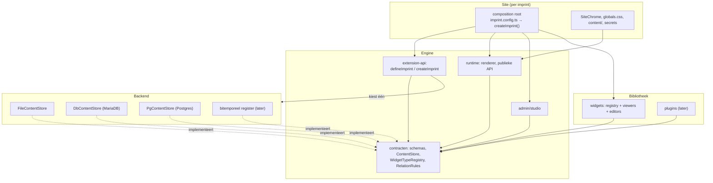

Pijlen zijn de *enige* toegestane afhankelijkheden. Concreet:

1. **Site → engine, nooit andersom.** Enginecode bevat geen verwijzing naar
   `musicbrain`, `imprint` of een ander site-id; sitekeuzes komen binnen via
   de composition root (dependency injection), niet via `if (site === …)`.
2. **Engine-contracten kennen geen React of Next.js.** `content-core` blijft
   framework-vrij; renderer en admin (die wél React kennen) horen bij de
   engine maar zijn een aparte laag dáárboven (het toekomstige
   `@imprint/runtime-admin`-package, eerst één package — voorstel §18).
3. **Backend alleen via `ContentStore`.** Site-, admin- en widgetcode praten
   uitsluitend via `ContentStore`/`WritableContentStore` met content; nooit
   met drizzle, SQL of bestanden. Alleen de composition root instantieert een
   backend. Een nieuwe backend = één implementatie van het contract die de
   contractsuite (§8) doorstaat; hij raakt geen paginacode.
4. **Bibliotheek → engine-contracten, nooit een site.** Een widget importeert
   geen site-globaal storebestand en geen SiteChrome; hij krijgt zijn context
   (store, subject) aangereikt. Een site kiest widgets **individueel** (de
   registry werkt al per widget); een "bundel" is niet meer dan een
   gemaks-export.
5. **Per site: eigen database, assets, secrets en sessiecookienaam.** Gedeelde
   code, aparte app en database per instantie; geen multitenant admin in deze
   fase (voorstel §18, bevestigd in de opdrachtbrief).
6. **Tijd is een leesparameter van het contract, niet van de backend.**
   `ReadOptions.asOf` is de materiële tijd ("gold op"). Het contract moet
   later ook een formele tijd ("beweerden wij op") als aparte leesparameter
   kunnen dragen zonder site-code te raken, zodat een `BitempContentStore` op
   het bitemporele register inplugbaar blijft. Nu vullen de backends dat
   verschillend in: de DB-store legt `asOf` op **beide** assen, de file-store
   kent alleen valid time (vastgelegd in de karakterisatietests, §8).

### Besluiten (genomen zonder Mark, terug te draaien als hij anders wil)

- **Product/component/release blijven voorlopig in core.** `plugin-catalog`
  komt pas in Fase 5 aan bod, ná Planning en Wiki (de volgorde van het
  voorstel §12); vroeger extraheren geeft nu geen tweede gebruiker.
- **Standaardwidgets zijn individueel kiesbaar** (regel 4); de catalogus van
  MusicBrain is met een test vastgepind zodat verplaatsen niets verandert.
- **Onbekende of uitgeschakelde widget blijft een harde fout** bij lezen én
  opslaan (huidig principe, nu getest). Een placeholder voor beheerders is
  een Fase 6-verfijning, geen contractwijziging.
- **Pluginconfig is code-only** in de composition root. Bewerkbare
  beheerconfig als content (met eigen schema) mag een plugin later zélf
  toevoegen; het contract sluit dat niet uit.
- **Postgres als tweede databasebackend, MariaDB blijft** (opdracht B,
  gerealiseerd — zie §4); het argument "MariaDB omdat shared hosting dat
  biedt" is met de VPS vervallen.
- **Reikwijdte van de bibliotheek** (Mark, september 2026): de bibliotheek
  levert *basisthema's/presets* (design-tokens, een neutrale SiteChrome); de
  site blijft eigenaar van haar merk. Herbruikbaar = bibliotheek, identiteit
  = site.
- **"Bibliotheek" is voorlopig een verzamelnaam** voor `widgets-standard` +
  `plugin-*` (Mark, september 2026); een package-prefix (`packages/library-*`)
  pas als er meer dan twee bibliotheek-packages zijn.

### Composition root (Fase 1, september 2026)

Elke site beschrijft zichzelf één keer in `imprint.config.ts` met
`defineImprint()` uit [`@imprint/extension-api`](../packages/extension-api/src/index.ts):

```ts
export default defineImprint({
  id: "musicbrain",
  store: { databaseUrl: process.env.DATABASE_URL, contentDir: path.join(process.cwd(), "content") },
  widgets: widgetRegistry,                       // de catalogus (configschema's)
  session: { cookie: "imprint_session", hours: 12 },
  assets: { root: process.env.ASSET_ROOT, baseUrl: process.env.ASSET_BASE_URL },
});
```

`createImprint(config)` in `src/lib/content.ts` maakt daar de levende
instantie van (`ImprintInstance`): `store`, `writableStore` (null in
file-modus), `users` (null zonder MariaDB), `widgets`, `assets` en
`session`. Eén instantie per proces per id (cache op `globalThis`, dezelfde
truc als vroeger voor de connection pool). De backend volgt het URL-schema
via `openContentDatabase()`; geen URL = file-store op `contentDir`.

Wat daarmee verschoven is: `auth.ts` haalt cookienaam, sessieduur en de
`DbUserStore` uit de instantie; `assets.ts` de `FileAssetStore`; `content.ts`
de stores. De 36 modules die `@/lib/content` importeren merken niets — dat
was de eis van Fase 1 ("zonder zichtbaar gedrag te veranderen"). Het package
is bewust framework-vrij: SiteChrome, viewers en editors blijven in de site
tot de renderer- en admin-extractie (Fase 2 en 4) ze een getypeerd slot
geeft. Secrets (`SESSION_SECRET`, `INGEST_TOKEN`, …) blijven in de
omgeving en worden gelezen waar ze gebruikt worden.

### Nog open

- **Vierde backend** (bitemporeel register, Omnium): niet bouwen; wel de
  formele-tijd-parameter uit regel 6 meenemen zodra het contract wordt
  aangeraakt (Bitemporal_2026 `docs/BACKLOG.md` §27.2).

## 1. Overzicht

npm-workspaces-monorepo. De kern (`@imprint/content-core`) kent schema's,
opslag en het widget-model, maar geen React en geen concrete widgets; elke
site levert zijn eigen gezicht én zijn eigen widget-catalogus.

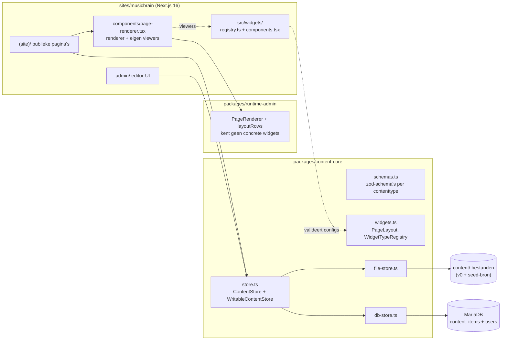

De site praat **uitsluitend** via de `ContentStore`-interface met content
(S1/§B3). Met `DATABASE_URL` gezet kiest [content.ts](../sites/musicbrain/src/lib/content.ts)
de database-store; zonder valt hij terug op de file-store, zodat een kale
checkout (en CI) altijd bouwt.

## 2. Contentmodel

Implementatie van het UML-contentmodel. Elk type heeft een zod-schema in
[schemas.ts](../packages/content-core/src/schemas.ts) — dat ene schema
valideert de content bij het lezen én genereert de admin-formulieren.

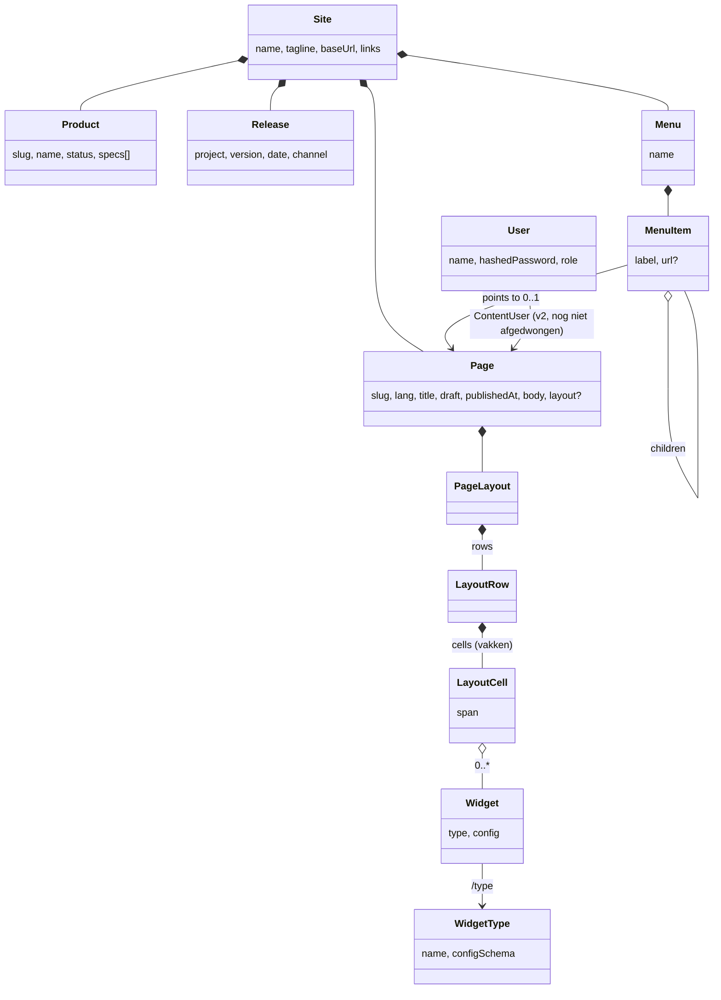

Verschillen met het oorspronkelijke UML:

- `ContentItem`-subklassen zijn aparte zod-schema's; het `/type`-kenmerk is
  de `type`-kolom in de database. `NewsItem` is een pagina onder `posts/`.
- `PageLayout` is het Pleio-achtige vakkenmodel: **rijen → cellen → widgets**.
  Een cel heeft een relatieve breedte (`span` in fractie-eenheden: cellen
  1|2 renderen als ⅓ + ⅔). Een ouder formaat (template + regio's) parseert
  nog en wordt bij renderen/bewerken naar rijen omgezet.
- `User`/`RoleType` zijn actief (admin-login); de rol per content-item
  (`ContentUser`) staat in het schema maar wordt nog niet gehandhaafd.
  Gebruikers lopen **niet** via de `ContentStore`: ze zijn geen content en
  krijgen bewust géén historie — een bitemporale tabel bewaart elke rij voor
  altijd, en dat is precies wat je met wachtwoordhashes niet wilt. Ze hebben
  een eigen `DbUserStore`
  ([user-store.ts](../packages/content-core/src/user-store.ts)), gedeeld door
  **/admin/users**, de seed en de `npm run user`-CLI, zodat de regels
  (wachtwoordlengte, "laatste admin blijft admin") overal gelden. Hashing en
  wachtwoordbeleid staan apart in
  [passwords.ts](../packages/content-core/src/passwords.ts).
- **Sessies** zijn stateless: een HMAC-ondertekend cookie met naam, rol en
  vervaltijd (12u), zonder tabel. Dat betekent dat een wachtwoordreset of
  rolwijziging een al openstaande sessie niet intrekt — die loopt gewoon af.
  Acceptabel bij deze handvol vertrouwde gebruikers; een `session_epoch`-kolom
  zou het dichtzetten (backlog).

## 3. Widgets: kern kent het model, de site de catalogus

Een widgettype bestaat uit drie stukken; alleen het eerste is verplicht
handwerk, de editor heeft een schema-gedreven default:

| stuk | bestand | draait | rol |
|---|---|---|---|
| **configschema** | `src/widgets/registry.ts` | overal (geen React/store) | valideert de config; bron voor het default-editorformulier |
| **viewer** | `src/widgets/components.tsx` | server | rendert de widget op de site (mag store/API's gebruiken) |
| **editor** | `src/widgets/editors.tsx` | client | bewerkt de config in de studio; default = formulier uit het schema, alleen overriden voor rijkere bewerking |

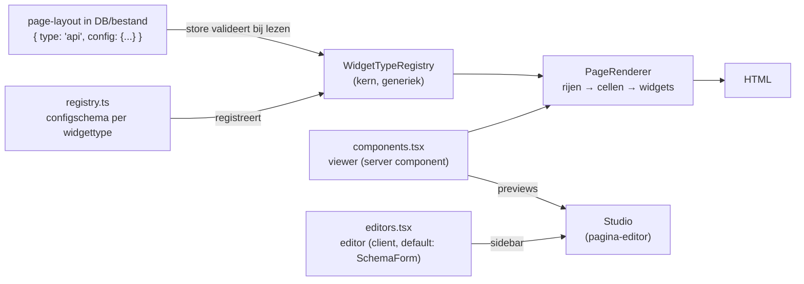

- De **renderer** zelf (`PageRenderer`, `Widget`, `layoutRows`, `Markdown`)
  staat sinds Fase 2 in `@imprint/runtime-admin` en kent geen concrete
  widgets. De site bindt hem in `src/components/page-renderer.tsx` aan haar
  eigen viewers; de rest van de site importeert die binding.
- De **store** valideert elke widget-config tegen het geregistreerde schema:
  een kapotte widget breekt de build/save met een duidelijke fout, in plaats
  van stil verkeerd te renderen.
- Config moet **JSON-serialiseerbaar** zijn (opslag als JSON); coördinaten
  e.d. relatief opslaan (0..1) zodat ze meeschalen met de vakbreedte.
- Interactieve viewers (hover/klik) zijn een dun server-component met een
  `"use client"`-eiland erin; `treeview`/`api` hebben dat niet nodig, een
  geannoteerde-afbeelding-widget wel.
- Catalogus van musicbrain: `text`, `table` (met custom grid-editor),
  `image`, `gallery` (fotoraster + lightbox, kan subject-media meenemen),
  `carousel`, `album` (externe foto-repo: JSON-API of Lightroom-share
  best-effort), `map` (Leaflet/OSM met markers), `kanban`, `itinerary`
  (component-reis door releases), `callout`/CTA, `embed` (iframe),
  `board` (geannoteerde render), `boardspec` (rendert een board-spec),
  `template` (markdown met Mustache merge fields over een content-item/
  subject), `list` (links die de content-graaf volgen), `treeview`,
  `api` (JSON-endpoint met veldselectie), `releases`, `products`.

## 3b. Product / component / release

Naast de website-content is er een productdomein: producten zijn opgebouwd
uit **componenten**, en worden in genummerde **releases** uitgebracht. Een
product-project (bijv. de MusicBrain-hardwarerepo) kan dit zelf **posten**
via de write-API; het landt in dezelfde bitemporal-store als alle content.

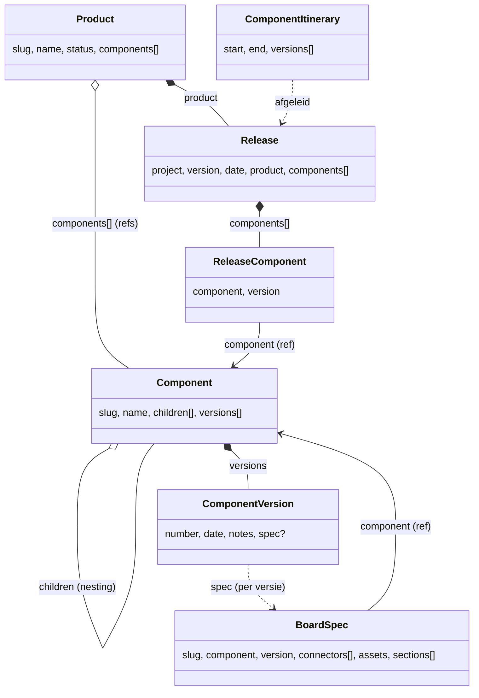

Modelleerkeuzes (naar het UML van Mark):

- **Component is een eigen contenttype**, niet genest in een product — omdat
  hetzelfde component in meerdere producten kan zitten. Componenten kunnen
  wél nesten (`children`), bijv. een busboard met modules.
- **Een release bevat componenten met genoteerde versie** (`components: [{
  component, version }]`) — de `ReleaseComponent`-associatie draagt het
  versienummer. Bewust géén directe relatie naar een `ComponentVersion`-
  entiteit: een versie ís geen component.
- **ProductComponentItinerary is afgeleid**, niet opgeslagen:
  [`computeItinerary()`](../packages/content-core/src/itinerary.ts) leest per
  component de eerste→laatste release af (`end: null` = zit nog in de nieuwste
  release).
- **Documentatie** hangt (voorlopig simpel) als optioneel `docs`-veld aan
  product/component: een pagina-slug of inline markdown. Differentiëren kan
  later.

**board-spec** (hardware-documentatie, D1–D10) is de eerste gedifferentieerde
documentatievorm: een eigen contenttype voor de machinaal gegenereerde
bord-info (connectors, nets, gerenderde SVG's/PNG's, proza-secties, fab-info,
hotspot-punten). Eén board-spec **per ComponentVersion** (slug
`<component>@<versie>`); de `ComponentVersion` verwijst er optioneel naar via
`spec`, en de board-spec verwijst terug naar zijn component (RelationRule
`board-spec.component → component`). De technische kern is taalneutraal, alleen
de `sections` zijn vertaalbaar (S9).

### 3d. Planning (kanban als content)

Een **planning** is een bord dat bij een product hoort en zijn **fasen**
(kolommen) declareert; de kaarten zijn een eigen contenttype **planning-item**
— want een kaart heeft een eigen eigenaar, een eigen rich-text-body en een
eigen levensloop. Een kaart verschuiven ís een `status`-wijziging, geen nieuwe
kaart, en dus **een nieuwe bitemporale versie**: de versiegeschiedenis van een
planning-item *is* het verhaal van hoe het werk door de fasen liep, en
`asOf`-preview toont het bord op elke datum. Relatieregels:
`planning → product`, `planning-item → planning`, `planning-item → component`.
De eigenaar is een gebruikersnaam (zachte verwijzing naar de users-tabel; geen
contenttype, dus geen RelationRule).

Bewerken gebeurt in de admin (`/admin/planning/<slug>`): een client-bord met
HTML5-drag&drop tussen kolommen en een edit-paneel per kaart; de mutatielogica
is puur ([`lib/planning.ts`](../sites/musicbrain/src/lib/planning.ts):
`computeMove` renummert de bron- en doelkolom), de serveracties doen de
bitemporale puts.

De **`planning`-widget** rendert een bord op de site, in twee modi: *board*
(een planning + zijn planning-items) of *generiek* — een read-only view over
elk contenttype met een aanwijsbaar fase-, eigenaar- en titelveld en de fasen
op de widget geconfigureerd. Zo toont hij bv. componenten gegroepeerd op hun
optionele `phase`-veld (dat een project via de API bijwerkt) zonder aparte
planning-items. Dit is Marks "widget = configureerbare view op data":
hoofditem + subitems + aanwijsbaar fase-veld + optionele eigenaar.

- **Assets** (renders, pinout-SVG's) gaan via de **AssetStore** (D7,
  `content-core/asset-store.ts`): `put(path,bytes) → url`, file-backend nu,
  MinIO/S3 later als config-wissel. Upload via multipart
  `POST /api/ingest/board-spec` (D5/D6): de backend slaat de bestanden op,
  herschrijft asset-namen in de doc naar URL's en doet `putItem`. Serveren via
  `GET /api/assets/...`.
- **Weergave** met lage auteurlast: `BoardSpecView` (D9) rendert een board-spec
  (interactief board of overzicht + connectors-tabel + pinouts + secties). De
  `boardspec`-widget zet dat op elke pagina met alleen een spec-slug. De
  `board`-widget-config is bovendien **afleidbaar** uit een board-spec
  (`boardSpecToBoardConfig`, D4): de punten komen uit `spec.points`, hun detail
  uit de per-connector pinout-SVG (`svgRef`, D10) — geen JSON-plak meer.
- **Navigatie (per-type pagina's, "optie B"):** elk contenttype heeft een
  eigen route — `/products/<slug>`, `/components/<slug>`, `/releases/<slug>` —
  die het item als *subject* rendert. De keten is klikbaar: productpagina →
  releases van dat product → release → zijn componenten → component → board
  (en terug: de componentpagina toont in welke producten/releases hij zit).
- **Studio-bewerkbare default-views:** een route gebruikt de layout van de
  pagina `_view/<type>` (in de studio samengesteld) met het item als subject;
  bestaat die niet, dan valt hij terug op de hand-gecodeerde weergave. In de
  studio kies je "preview als <voorbeeld-item>" zodat de widgets zich vullen
  terwijl je de template ontwerpt. `_view/*`-pagina's zijn niet publiek
  bereikbaar. Beheer via **/admin → Default views**.
- **`list`-widget** volgt de content-graaf voor die navigatie: modus `query`
  (items van een type waar `veld == waarde`, bijv. releases van dit product)
  of `refs` (een slug-array op de subject, bijv. `release.components[]`), met
  een `linkPattern` naar de doelpagina. De `template`- en `list`-widgets
  krijgen de subject van de pagina mee (PageRenderer geeft `subject` door),
  zodat dezelfde default-view zich vult voor elk item.

Omdat de `content_items`-tabel generiek is (§4), kostte dit **geen
DB-migratie**: `component` is gewoon een nieuwe waarde in de `type`-kolom,
met een eigen zod-schema.

### Relaties tussen contenttypen

Referenties tussen types (`release → product`, `product → components`,
`component → children`, …) zijn **zachte slug-verwijzingen** in de JSON,
maar hun integriteit is bewaakbaar. Een set **RelationRules** verklaart welk
veld van welk type naar welk ander type wijst; de store controleert dat bij
elke schrijfactie ([relations.ts](../packages/content-core/src/relations.ts),
`validateReferences`). De regels zijn zélf content (`type: "relations"`),
bewerkbaar in **/admin/relations** — dus configureerbaar, niet hardgecodeerd.

- Veldpaden: `product` (slug), `components[]` (array van slugs),
  `components[].component` (array van objecten met een slug-veld).
- Per regel een `enforce`-vlag: aan = een verwijzing naar niet-bestaande
  content weigert de write (422); uit = advies.
- Machine-ingest post daarom in volgorde: eerst componenten, dan het product,
  dan de releases (de bundle-POST doet dit al).

## 3c. Theming

Een **thema is content**: een set design-tokens (kleuren, fonts) als
`type: "theme"`-item, bewerkbaar in de admin met kleurpickers en bitemporeel
geversioneerd zoals alles. De aanpak volgt de standaardpraktijk:

- **Tokens als CSS custom properties** — componenten gebruiken uitsluitend
  token-klassen (`bg-background`, `text-accent`, …; afgedwongen door de
  werkafspraak "geen losse hexkleuren"). `globals.css` houdt de
  default-waarden op `:root` (tevens de no-JS-fallback); die default is het
  **Amber-thema** (het "open brain"-palet). Fonts gaan via een indirectie
  (`--sans`/`--mono` op `:root`, door `@theme inline` gemapt naar Tailwinds
  `--font-*`): zou `@theme inline` direct naar de next/font-variabelen
  wijzen, dan bakt Tailwind die ín de `font-mono`-utilities en raken
  thema-overrides ze niet meer.
- **`[data-theme="<naam>"]`-switching** — de site rendert per thema een
  CSS-blok dat de variabelen overschrijft (`ThemeStyles`). Omdat Tailwind v4
  de tokens via `@theme inline` aan de variabelen bindt, restylet één
  attribuutwissel de hele site, direct.
- **Gebruikers-switcher** (IDE-stijl) in de header: zet `data-theme` op
  `<html>` en bewaart de keuze in localStorage; een klein inline-script
  bovenin `<body>` past de keuze vóór de eerste paint toe (geen flash).
- **Formaat**: het zod-`ThemeSchema` is bewust plat (7 kleurtokens + een
  optioneel achtste, `accent2`, voor sierelementen zoals de scope-divider —
  leeg valt het serverside terug op `accent` — plus optionele font-stacks) —
  in de geest van het W3C **Design Tokens (DTCG)**-formaat (tokens als
  data), maar zonder de volle diepte daarvan. Import/export naar DTCG-JSON
  kan later een dunne mapping zijn.
- **Afgeleide textuur**: de achtergrond (dot-grid + accentgloed bovenin,
  uit het "open brain"-ontwerp) staat in `globals.css` en is met
  `color-mix()` afgeleid van de tokens `--muted`/`--accent`; hij kleurt dus
  automatisch mee met elk thema zonder eigen tokens nodig te hebben.
- **Afbakening**: tokens (kleur/typografie) zijn client-side wisselbaar; de
  **grove pagina-indeling** (logo-positie, header-variant) is een
  server-concern en hoort bij een aparte chrome-variant per site — bewust
  níet in het thema gestopt (staat op de backlog).

## 3d. Autorisatie: PEP met inplugbare PDP

Elke lees/schrijf-beslissing hoort door één poortje: `authorize()` in
[authorize.ts](../sites/musicbrain/src/lib/authorize.ts) — het **Policy
Enforcement Point**. Het PEP beslist zelf niets; het bouwt een
`DecisionRequest` (subject/action/resource/context) en vraagt een
**PolicyDecisionPoint** om een besluit. Dat interface is het
AuthZEN-snijvlak: we standaardiseren op het contract tussen PEP en PDP,
niet op een policytaal, zodat de beslisser verwisselbaar is (nu
`staticPdp` met de vaste regelset — admin alles / editor schrijft /
reader leest / publiek alleen `visibility: "public"`; later policies als
content, of een ODRL-gebaseerde taal). `canEdit()` in auth.ts is een dunne
wrapper over het PEP. Ontwerp en groeipad: design/wiki.md §4.

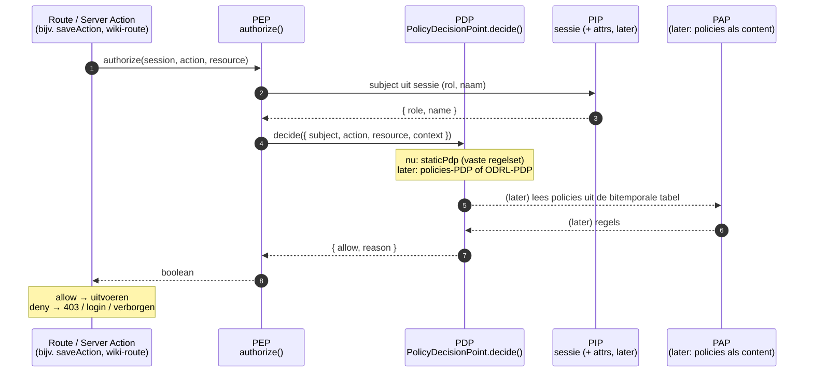

De verwisselbaarheid zit in stap 4: `decide()` is het hele contract. Een
andere beslisser (policies-als-content, ODRL-vertaling) vervangt alleen de
PDP-deelnemer; route-code en PEP blijven identiek.

## 4. Opslag: bitemporal-light (§B3)

Eén generieke tabel `content_items`; de payload per type blijft een
zod-gevalideerd JSON-document. Twee tijdassen:

| as | kolommen | betekenis | levert |
|---|---|---|---|
| valid time | `valid_from` / `valid_to` | wanneer de content *geldt* | geplande publicatie (S6), "site zoals op datum X" (S5) |
| transaction time | `tx_from` / `tx_to` | wanneer wij het *beweerd* hebben | versiegeschiedenis + rollback (S4) |

Elke save is een nieuwe rij; `tx_to IS NULL` markeert de huidige versie.

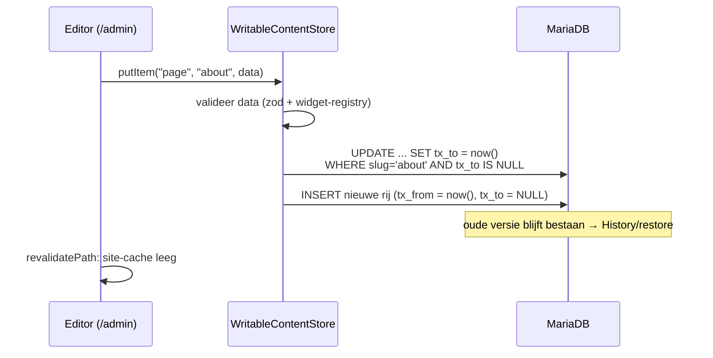

Lezen voor de site is volledig bitemporeel op één moment: `tx_from ≤ asOf <
tx_to` (wat we op dat moment beweerden) én `valid_from ≤ asOf < valid_to`
(wat op dat moment gold). Zonder `asOf` is dat moment "nu", en is de
tx-clausule gelijkwaardig aan `tx_to IS NULL` — maar met een `asOf` in het
verleden komen de tóen actuele (inmiddels gesuperseerde of getombstonede)
rijen terug: echt tijdreizen. Terugrollen = een oude payload opnieuw
asserteren; de geschiedenis zelf wordt nooit herschreven. Let op het
verschil met de file-store: die kent alleen valid time (`publishedAt`,
releasedatum), dus een `asOf` vóór de eerste assertie geeft in de DB-store
níets en in de file-store gewoon de content van toen (§0 regel 6; getest
in §8).

**As-of-preview** (S6) maakt dat tijdreizen zichtbaar: het admin-dashboard
("Time travel") opent de publieke site met een gekozen moment. Technisch:
Next **draft mode** (de bypass-cookie laat de prerendered pagina's dynamisch
renderen voor déze browser) plus een `imprint_asof`-cookie met het moment;
[preview.ts](../sites/musicbrain/src/lib/preview.ts) vertaalt dat per request
naar `ReadOptions` en elke publieke pagina geeft die door aan de store.
In-/uitstappen via `/api/preview?asOf=…&to=…` (editors only) en
`/api/preview/exit`; een banner in de site-layout markeert de preview.
Beperking: widgets die zelf content ophalen (posts, list, releases…) kijken
nog naar "nu" — de kernpagina's reizen mee. Dit model migreert later naadloos naar het echte
bitemporal-register (bitemporal2026) — de site merkt daar niets van, want
alles loopt via de `ContentStore`-interface.

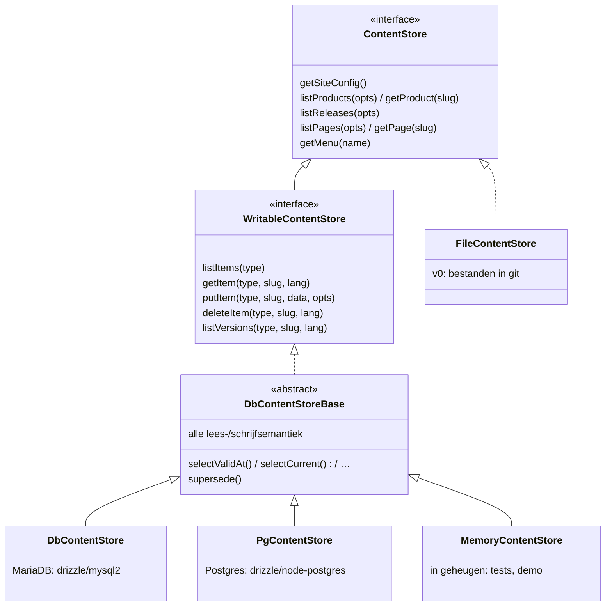

### Twee databasedialecten, één semantiek

Sinds september 2026 zijn er twee databasebackends achter hetzelfde contract
(§0 regel 3): **MariaDB** (MusicBrain, ongewijzigd) en **Postgres** (de
Imprint-productsite). De opzet is bewust *geen* kopie van de store:

- [db-store-base.ts](../packages/content-core/src/db-store-base.ts) bevat
  álles wat een site kan waarnemen — taal-overlay, drafts, `asOf` op beide
  tijdassen, validatie, referentiecontrole, supersede-in-plaats-van-overschrijven
  — en declareert zes abstracte rij-operaties (`selectValidAt`,
  `selectCurrent`, `selectCurrentOne`, `selectVersions`, `supersede`).
- [db-store.ts](../packages/content-core/src/db-store.ts) (`DbContentStore`)
  en [db-store.pg.ts](../packages/content-core/src/db-store.pg.ts)
  (`PgContentStore`) implementeren alleen die zes in hun dialect; elk ~100
  regels drizzle. De MariaDB-variant houdt de "JSON is LONGTEXT"-thaw, de
  Postgres-variant krijgt `jsonb` al geparsed terug.
- Het schema is per dialect een eigen bestand met **dezelfde kolomnamen**
  ([db-schema.ts](../packages/content-core/src/db-schema.ts) `mysqlTable`,
  [db-schema.pg.ts](../packages/content-core/src/db-schema.pg.ts) `pgTable`:
  `bigserial`, `jsonb`, `timestamptz(3)`), met een eigen migratiejournal
  (`drizzle/` resp. `drizzle-pg/`, `drizzle.config.ts` resp.
  `drizzle.config.pg.ts`; `npm run db:generate:pg` / `db:migrate:pg`).
- [db.ts](../packages/content-core/src/db.ts) (`openContentDatabase(url)`)
  kiest de backend op het URL-schema (`mysql://` → MariaDB, `postgres://` →
  Postgres). Dat is de enige plek in de kern die weet dat er twee dialecten
  zijn; de composition root van een site en de seed roepen alleen dít aan.
- Beide draaien **dezelfde contract- en schrijfsuite** (§8) — dat is het
  bewijs dat ze gelijk zijn, niet de code-review.
- Een derde implementatie op dezelfde basis, `MemoryContentStore`
  ([memory-store.ts](../packages/content-core/src/memory-store.ts)), houdt de
  rijen in een array. Hij haalt dezelfde lees- en schrijfsuites en is daarmee
  een bewezen stand-in voor een database: de renderer-karakterisatie (§8)
  draait erop. Niet persistent, nooit een productiebackend.

Wat (nog) MariaDB-only is: `DbUserStore` (users, admin-login), `npm run user`,
`npm run backup` en `npm run assets:gc`. De Imprint-site heeft nog geen admin,
dus dat knelt niet; het staat in de backlog bij Fase 3. Waarom Postgres
wenselijk is voor de bitemporele route: `jsonb` i.p.v. tekst, en
`tstzrange` + exclusion constraints maken de stap van bitemporal-light naar
echt bitemporeel klein.

Alle reads nemen `ReadOptions` mee: `asOf` (tijdreizen), `lang`
(taal-fallback naar EN, S9) en `includeDrafts` (previews).

Dezelfde store is ook als **JSON-API** ontsloten (`/api/content/...`, zie de
README): één catch-all route handler die de `ContentStore` aanroept, met
dezelfde query-parameters. API, site en admin kunnen daardoor per definitie
niet van elkaar afwijken.

- **GET** is read-only en publiek (alleen gepubliceerde content; `?drafts=1`
  met admin-sessie). Endpoints o.a. `products`, `components`, `board-specs`
  (`?component=`), `releases` (`?product=`), en de afgeleide
  `itinerary/<product>`.
- **POST** is de schrijfkant voor product-projecten: `Authorization: Bearer
  <INGEST_TOKEN>` (constant-time check; leeg token = schrijven uit). Eén item
  via `POST /api/content/<type>/<slug>`, een bundle via `POST /api/content`
  met `{ product?, components?, releases? }`, of assets+doc via multipart
  `POST /api/ingest/board-spec`. Elke put loopt door de zod-validatie + de
  referentiecheck en wordt een nieuwe bitemporale versie — dus ook machine-
  posts hebben volledige historie en rollback. Schrijven revalideert de
  site-cache. Een handleiding voor de consument staat in
  [mmb-ingest-guide.md](mmb-ingest-guide.md).
- **Webhook**: `POST /api/webhooks/github` (W2/S7) maakt van GitHub-releases
  release-items — HMAC-signed (`GITHUB_WEBHOOK_SECRET`), mapping
  repo→project/product in de site-config (`releaseSources`), onbekende repos
  genegeerd.
- **Metamodel**: `GET /api/meta` publiceert het contentmodel als JSON Schema
  (2020-12) per type — gegenereerd uit dezelfde zod-schema's, dus per
  definitie synchroon — plus de actieve relatieregels als referentietypen.
  Bedoeld voor externe form-builders (het bitemporal/Omnium-formulierspoor);
  een V3-vertaling kan er later naast onder `?format=v3`.
- **Feed**: `GET /feed.xml` — RSS 2.0 van de devlog (`posts/`-pagina's).

## 5. Admin (/admin)

- **Auth:** scrypt-wachtwoordhashes in de `users`-tabel, HMAC-signed
  session-cookie ([auth.ts](../sites/musicbrain/src/lib/auth.ts)). Rollen:
  `admin`/`editor` mogen schrijven, `reader` niet.
- **Formulieren uit schema's:** `contentFormSchema` zet het zod-schema om
  naar JSON Schema; `SchemaForm` rendert scalars als echte controls en
  complexe/recursieve velden als gevalideerde JSON-boxen. Een nieuw veld
  hoort dus in het schema, niet als los formulierveld.
- **Studio (pagina-editor):** WYSIWYG-achtig, Pleio/Gutenberg-stijl. Het
  canvas ís de pagina: de echte widget-viewers, met echte data, binnen de
  echte site-omlijsting (`SiteChrome`, gedeeld met de publieke layout).
  Klik op een widget → links een sidebar met zíjn editor; een wijziging
  gaat (gedebounced) naar een **serverside draft** en het canvas rendert
  opnieuw — direct effect, zonder dat er iets is gepubliceerd. "+"-balken
  voegen rijen toe, "+"-stroken vakken links/rechts; pas "Save" assereert
  de draft als nieuwe versie in de store.
- **Menu-editor:** genest lijstje; een item wijst naar een pagina (dropdown
  met echte pagina's), een URL, of niets (groepslabel).
- **History:** alle versies per item, met restore.

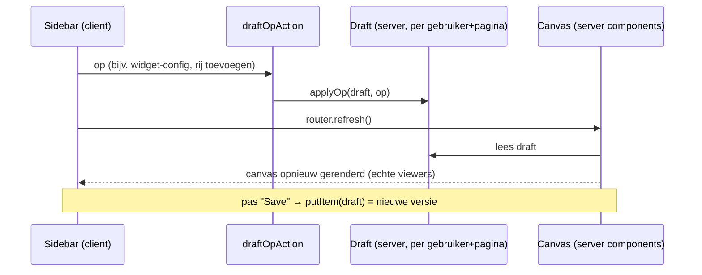

## 6. Omgevingen & deploy

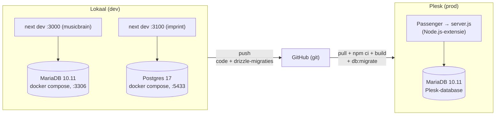

- **Code en schema** reizen via git: `db:generate` maakt van een wijziging
  in [db-schema.ts](../packages/content-core/src/db-schema.ts) een
  SQL-migratie in `drizzle/`; elke omgeving haalt zichzelf bij met
  `db:migrate`. Voor Postgres: `db-schema.pg.ts` → `db:generate:pg` →
  `drizzle-pg/` → `db:migrate:pg`. Een schemawijziging hoort dus in **beide**
  schemabestanden (zelfde kolomnamen), met een migratie per journal.
- **Lokale databases**: `npm run db:up` start MariaDB (poort 3306) én
  Postgres (poort **5433**, omdat 5432 lokaal vaak al bezet is); de
  Postgres-container maakt bij de eerste start ook `imprint_test` aan
  (`docker/pg-init.sql`).
- **Content** wordt níet gesynct: de productie-database is de bron van
  waarheid; `db:seed` importeert de bestanden éénmalig (idempotent — draait
  hij nogmaals, dan wordt dat een nieuwe versie in de historie).
- Publieke pagina's zijn prerendered (SSG); admin-saves legen de cache en
  nieuwe pagina's renderen on demand — geen rebuild nodig.
- **CI**: GitHub Actions ([ci.yml](../.github/workflows/ci.yml)) draait
  typecheck + lint + build bij elke push/PR. De build draait zonder
  `DATABASE_URL` en valt dus terug op de file-store — precies de
  v0-belofte "een checkout bouwt zonder database".
- **Backups**: `npm run backup` (Node-only; hele bitemporale historie +
  users + assets, retentie) — zie [backups.md](backups.md); asset-wezen
  opruimen met `npm run assets:gc` (houdt alles wat óóit gerefereerd is).

## 7. Nieuwe site ("imprint") toevoegen

De repository bevat naast MusicBrain een tweede site onder `sites/imprint`:
de publieke productsite van Imprint zelf. De siteconfig loopt via de
`ContentStore`: lokaal met een eigen `DATABASE_URL` naar de aparte
**Postgres**-database `imprint` (de tweede backend, §4), zonder URL via de
eigen `content/`-map. De publieke routes
zijn statisch; hun overige inhoud staat in deze eerste versie nog in code en
er is nog geen admin. Daarmee zijn opslag en identiteit al geïsoleerd van
MusicBrain, terwijl de volledige redactionele keten nog moet worden aangesloten.

1. `sites/<naam>/` scaffolden (Next.js), `@imprint/content-core` als
   dependency.
2. Eigen `src/widgets/registry.ts` + `components.tsx` (de catalogus mag
   compleet anders zijn dan die van musicbrain).
3. Eigen design-tokens in `globals.css`.
4. `imprint.config.ts` schrijven (`defineImprint`: id, `store.databaseUrl`
   + `contentDir`, widgetcatalogus, sessiecookie, assets) en in
   `src/lib/content.ts` met `createImprint()` tot instantie maken — MariaDB
   of Postgres, het URL-schema beslist; zonder URL de eigen `content/`-map.

De kern verandert daarbij niet — dat is de kern van het ontwerp.

## 8. Tests: contractsuite en karakterisatie

`npm test` draait in elke workspace diens eigen `test`-script (`npm run test
--workspaces`), met Node's ingebouwde testrunner (`node --test` via `tsx`,
geen extra framework); CI doet hetzelfde. Per workspace, omdat `tsx` de
tsconfig van de map pakt waarin hij draait: de site-tests hebben de
`@/`-paden van de site nodig, en straks hebben engine-packages hun eigen
tsconfig. De tests zijn
**karakterisatietests** (Fase 0): ze leggen het huidige gedrag vast, zodat de
extractie in Fase 1–4 aantoonbaar niets verandert. Ze schrijven géén
verwachtingen voor die de code nu niet waarmaakt.

| suite | bestand | bewaakt |
|---|---|---|
| **ContentStore-contract** | `packages/content-core/test/store-contract.ts` | de leessemantiek die élke backend moet delen: taal-overlay op EN, drafts/toekomst verborgen, `asOf` in de toekomst, prefix, sortering, schema-defaults, widget-validatie bij lezen. Eén fixture-set (`fixtures.ts`), door elke backend zelf gematerialiseerd |
| file-store | `test/file-store.test.ts` | contract + file-eigen: `asOf` = alleen valid time, lege mappen, kapot bestand breekt de build |
| **WritableContentStore-contract** | `test/writable-contract.ts` | de schrijfkant die elke databasebackend deelt: nieuwe versie supersedeert, historie nieuwste eerst, tijdreizen op beide assen, tombstone, `listItems` negeert valid time en sorteert op slug/lang, zod- en referentieweigering, onbekende widget geweigerd bij opslaan |
| db-store (MariaDB) | `test/db-store.test.ts` | lees- + schrijfcontract tegen `TEST_DATABASE_URL`, tabellen uit `drizzle/` |
| db-store (Postgres) | `test/db-store.pg.test.ts` | exact dezelfde suites tegen `TEST_PG_DATABASE_URL`, tabellen uit `drizzle-pg/` |
| memory-store | `test/memory-store.test.ts` | exact dezelfde suites tegen de geheugen-backend; draait altijd, geen database nodig |
| backendkeuze | `test/db.test.ts` | `dialectOf()`: URL-schema → dialect |
| composition root | `packages/extension-api/test/imprint.test.ts` | `defineImprint` weigert ongeldige config; `resolveImprint` levert file-/MariaDB-/Postgres-instantie met juiste write-side, users, sessie- en asset-defaults; `createImprint` is één instantie per id |
| widget-model | `test/widgets.test.ts` | `WidgetTypeRegistry` (dubbel, onbekend, ongeldig, defaults), layoutschema's |
| relaties, itinerary | `test/relations.test.ts`, `test/itinerary.test.ts` | `extractRefs`/`validateReferences`, afgeleide reis |
| renderer-normalisatie | `packages/runtime-admin/test/layout.test.ts` | `layoutRows()`: legacy template+regio's → rijen, presets |
| studio-ops | `sites/musicbrain/test/layout-ops.test.ts` | `applyOp()`: alle draft-mutaties, geen widgetverlies, limieten |
| catalogus | `sites/musicbrain/test/catalog.test.ts` | de exacte widgetset van MusicBrain, en dat alle `content/`-pagina's ertegen valideren |
| **renderer (golden HTML)** | `sites/musicbrain/test/render/` | de HTML van `PageRenderer`, alle viewers, `DefaultView` en `SiteChrome`; zie hieronder |
| **CSS-dekking** | `sites/musicbrain/test/render/css-coverage.test.ts` | dat elke class in de golden HTML CSS krijgt uit de eigen bronnen van de site; zie hieronder |

De databasesuites draaien alleen met `TEST_DATABASE_URL` (MariaDB) en/of
`TEST_PG_DATABASE_URL` (Postgres): wegwerpdatabases waarvan de naam op
`_test` eindigt; de suites droppen en hermaken de tabellen met de échte
drizzle-migraties van het dialect. Lokaal: de Postgres-container maakt
`imprint_test` zelf aan; voor MariaDB eenmalig

```bash
docker compose exec -T db mariadb -uroot -pimprint-root -e \
  "CREATE DATABASE IF NOT EXISTS imprint_test; GRANT ALL ON imprint_test.* TO 'imprint'@'%';"
npm run test:db
```

Zonder die variabelen worden de suites overgeslagen, zodat `npm test` op een
kale checkout en in CI groen is. Een derde databasebackend (het bitemporele
register) is straks: één klasse op `DbContentStoreBase` plus één testbestand
van twintig regels dat dezelfde twee suites aanroept.

### Renderer-karakterisatie (Fase 2, stap 1)

Voordat de renderer naar de engine verhuist, ligt vast wat hij nu oplevert.
De suite rendert de échte server components naar HTML in gewone Node, met
React's eigen prerenderer (die async server components aankan), en vergelijkt
met *golden files* in `sites/musicbrain/test/render/__golden__/`: per
widgettype één bestand met al zijn gevallen, plus pagina's, default views en
de chrome.

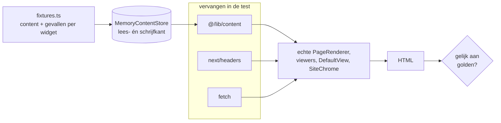

- **Wat vervangen wordt, zijn precies de koppelingen die Fase 2 weghaalt**:
  `@/lib/content` (de store-singletons) wordt de geheugen-backend,
  `next/headers` (gelezen door `readOpts()` voor de as-of-preview) zegt "geen
  preview", en `fetch` (album- en api-widget) krijgt vaste antwoorden. Dat
  vervangen loopt via `mock.module` van de Node-testrunner, vandaar de vlag
  `--experimental-test-module-mocks` in het site-testscript.
- **Productieconfiguratie, niet de hint-paden**: de store heeft een
  schrijfkant, dus `planning`, `list` en `template` renderen echte data zoals
  op de databasesite, in plaats van "needs the database".
- **Dekking wordt afgedwongen**: een test faalt als een geregistreerd
  widgettype geen gevallen heeft, en een andere als een widget een URL
  ophaalt die geen vast antwoord heeft.
- **Deterministisch**: vaste antwoorden in plaats van netwerk, datums in 2025
  of 2026 en 2099 zodat "nu" er altijd tussen valt, en het footerjaar wordt
  geneutraliseerd.
- **Bewust gewijzigde weergave?** Draai
  `UPDATE_GOLDEN=1 npm test --workspace=musicbrain` en review de diff van de
  golden files zoals elke andere codewijziging.
- **Engine-packages in de test**: `tsx` past de JSX-instellingen van een
  tsconfig alleen toe op bestanden binnen diens map. Daarom draaien de
  site-tests met `sites/musicbrain/tsconfig.test.json`, die de
  site-instellingen uitbreidt naar `packages/*/src`. Next en `tsc` gebruiken
  gewoon `tsconfig.json`.
- **CSS-dekking**: de golden HTML ziet niet of een class ook CSS krijgt, en
  een build faalt er ook niet op. Staan componenten in een engine-package,
  dan moet Tailwind dat package scannen via een `@source`-regel in
  `globals.css`, anders verdwijnen hun classes stil. De testmap staat juist
  buiten de scan: de golden HTML bevat dezelfde classes en zou een vergeten
  `@source` maskeren. `css-coverage.test.ts` bouwt de CSS twee keer, zoals
  ingesteld en mét de golden HTML gescand (testcode blijft buiten, anders
  tellen class-achtige strings in tests mee), en eist dat die gelijk zijn.
  Elke bouw draait in een eigen Node-proces: de Tailwind-plugin cachet per
  invoerbestand, waardoor een tweede bouw in hetzelfde proces stil het
  eerste resultaat teruggeeft. Een gevoeligheidstest met een verzonnen class
  bewaakt dat de vergelijking echt iets kan vangen.

Gevonden bij het vastleggen, niet gerepareerd (karakterisatie verandert geen
gedrag): de releases-sectie in productmodus, dus ook op de productpagina,
toont releases met een datum in de toekomst, terwijl `/releases` die
verbergt. Staat in de backlog.

**Nog niet gekarakteriseerd** (bewust; staat in de backlog): de admin-flows
(login, save, restore, studio-save) en de API-routes. Die worden nu alleen
end-to-end bewaakt door `npm run smoke` en `npm run testcase:bitemporal`
tegen een draaiende site.
