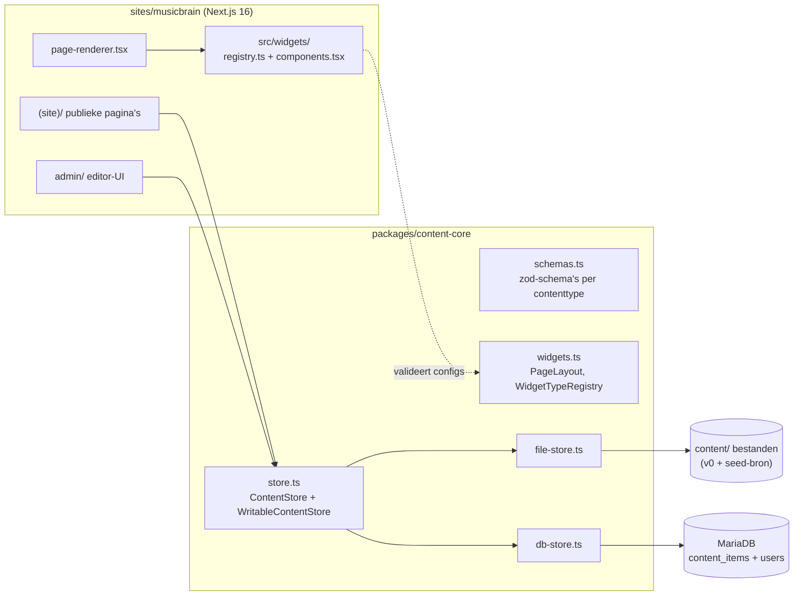
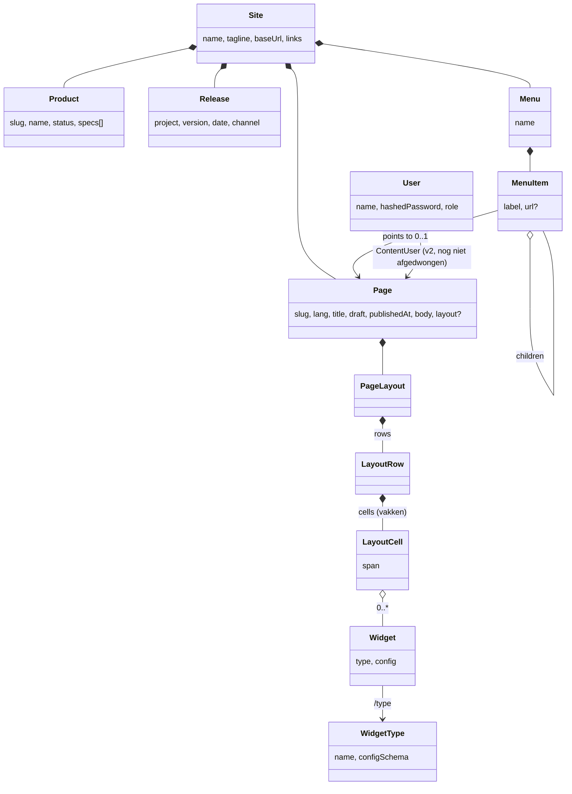
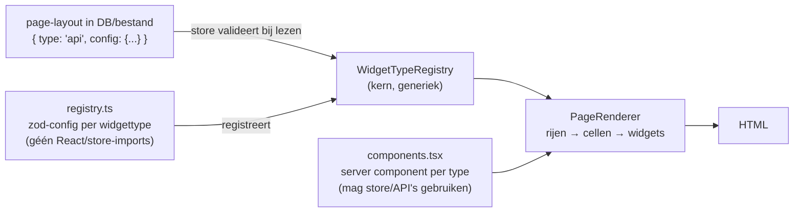
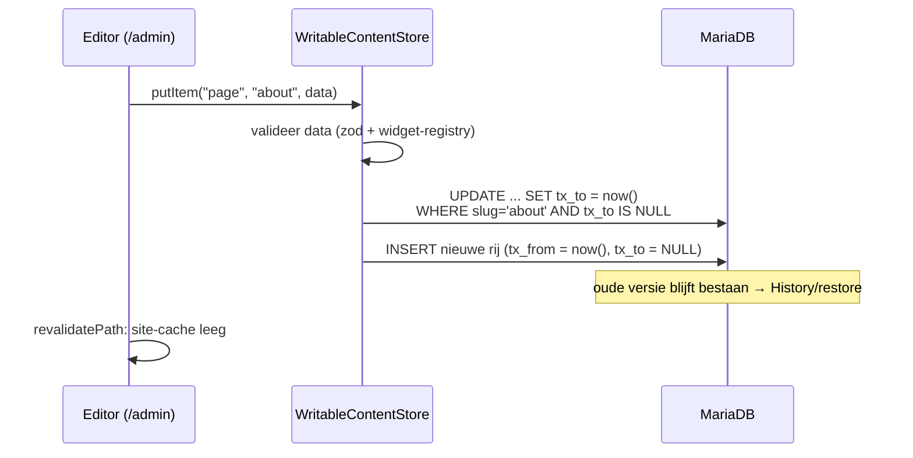
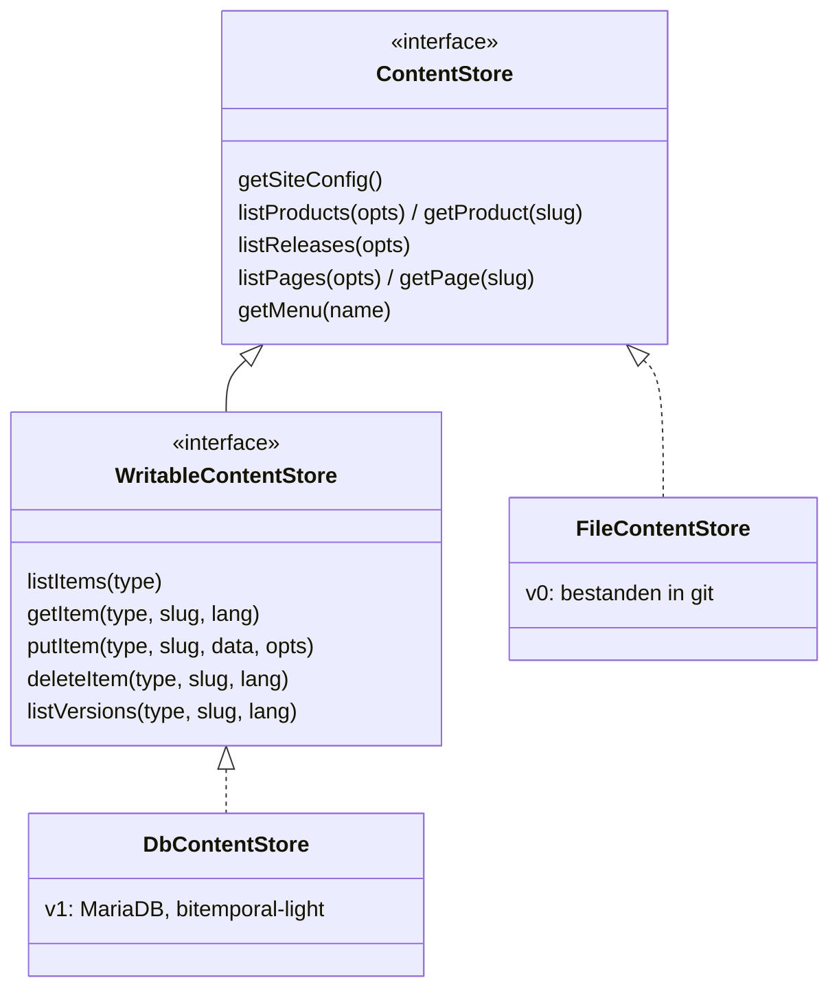
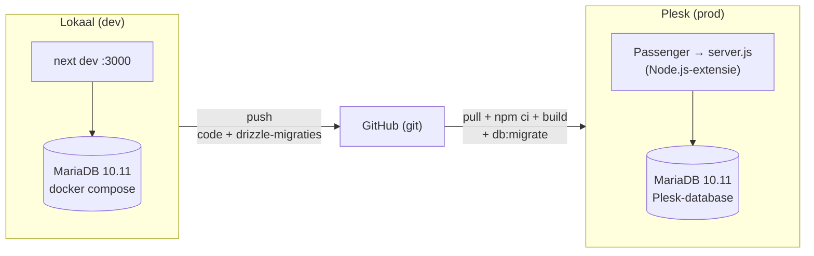

# Imprint — architectuur

Eén publicatie-motor, meerdere merk-sites ("imprints"). Dit document beschrijft
het ontwerp zoals het er staat; de requirements staan in
[website-requirements.md](website-requirements.md) (eisnummers W*/S*/§B/§C
worden in code-comments aangehaald).

## 1. Overzicht

npm-workspaces-monorepo. De kern (`@imprint/content-core`) kent schema's,
opslag en het widget-model, maar geen React en geen concrete widgets; elke
site levert zijn eigen gezicht én zijn eigen widget-catalogus.

De site praat **uitsluitend** via de `ContentStore`-interface met content
(S1/§B3). Met `DATABASE_URL` gezet kiest [content.ts](../sites/musicbrain/src/lib/content.ts)
de database-store; zonder valt hij terug op de file-store, zodat een kale
checkout (en CI) altijd bouwt.

## 2. Contentmodel

Implementatie van het UML-contentmodel. Elk type heeft een zod-schema in
[schemas.ts](../packages/content-core/src/schemas.ts) — dat ene schema
valideert de content bij het lezen én genereert de admin-formulieren.

Verschillen met het oorspronkelijke UML:

- `ContentItem`-subklassen zijn aparte zod-schema's; het `/type`-kenmerk is
  de `type`-kolom in de database. `NewsItem` is een pagina onder `posts/`.
- `PageLayout` is het Pleio-achtige vakkenmodel: **rijen → cellen → widgets**.
  Een cel heeft een relatieve breedte (`span` in fractie-eenheden: cellen
  1|2 renderen als ⅓ + ⅔). Een ouder formaat (template + regio's) parseert
  nog en wordt bij renderen/bewerken naar rijen omgezet.
- `User`/`RoleType` zijn actief (admin-login); de rol per content-item
  (`ContentUser`) staat in het schema maar wordt nog niet gehandhaafd.

## 3. Widgets: kern kent het model, de site de catalogus

Nieuwe widget = één configschema + één component, verder niets:

- De **store** valideert elke widget-config tegen het geregistreerde schema:
  een kapotte widget breekt de build/save met een duidelijke fout, in plaats
  van stil verkeerd te renderen.
- De **admin-composer** gebruikt dezelfde schema's (via `z.toJSONSchema`) om
  per widget een configformulier te genereren.
- Catalogus van musicbrain: `text`, `treeview`, `api` (JSON-endpoint met
  veldselectie), `releases`, `products`.

## 4. Opslag: bitemporal-light (§B3)

Eén generieke tabel `content_items`; de payload per type blijft een
zod-gevalideerd JSON-document. Twee tijdassen:

| as | kolommen | betekenis | levert |
|---|---|---|---|
| valid time | `valid_from` / `valid_to` | wanneer de content *geldt* | geplande publicatie (S6), "site zoals op datum X" (S5) |
| transaction time | `tx_from` / `tx_to` | wanneer wij het *beweerd* hebben | versiegeschiedenis + rollback (S4) |

Elke save is een nieuwe rij; `tx_to IS NULL` markeert de huidige versie.

Lezen voor de site is altijd: `tx_to IS NULL` (huidige bewering) én
`valid_from ≤ asOf < valid_to` (geldig op dat moment). Terugrollen =
een oude payload opnieuw asserteren; de geschiedenis zelf wordt nooit
herschreven. Dit model migreert later naadloos naar het echte
bitemporal-register (bitemporal2026) — de site merkt daar niets van, want
alles loopt via de `ContentStore`-interface.

Alle reads nemen `ReadOptions` mee: `asOf` (tijdreizen), `lang`
(taal-fallback naar EN, S9) en `includeDrafts` (previews).

## 5. Admin (/admin)

- **Auth:** scrypt-wachtwoordhashes in de `users`-tabel, HMAC-signed
  session-cookie ([auth.ts](../sites/musicbrain/src/lib/auth.ts)). Rollen:
  `admin`/`editor` mogen schrijven, `reader` niet.
- **Formulieren uit schema's:** `contentFormSchema` zet het zod-schema om
  naar JSON Schema; `SchemaForm` rendert scalars als echte controls en
  complexe/recursieve velden als gevalideerde JSON-boxen. Een nieuw veld
  hoort dus in het schema, niet als los formulierveld.
- **Composer:** visueel vakkenmodel — "+"-balken voegen rijen boven/onder
  toe, "+"-stroken cellen links/rechts; widgets verhuizen met pijltjes,
  celbreedte met −/+. Geen pixel-WYSIWYG: het canvas toont de echte
  verhoudingen, de site bepaalt de styling.
- **Menu-editor:** genest lijstje; een item wijst naar een pagina (dropdown
  met echte pagina's), een URL, of niets (groepslabel).
- **History:** alle versies per item, met restore.

## 6. Omgevingen & deploy

- **Code en schema** reizen via git: `db:generate` maakt van een wijziging
  in [db-schema.ts](../packages/content-core/src/db-schema.ts) een
  SQL-migratie in `drizzle/`; elke omgeving haalt zichzelf bij met
  `db:migrate`.
- **Content** wordt níet gesynct: de productie-database is de bron van
  waarheid; `db:seed` importeert de bestanden éénmalig (idempotent — draait
  hij nogmaals, dan wordt dat een nieuwe versie in de historie).
- Publieke pagina's zijn prerendered (SSG); admin-saves legen de cache en
  nieuwe pagina's renderen on demand — geen rebuild nodig.

## 7. Nieuwe site ("imprint") toevoegen

1. `sites/<naam>/` scaffolden (Next.js), `@imprint/content-core` als
   dependency.
2. Eigen `src/widgets/registry.ts` + `components.tsx` (de catalogus mag
   compleet anders zijn dan die van musicbrain).
3. Eigen design-tokens in `globals.css`.
4. Store aanwijzen in `src/lib/content.ts` (eigen `content/`-map of eigen
   database).

De kern verandert daarbij niet — dat is de kern van het ontwerp.
