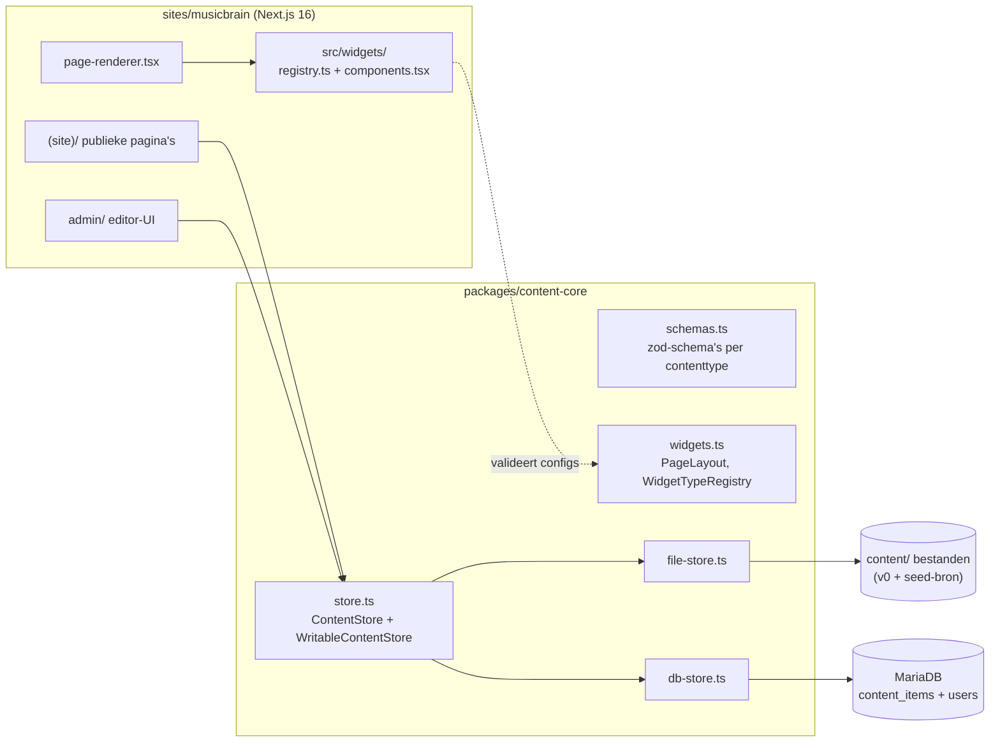
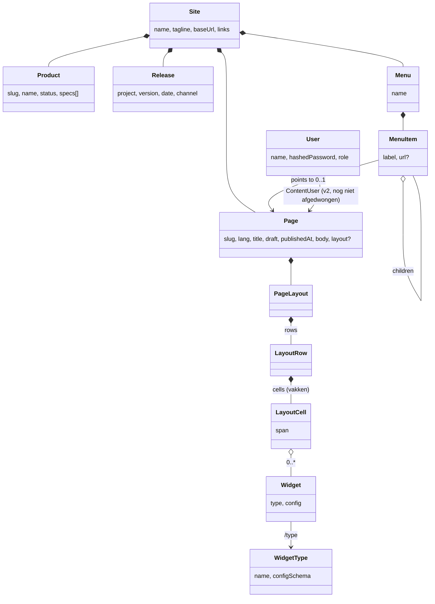
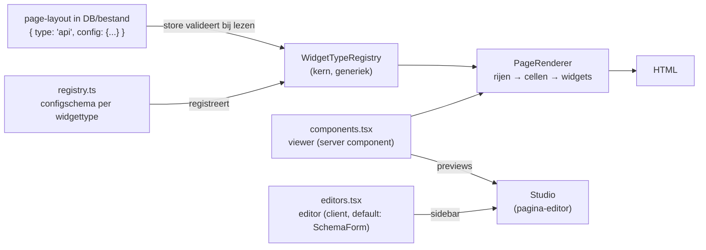
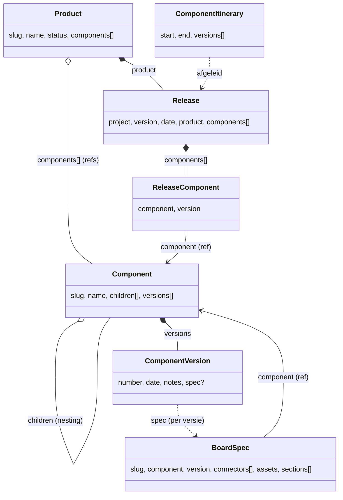
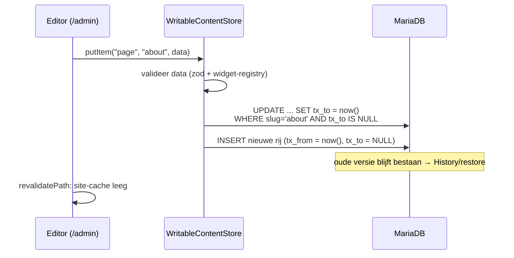
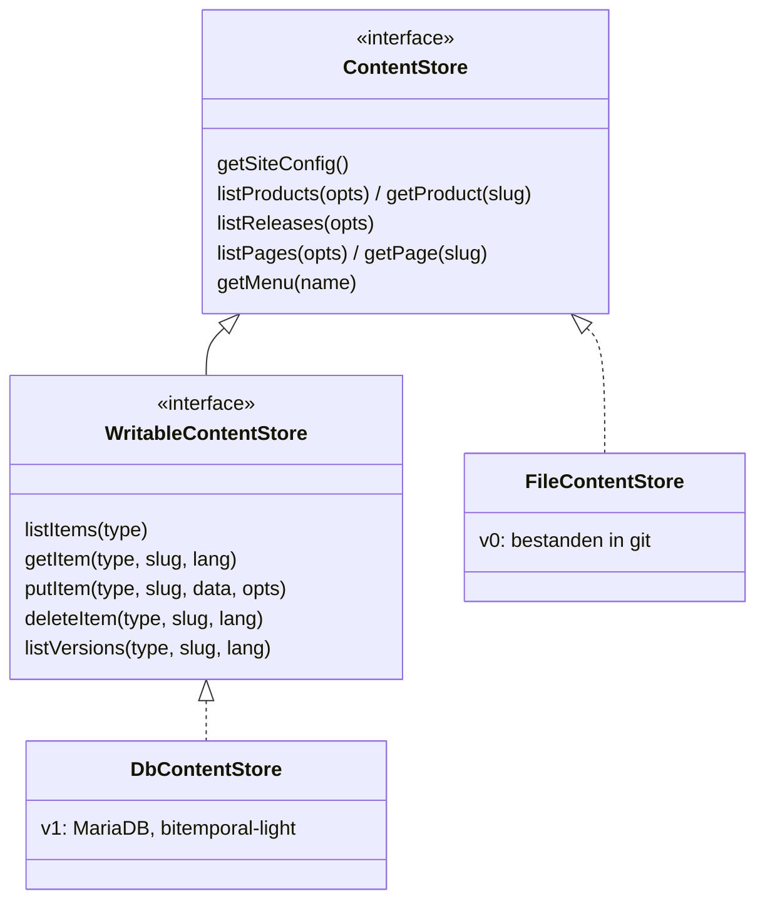
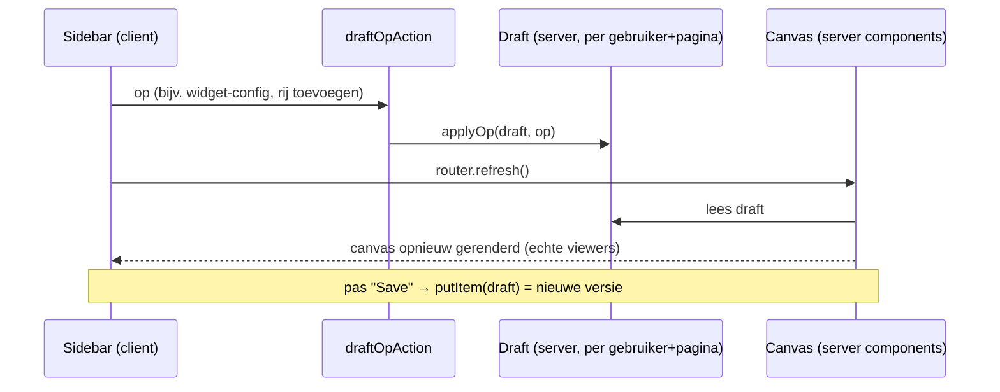
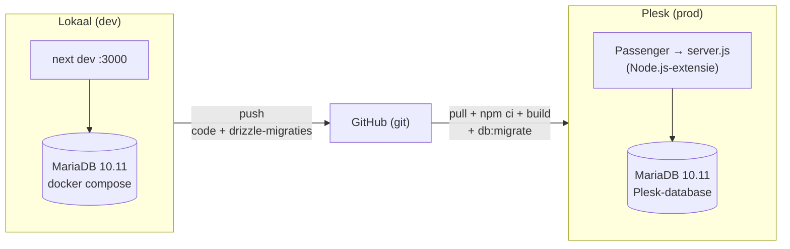

# Imprint — architectuur

Eén publicatie-motor, meerdere merk-sites ("imprints"). Dit document beschrijft
het ontwerp zoals het er staat; de requirements staan in
[website-requirements.md](website-requirements.md) (eisnummers W*/S*/§B/§C
worden in code-comments aangehaald).

## 1. Overzicht

npm-workspaces-monorepo. De kern (`@imprint/content-core`) kent schema's,
opslag en het widget-model, maar geen React en geen concrete widgets; elke
site levert zijn eigen gezicht én zijn eigen widget-catalogus.

De site praat **uitsluitend** via de `ContentStore`-interface met content
(S1/§B3). Met `DATABASE_URL` gezet kiest [content.ts](../sites/musicbrain/src/lib/content.ts)
de database-store; zonder valt hij terug op de file-store, zodat een kale
checkout (en CI) altijd bouwt.

## 2. Contentmodel

Implementatie van het UML-contentmodel. Elk type heeft een zod-schema in
[schemas.ts](../packages/content-core/src/schemas.ts) — dat ene schema
valideert de content bij het lezen én genereert de admin-formulieren.

Verschillen met het oorspronkelijke UML:

- `ContentItem`-subklassen zijn aparte zod-schema's; het `/type`-kenmerk is
  de `type`-kolom in de database. `NewsItem` is een pagina onder `posts/`.
- `PageLayout` is het Pleio-achtige vakkenmodel: **rijen → cellen → widgets**.
  Een cel heeft een relatieve breedte (`span` in fractie-eenheden: cellen
  1|2 renderen als ⅓ + ⅔). Een ouder formaat (template + regio's) parseert
  nog en wordt bij renderen/bewerken naar rijen omgezet.
- `User`/`RoleType` zijn actief (admin-login); de rol per content-item
  (`ContentUser`) staat in het schema maar wordt nog niet gehandhaafd.
  Gebruikers lopen **niet** via de `ContentStore`: ze zijn geen content en
  krijgen bewust géén historie — een bitemporale tabel bewaart elke rij voor
  altijd, en dat is precies wat je met wachtwoordhashes niet wilt. Ze hebben
  een eigen `DbUserStore`
  ([user-store.ts](../packages/content-core/src/user-store.ts)), gedeeld door
  **/admin/users**, de seed en de `npm run user`-CLI, zodat de regels
  (wachtwoordlengte, "laatste admin blijft admin") overal gelden. Hashing en
  wachtwoordbeleid staan apart in
  [passwords.ts](../packages/content-core/src/passwords.ts).
- **Sessies** zijn stateless: een HMAC-ondertekend cookie met naam, rol en
  vervaltijd (12u), zonder tabel. Dat betekent dat een wachtwoordreset of
  rolwijziging een al openstaande sessie niet intrekt — die loopt gewoon af.
  Acceptabel bij deze handvol vertrouwde gebruikers; een `session_epoch`-kolom
  zou het dichtzetten (backlog).

## 3. Widgets: kern kent het model, de site de catalogus

Een widgettype bestaat uit drie stukken; alleen het eerste is verplicht
handwerk, de editor heeft een schema-gedreven default:

| stuk | bestand | draait | rol |
|---|---|---|---|
| **configschema** | `src/widgets/registry.ts` | overal (geen React/store) | valideert de config; bron voor het default-editorformulier |
| **viewer** | `src/widgets/components.tsx` | server | rendert de widget op de site (mag store/API's gebruiken) |
| **editor** | `src/widgets/editors.tsx` | client | bewerkt de config in de studio; default = formulier uit het schema, alleen overriden voor rijkere bewerking |

- De **store** valideert elke widget-config tegen het geregistreerde schema:
  een kapotte widget breekt de build/save met een duidelijke fout, in plaats
  van stil verkeerd te renderen.
- Config moet **JSON-serialiseerbaar** zijn (opslag als JSON); coördinaten
  e.d. relatief opslaan (0..1) zodat ze meeschalen met de vakbreedte.
- Interactieve viewers (hover/klik) zijn een dun server-component met een
  `"use client"`-eiland erin; `treeview`/`api` hebben dat niet nodig, een
  geannoteerde-afbeelding-widget wel.
- Catalogus van musicbrain: `text`, `table` (met custom grid-editor),
  `image`, `gallery` (fotoraster + lightbox, kan subject-media meenemen),
  `carousel`, `album` (externe foto-repo: JSON-API of Lightroom-share
  best-effort), `map` (Leaflet/OSM met markers), `kanban`, `itinerary`
  (component-reis door releases), `callout`/CTA, `embed` (iframe),
  `board` (geannoteerde render), `boardspec` (rendert een board-spec),
  `template` (markdown met Mustache merge fields over een content-item/
  subject), `list` (links die de content-graaf volgen), `treeview`,
  `api` (JSON-endpoint met veldselectie), `releases`, `products`.

## 3b. Product / component / release

Naast de website-content is er een productdomein: producten zijn opgebouwd
uit **componenten**, en worden in genummerde **releases** uitgebracht. Een
product-project (bijv. de MusicBrain-hardwarerepo) kan dit zelf **posten**
via de write-API; het landt in dezelfde bitemporal-store als alle content.

Modelleerkeuzes (naar het UML van Mark):

- **Component is een eigen contenttype**, niet genest in een product — omdat
  hetzelfde component in meerdere producten kan zitten. Componenten kunnen
  wél nesten (`children`), bijv. een busboard met modules.
- **Een release bevat componenten met genoteerde versie** (`components: [{
  component, version }]`) — de `ReleaseComponent`-associatie draagt het
  versienummer. Bewust géén directe relatie naar een `ComponentVersion`-
  entiteit: een versie ís geen component.
- **ProductComponentItinerary is afgeleid**, niet opgeslagen:
  [`computeItinerary()`](../packages/content-core/src/itinerary.ts) leest per
  component de eerste→laatste release af (`end: null` = zit nog in de nieuwste
  release).
- **Documentatie** hangt (voorlopig simpel) als optioneel `docs`-veld aan
  product/component: een pagina-slug of inline markdown. Differentiëren kan
  later.

**board-spec** (hardware-documentatie, D1–D10) is de eerste gedifferentieerde
documentatievorm: een eigen contenttype voor de machinaal gegenereerde
bord-info (connectors, nets, gerenderde SVG's/PNG's, proza-secties, fab-info,
hotspot-punten). Eén board-spec **per ComponentVersion** (slug
`<component>@<versie>`); de `ComponentVersion` verwijst er optioneel naar via
`spec`, en de board-spec verwijst terug naar zijn component (RelationRule
`board-spec.component → component`). De technische kern is taalneutraal, alleen
de `sections` zijn vertaalbaar (S9).

### 3d. Planning (kanban als content)

Een **planning** is een bord dat bij een product hoort en zijn **fasen**
(kolommen) declareert; de kaarten zijn een eigen contenttype **planning-item**
— want een kaart heeft een eigen eigenaar, een eigen rich-text-body en een
eigen levensloop. Een kaart verschuiven ís een `status`-wijziging, geen nieuwe
kaart, en dus **een nieuwe bitemporale versie**: de versiegeschiedenis van een
planning-item *is* het verhaal van hoe het werk door de fasen liep, en
`asOf`-preview toont het bord op elke datum. Relatieregels:
`planning → product`, `planning-item → planning`, `planning-item → component`.
De eigenaar is een gebruikersnaam (zachte verwijzing naar de users-tabel; geen
contenttype, dus geen RelationRule).

Bewerken gebeurt in de admin (`/admin/planning/<slug>`): een client-bord met
HTML5-drag&drop tussen kolommen en een edit-paneel per kaart; de mutatielogica
is puur ([`lib/planning.ts`](../sites/musicbrain/src/lib/planning.ts):
`computeMove` renummert de bron- en doelkolom), de serveracties doen de
bitemporale puts.

De **`planning`-widget** rendert een bord op de site, in twee modi: *board*
(een planning + zijn planning-items) of *generiek* — een read-only view over
elk contenttype met een aanwijsbaar fase-, eigenaar- en titelveld en de fasen
op de widget geconfigureerd. Zo toont hij bv. componenten gegroepeerd op hun
optionele `phase`-veld (dat een project via de API bijwerkt) zonder aparte
planning-items. Dit is Marks "widget = configureerbare view op data":
hoofditem + subitems + aanwijsbaar fase-veld + optionele eigenaar.

- **Assets** (renders, pinout-SVG's) gaan via de **AssetStore** (D7,
  `content-core/asset-store.ts`): `put(path,bytes) → url`, file-backend nu,
  MinIO/S3 later als config-wissel. Upload via multipart
  `POST /api/ingest/board-spec` (D5/D6): de backend slaat de bestanden op,
  herschrijft asset-namen in de doc naar URL's en doet `putItem`. Serveren via
  `GET /api/assets/...`.
- **Weergave** met lage auteurlast: `BoardSpecView` (D9) rendert een board-spec
  (interactief board of overzicht + connectors-tabel + pinouts + secties). De
  `boardspec`-widget zet dat op elke pagina met alleen een spec-slug. De
  `board`-widget-config is bovendien **afleidbaar** uit een board-spec
  (`boardSpecToBoardConfig`, D4): de punten komen uit `spec.points`, hun detail
  uit de per-connector pinout-SVG (`svgRef`, D10) — geen JSON-plak meer.
- **Navigatie (per-type pagina's, "optie B"):** elk contenttype heeft een
  eigen route — `/products/<slug>`, `/components/<slug>`, `/releases/<slug>` —
  die het item als *subject* rendert. De keten is klikbaar: productpagina →
  releases van dat product → release → zijn componenten → component → board
  (en terug: de componentpagina toont in welke producten/releases hij zit).
- **Studio-bewerkbare default-views:** een route gebruikt de layout van de
  pagina `_view/<type>` (in de studio samengesteld) met het item als subject;
  bestaat die niet, dan valt hij terug op de hand-gecodeerde weergave. In de
  studio kies je "preview als <voorbeeld-item>" zodat de widgets zich vullen
  terwijl je de template ontwerpt. `_view/*`-pagina's zijn niet publiek
  bereikbaar. Beheer via **/admin → Default views**.
- **`list`-widget** volgt de content-graaf voor die navigatie: modus `query`
  (items van een type waar `veld == waarde`, bijv. releases van dit product)
  of `refs` (een slug-array op de subject, bijv. `release.components[]`), met
  een `linkPattern` naar de doelpagina. De `template`- en `list`-widgets
  krijgen de subject van de pagina mee (PageRenderer geeft `subject` door),
  zodat dezelfde default-view zich vult voor elk item.

Omdat de `content_items`-tabel generiek is (§4), kostte dit **geen
DB-migratie**: `component` is gewoon een nieuwe waarde in de `type`-kolom,
met een eigen zod-schema.

### Relaties tussen contenttypen

Referenties tussen types (`release → product`, `product → components`,
`component → children`, …) zijn **zachte slug-verwijzingen** in de JSON,
maar hun integriteit is bewaakbaar. Een set **RelationRules** verklaart welk
veld van welk type naar welk ander type wijst; de store controleert dat bij
elke schrijfactie ([relations.ts](../packages/content-core/src/relations.ts),
`validateReferences`). De regels zijn zélf content (`type: "relations"`),
bewerkbaar in **/admin/relations** — dus configureerbaar, niet hardgecodeerd.

- Veldpaden: `product` (slug), `components[]` (array van slugs),
  `components[].component` (array van objecten met een slug-veld).
- Per regel een `enforce`-vlag: aan = een verwijzing naar niet-bestaande
  content weigert de write (422); uit = advies.
- Machine-ingest post daarom in volgorde: eerst componenten, dan het product,
  dan de releases (de bundle-POST doet dit al).

## 3c. Theming

Een **thema is content**: een set design-tokens (kleuren, fonts) als
`type: "theme"`-item, bewerkbaar in de admin met kleurpickers en bitemporeel
geversioneerd zoals alles. De aanpak volgt de standaardpraktijk:

- **Tokens als CSS custom properties** — componenten gebruiken uitsluitend
  token-klassen (`bg-background`, `text-accent`, …; afgedwongen door de
  werkafspraak "geen losse hexkleuren"). `globals.css` houdt de
  default-waarden op `:root` (tevens de no-JS-fallback); die default is het
  **Amber-thema** (het "open brain"-palet). Fonts gaan via een indirectie
  (`--sans`/`--mono` op `:root`, door `@theme inline` gemapt naar Tailwinds
  `--font-*`): zou `@theme inline` direct naar de next/font-variabelen
  wijzen, dan bakt Tailwind die ín de `font-mono`-utilities en raken
  thema-overrides ze niet meer.
- **`[data-theme="<naam>"]`-switching** — de site rendert per thema een
  CSS-blok dat de variabelen overschrijft (`ThemeStyles`). Omdat Tailwind v4
  de tokens via `@theme inline` aan de variabelen bindt, restylet één
  attribuutwissel de hele site, direct.
- **Gebruikers-switcher** (IDE-stijl) in de header: zet `data-theme` op
  `<html>` en bewaart de keuze in localStorage; een klein inline-script
  bovenin `<body>` past de keuze vóór de eerste paint toe (geen flash).
- **Formaat**: het zod-`ThemeSchema` is bewust plat (7 kleurtokens + een
  optioneel achtste, `accent2`, voor sierelementen zoals de scope-divider —
  leeg valt het serverside terug op `accent` — plus optionele font-stacks) —
  in de geest van het W3C **Design Tokens (DTCG)**-formaat (tokens als
  data), maar zonder de volle diepte daarvan. Import/export naar DTCG-JSON
  kan later een dunne mapping zijn.
- **Afgeleide textuur**: de achtergrond (dot-grid + accentgloed bovenin,
  uit het "open brain"-ontwerp) staat in `globals.css` en is met
  `color-mix()` afgeleid van de tokens `--muted`/`--accent`; hij kleurt dus
  automatisch mee met elk thema zonder eigen tokens nodig te hebben.
- **Afbakening**: tokens (kleur/typografie) zijn client-side wisselbaar; de
  **grove pagina-indeling** (logo-positie, header-variant) is een
  server-concern en hoort bij een aparte chrome-variant per site — bewust
  níet in het thema gestopt (staat op de backlog).

## 4. Opslag: bitemporal-light (§B3)

Eén generieke tabel `content_items`; de payload per type blijft een
zod-gevalideerd JSON-document. Twee tijdassen:

| as | kolommen | betekenis | levert |
|---|---|---|---|
| valid time | `valid_from` / `valid_to` | wanneer de content *geldt* | geplande publicatie (S6), "site zoals op datum X" (S5) |
| transaction time | `tx_from` / `tx_to` | wanneer wij het *beweerd* hebben | versiegeschiedenis + rollback (S4) |

Elke save is een nieuwe rij; `tx_to IS NULL` markeert de huidige versie.

Lezen voor de site is volledig bitemporeel op één moment: `tx_from ≤ asOf <
tx_to` (wat we op dat moment beweerden) én `valid_from ≤ asOf < valid_to`
(wat op dat moment gold). Zonder `asOf` is dat moment "nu", en is de
tx-clausule gelijkwaardig aan `tx_to IS NULL` — maar met een `asOf` in het
verleden komen de tóen actuele (inmiddels gesuperseerde of getombstonede)
rijen terug: echt tijdreizen. Terugrollen = een oude payload opnieuw
asserteren; de geschiedenis zelf wordt nooit herschreven.

**As-of-preview** (S6) maakt dat tijdreizen zichtbaar: het admin-dashboard
("Time travel") opent de publieke site met een gekozen moment. Technisch:
Next **draft mode** (de bypass-cookie laat de prerendered pagina's dynamisch
renderen voor déze browser) plus een `imprint_asof`-cookie met het moment;
[preview.ts](../sites/musicbrain/src/lib/preview.ts) vertaalt dat per request
naar `ReadOptions` en elke publieke pagina geeft die door aan de store.
In-/uitstappen via `/api/preview?asOf=…&to=…` (editors only) en
`/api/preview/exit`; een banner in de site-layout markeert de preview.
Beperking: widgets die zelf content ophalen (posts, list, releases…) kijken
nog naar "nu" — de kernpagina's reizen mee. Dit model migreert later naadloos naar het echte
bitemporal-register (bitemporal2026) — de site merkt daar niets van, want
alles loopt via de `ContentStore`-interface.

Alle reads nemen `ReadOptions` mee: `asOf` (tijdreizen), `lang`
(taal-fallback naar EN, S9) en `includeDrafts` (previews).

Dezelfde store is ook als **JSON-API** ontsloten (`/api/content/...`, zie de
README): één catch-all route handler die de `ContentStore` aanroept, met
dezelfde query-parameters. API, site en admin kunnen daardoor per definitie
niet van elkaar afwijken.

- **GET** is read-only en publiek (alleen gepubliceerde content; `?drafts=1`
  met admin-sessie). Endpoints o.a. `products`, `components`, `board-specs`
  (`?component=`), `releases` (`?product=`), en de afgeleide
  `itinerary/<product>`.
- **POST** is de schrijfkant voor product-projecten: `Authorization: Bearer
  <INGEST_TOKEN>` (constant-time check; leeg token = schrijven uit). Eén item
  via `POST /api/content/<type>/<slug>`, een bundle via `POST /api/content`
  met `{ product?, components?, releases? }`, of assets+doc via multipart
  `POST /api/ingest/board-spec`. Elke put loopt door de zod-validatie + de
  referentiecheck en wordt een nieuwe bitemporale versie — dus ook machine-
  posts hebben volledige historie en rollback. Schrijven revalideert de
  site-cache. Een handleiding voor de consument staat in
  [mmb-ingest-guide.md](mmb-ingest-guide.md).
- **Webhook**: `POST /api/webhooks/github` (W2/S7) maakt van GitHub-releases
  release-items — HMAC-signed (`GITHUB_WEBHOOK_SECRET`), mapping
  repo→project/product in de site-config (`releaseSources`), onbekende repos
  genegeerd.
- **Metamodel**: `GET /api/meta` publiceert het contentmodel als JSON Schema
  (2020-12) per type — gegenereerd uit dezelfde zod-schema's, dus per
  definitie synchroon — plus de actieve relatieregels als referentietypen.
  Bedoeld voor externe form-builders (het bitemporal/Omnium-formulierspoor);
  een V3-vertaling kan er later naast onder `?format=v3`.
- **Feed**: `GET /feed.xml` — RSS 2.0 van de devlog (`posts/`-pagina's).

## 5. Admin (/admin)

- **Auth:** scrypt-wachtwoordhashes in de `users`-tabel, HMAC-signed
  session-cookie ([auth.ts](../sites/musicbrain/src/lib/auth.ts)). Rollen:
  `admin`/`editor` mogen schrijven, `reader` niet.
- **Formulieren uit schema's:** `contentFormSchema` zet het zod-schema om
  naar JSON Schema; `SchemaForm` rendert scalars als echte controls en
  complexe/recursieve velden als gevalideerde JSON-boxen. Een nieuw veld
  hoort dus in het schema, niet als los formulierveld.
- **Studio (pagina-editor):** WYSIWYG-achtig, Pleio/Gutenberg-stijl. Het
  canvas ís de pagina: de echte widget-viewers, met echte data, binnen de
  echte site-omlijsting (`SiteChrome`, gedeeld met de publieke layout).
  Klik op een widget → links een sidebar met zíjn editor; een wijziging
  gaat (gedebounced) naar een **serverside draft** en het canvas rendert
  opnieuw — direct effect, zonder dat er iets is gepubliceerd. "+"-balken
  voegen rijen toe, "+"-stroken vakken links/rechts; pas "Save" assereert
  de draft als nieuwe versie in de store.
- **Menu-editor:** genest lijstje; een item wijst naar een pagina (dropdown
  met echte pagina's), een URL, of niets (groepslabel).
- **History:** alle versies per item, met restore.

## 6. Omgevingen & deploy

- **Code en schema** reizen via git: `db:generate` maakt van een wijziging
  in [db-schema.ts](../packages/content-core/src/db-schema.ts) een
  SQL-migratie in `drizzle/`; elke omgeving haalt zichzelf bij met
  `db:migrate`.
- **Content** wordt níet gesynct: de productie-database is de bron van
  waarheid; `db:seed` importeert de bestanden éénmalig (idempotent — draait
  hij nogmaals, dan wordt dat een nieuwe versie in de historie).
- Publieke pagina's zijn prerendered (SSG); admin-saves legen de cache en
  nieuwe pagina's renderen on demand — geen rebuild nodig.
- **CI**: GitHub Actions ([ci.yml](../.github/workflows/ci.yml)) draait
  typecheck + lint + build bij elke push/PR. De build draait zonder
  `DATABASE_URL` en valt dus terug op de file-store — precies de
  v0-belofte "een checkout bouwt zonder database".
- **Backups**: `npm run backup` (Node-only; hele bitemporale historie +
  users + assets, retentie) — zie [backups.md](backups.md); asset-wezen
  opruimen met `npm run assets:gc` (houdt alles wat óóit gerefereerd is).

## 7. Nieuwe site ("imprint") toevoegen

1. `sites/<naam>/` scaffolden (Next.js), `@imprint/content-core` als
   dependency.
2. Eigen `src/widgets/registry.ts` + `components.tsx` (de catalogus mag
   compleet anders zijn dan die van musicbrain).
3. Eigen design-tokens in `globals.css`.
4. Store aanwijzen in `src/lib/content.ts` (eigen `content/`-map of eigen
   database).

De kern verandert daarbij niet — dat is de kern van het ontwerp.
