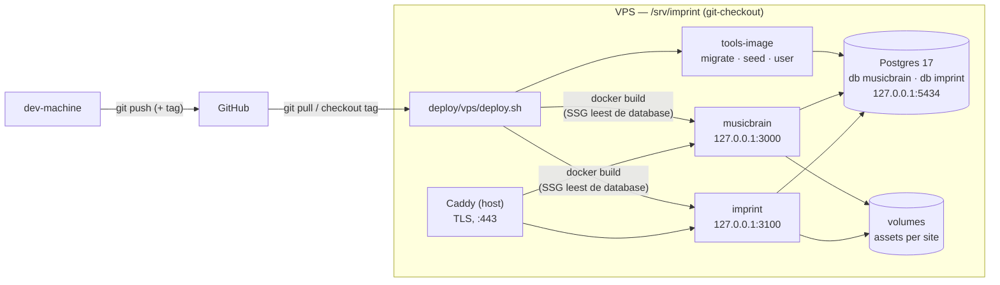

# Deploy op de VPS

Imprint draait op **vps1.paratmos.nl** (mijn.host, Ubuntu, Docker, Caddy op de
host), naast Omnium. Hoe die machine zelf is ingericht — gebruiker, firewall,
Caddy, backups naar de NAS — staat in het Bitemporal-repo:
`bitemp_register_v06/docs/VPS_DEPLOYMENT.md`. Dit document gaat alleen over
wat Imprint daar bovenop zet. Alles wat je nodig hebt staat in
[deploy/vps/](../deploy/vps/) en de [Dockerfile](../Dockerfile) in de root.

De Plesk-deploy (README §"Deploy naar Plesk") is sinds 1 september 2026
historie: de shared hosting heeft Node.js uitgezet.

## Het model: git levert de bron, containers draaien hem



| Wat | Waar | Verandert bij |
|---|---|---|
| Engine, widgets, site-code, CSS | de image (één per site) | een deploy |
| Content, layouts, users, historie | Postgres, één database per site | een admin-save |
| Uploads (AssetStore) | named volume per site, `/data/assets` | een upload |
| Secrets | `deploy/vps/.env` op de VPS | met de hand |

**Waarom geen "kern als container, widgets en CSS als losse bestanden"?** De
compositie van een imprint is buildtime: viewers zijn React server components
die via `transpilePackages` worden meegecompileerd, de catalogus wordt
geïmporteerd (niet dynamisch geladen) en Tailwind genereert de CSS uit de
`@source`-paden. Er valt tijdens het draaien niets in te mounten. De scheiding
die wél bestaat is die uit de tabel: code in de image, content in de database.

**Waarom bouwen op de VPS en niet in CI?** Publieke pagina's zijn SSG; `next
build` leest de ContentStore. Een build zonder database valt terug op
`sites/<site>/content` en bakt dan verouderde pagina's in, die pas verversen
bij een admin-save. De build krijgt daarom de database mee: als
BuildKit-secret (komt niet in de image of de history) en via `network: host`
naar de loopback-poort van Postgres. Een secret telt niet mee in de
build-cache, en de content in de database al helemaal niet; `deploy.sh` geeft
daarom een `BUILD_ID` mee dat een verse build afdwingt.

**Eén Postgres, per site een database en een rol** (`pg-init.sh`): de ene site
kan de andere niet lezen. MariaDB blijft een geteste backend
(`npm run test:db`), maar draait niet in productie.

## Eerste keer

Vereist: SSH-toegang tot de VPS (Bitemporal-handover §4) en Docker + Caddy
zoals in het Omnium-runbook.

```bash
# op de VPS
sudo mkdir -p /srv/imprint /srv/imprint-backups && sudo chown "$USER": /srv/imprint /srv/imprint-backups
git clone https://github.com/MarkWestbroek/imprint-engine.git /srv/imprint
cd /srv/imprint/deploy/vps
cp .env.example .env && chmod 600 .env     # invullen: openssl rand -hex 24 per geheim

# De Imprint-site eerst: draait al op Postgres, niets te migreren.
docker compose build tools
./deploy.sh migrate imprint                        # start postgres, maakt het schema
./deploy.sh seed imprint --only=site,page,user     # content/ + eerste admin
SITES=imprint ./deploy.sh                          # bouwt (SSG leest de database) en start
curl -I http://127.0.0.1:3100/
```

Eerst seeden, dan bouwen: de seed leegt de Next-cache niet (backlog §6), dus
na een latere seed is opnieuw `./deploy.sh` nodig. Haal `SEED_ADMIN_PASSWORD`
na de eerste seed weer uit `.env`.

Dan Caddy: neem het blok uit [Caddyfile.snippet](../deploy/vps/Caddyfile.snippet)
over in `/etc/caddy/Caddyfile` en `sudo systemctl reload caddy` — **pas als
het A-record naar de VPS wijst**, anders blijft Caddy vergeefs een certificaat
aanvragen. Geen AAAA-record naar een parkeeradres laten staan.

## Bijwerken

```bash
cd /srv/imprint/deploy/vps
./deploy.sh                 # alle sites, git pull op de huidige branch
./deploy.sh v0.11.0         # alle sites, op die tag
SITES=musicbrain ./deploy.sh
```

Per site: migreren → bouwen → herstarten, sites na elkaar (twee gelijktijdige
`next build`-runs lopen uit het geheugen). Faalt de build, dan blijft de
draaiende container op de vorige image staan. **Terugdraaien** = dezelfde
opdracht met de vorige tag.

Gebruikersbeheer: `./deploy.sh user musicbrain passwd mark` (= `npm run user`).

## MusicBrain verhuizen (MariaDB → Postgres) — nog te doen

MusicBrain draaide op MariaDB. De code is klaar voor Postgres (users, seed en
migraties werken op beide dialecten; de hele keten is lokaal getest met een
vers geseede Postgres), maar de **bestaande data** moet nog over:

1. Export van Quickhost halen zolang het kan: MariaDB-dump, de twee
   env-bestanden en de asset-map (zie [overdracht.md](overdracht.md) §0.2).
2. Data overzetten **met behoud van historie**: de dump lokaal in de
   MariaDB-container laden en de tabellen rij voor rij naar Postgres kopiëren
   (zelfde kolomnamen in beide schema's). Een verse seed kan ook, maar begint
   de historie opnieuw en mist alles wat in de admin is bewerkt. Dit
   kopieerscript bestaat nog niet (backlog §6).
3. Assets in het volume zetten:
   `docker run --rm -v imprint_musicbrain_assets:/data -v "$PWD":/in alpine tar xzf /in/assets.tgz -C /data`
   (eigenaar moet uid 1000 zijn: `chown -R 1000:1000 /data`).
4. `MUSICBRAIN_SESSION_SECRET`, `_INGEST_TOKEN` en `_GITHUB_WEBHOOK_SECRET`
   uit de Plesk-omgeving overnemen in `.env`.
5. `SITES=musicbrain ./deploy.sh`, Caddy-blok aanzetten, DNS omzetten,
   `npm run smoke` tegen de live-URL. Daarna de Plesk-webhook op GitHub
   verwijderen.

## Backups

[backup.sh](../deploy/vps/backup.sh): per site een `pg_dump -Fc` en een tar
van het asset-volume naar `/srv/imprint-backups/<datum>/`; de NAS haalt die
map op, net als bij Omnium. Cron-regel en terugzet-opdracht staan bovenin het
script. `npm run backup` en `npm run assets:gc` zijn nog MariaDB-only.

## Een site erbij

1. `sites/<naam>/` met `next.config.ts` zoals de andere twee (`output` via
   `NEXT_OUTPUT`, `outputFileTracingRoot`) en `assets` uit de omgeving in
   `imprint.config.ts`; de `package.json` erbij in de [Dockerfile](../Dockerfile)
   (de `COPY`-regels vóór `npm ci`).
2. Service in [compose.yml](../deploy/vps/compose.yml) (kopie van `imprint`,
   eigen loopback-poort en volume), `<NAAM>_DB_PASSWORD` en
   `<NAAM>_SESSION_SECRET` in `.env`.
3. Database + rol met de hand (het init-script draait alleen op een lege
   datamap) — de opdracht staat bovenin [pg-init.sh](../deploy/vps/pg-init.sh).
4. Caddy-blok, DNS, `SITES=<naam> ./deploy.sh`.

## Valkuilen

- **`.env`-wachtwoorden in hex**: ze komen in een `postgres://`-URL.
- **Shell-scripts zijn LF** (`.gitattributes`); een CRLF-shebang start niet.
- **Build leest de database via loopback**, niet via de servicenaam
  `postgres`: tijdens een build bestaat het compose-netwerk niet.
- **Docker zet `HOSTNAME` op de container-id** en de standalone-server bindt
  daarop; de image zet daarom `HOSTNAME=0.0.0.0`.
- **Geheugen**: `next build` is het zwaarste wat deze machine doet (op Plesk
  gaf een dubbele build een OOM). Is de VPS krap, zet dan swap aan vóór de
  eerste build; het geheugengebruik op de VPS zelf is nog niet gemeten.
