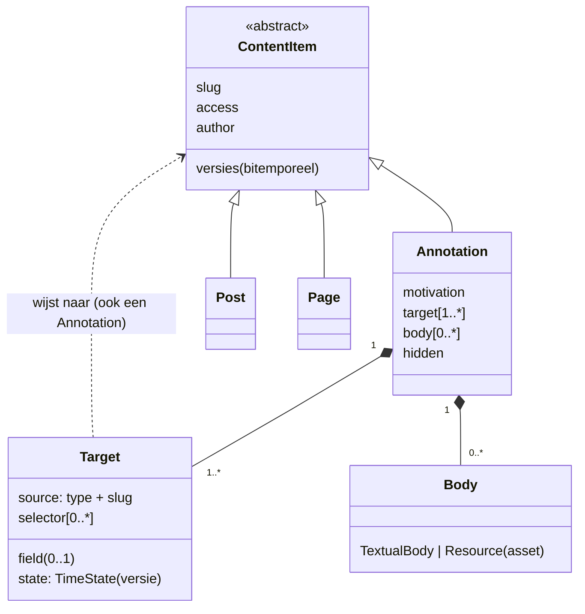

# Annotaties: reacties, kanttekeningen en meer

> Ontwerp van 1 oktober 2026 (Mark + Claude), bij G3b van
> [communities.md](communities.md) (§4.3 reacties, §4.6 annotaties in de
> kantlijn). Mark leverde het UML-model en wees op het
> [W3C Web Annotation Data Model](https://www.w3.org/TR/annotation-model/);
> dat is de taal die we overnemen. Status: **stap 1 gebouwd** (de draad onder
> een item), stap 2 (de kantlijn) volgt.

## 1. Het model

**Een annotatie is een contentitem** dat naar een ander contentitem wijst.
Daarmee krijgt ze alles wat elk item heeft: versies en historie, de drie
zichtbaarheidsniveaus (afgeleid van het doel), de ledenregel, de admin. En
omdat een annotatie zelf een item is, is een *antwoord* een annotatie op een
annotatie: een draad.

De abstracte `ContentItem` is het loodgieterswerk dat elk item al heeft
(slug, taal, toegang, auteur, versies, relaties, zoeken) en **heeft geen
generieke body**. Elk concreet type heeft zijn eigen soort body: een pagina
een layout van widgets, een bericht rijke tekst, een beeld een bestand met
metadata. Bodies **bevatten** bodies (rijke tekst bevat een beeld op een
plek; een beeld bevat pixels én een dataset metadata): de bevatter hangt af
van het bevatte, en de bevatting heeft een plaats. Een **annotatie is de
omgekeerde pijl**: zij hangt af van haar doel, eventueel versmald tot een
segment en een toestand. Verwijder je het doel, dan raken annotaties
verweesd (ze blijven in de historie); verwijder je iets wat bevat wordt, dan
breekt de bevatter — daarom bewaken relatieregels en de asset-gc wel
verwijzingen, maar niet annotatiedoelen.

## 2. De W3C-termen

| W3C | Imprint |
|---|---|
| Annotation | het type `annotation` (plugin-annotations); "reactie" blijft het gewone woord in de UI |
| target (1..n) | `{ source: {type, slug}, field?, selector[], state? }` — `field` is onze verfijning: welk veld van het item |
| state | `TimeState { sourceDate }` = de transactietijd van de versie waarop de annotatie gemaakt is |
| selector | `TextQuoteSelector` (exact + prefix/suffix) én `TextPositionSelector`, zoals de spec aanraadt; `FragmentSelector` met Media Fragments (`xywh=`, `t=`) voor een asset |
| body (0..n) | `TextualBody` (Markdown) of `Resource`: een asset uit de bibliotheek (beeld, audio, data, document), later een video-URL |
| motivation | `commenting`, `replying`, `highlighting`, `questioning`, `tagging`, `bookmarking`, `describing` |
| creator, created | `author` (het account; door de engine gezet) en `created` |

Een gewone **reactie** is een annotatie zonder selector met `commenting`; een
**antwoord** heeft een annotatie als doel en `replying`; een **markering**
heeft een selector en geen body; een **bladwijzer** geen van beide. Scenario
"reageren onder de pagina" en "kanttekening bij een passage" zijn dus één
mechanisme: met of zonder segment. De records zijn naar echte W3C-JSON-LD te
exporteren (`toWebAnnotation` in content-core), dus uitwisselbaar.

**Zichtbaarheid is afgeleid, niet opgeslagen.** Wie het wortel-doel mag lezen
mag de draad lezen; de plugin controleert dat bij het ophalen en geeft de
annotatie zelf geen `access`. Opslaan zou verlopen zodra iemand het doel
promoveert.

## 3. Versies: het doel verandert

Er wordt nooit iets meegenomen of herschreven: een annotatie houdt haar
`state` (de versie van toen) en haar selectors. Bij het tonen op de huidige
versie wordt de passage opnieuw gezocht:

- **passage ongewijzigd, doel wél** (er kwam een alinea vóór): de ballon
  blijft op de passage, met de markering "de tekst is sindsdien gewijzigd"
  en een link naar de versie van toen. Ook een reactie op het hele item
  krijgt die markering: de context kan de betekenis veranderd hebben.
- **passage gewijzigd**: niet exact gevonden; dan via prefix/suffix en
  positie; lukt dat niet met vertrouwen, dan getoond tegen de oude versie
  met "de passage is gewijzigd" en de diff van dat stuk.
- **passage verwijderd**: onder "op een eerdere versie", met de oude tekst.

De auteur informeren is een melding (G3c); de gebeurtenis is nu al te
berekenen (stap 1 toont de markering).

**De annotatie zelf heeft versies**: bewerken is een nieuwe versie ("bewerkt",
eerdere versies op te vragen door wie de draad mag lezen); verbergen door
een beheerder is ook een versie.

## 4. Beleid: mag hier geannoteerd worden, door wie

Of een item geannoteerd mag worden is beleid, geen UI-logica:

- per **type** een standaard in de plugin-config (`targets: { post:
  "members", event: "members", "wiki-page": "members", page: "off" }`);
- per **item** een optionele overschrijving (`annotations: off | members |
  public` op de pagina; andere typen kunnen het veld ook krijgen).

De plugin is de **PIP**: hij lost de instelling en de toegang van het
wortel-doel op en geeft ze de PDP mee als eigenschappen van het doel (`on:
{ access, annotations }`). De regel in de PDP is generiek — *maak iets óp
een item dat je mag lezen, als jezelf, als dat item het toelaat* — zonder
typenamen. Twee **PEP's** stellen dezelfde vraag: het scherm ("toon het
formulier?") en de data ("accepteer deze schrijfactie?"). Beide roepen
`permit(subject, "create", …)` aan, dus de in-process regels inruilen voor de
OpenFTV-sidecar verandert geen van beide.

## 5. Stappen

1. **Gedaan**: het type, de draad onder berichten, evenementen en
   wikipagina's (pagina's per item aan te zetten), antwoorden, eigen reactie
   bewerken en verwijderen, verbergen door beheerders (redactie, of de
   beheerders van de groep van het doel), "bewerkt" met versies, "de tekst
   is sindsdien gewijzigd".
2. **De kantlijn**: selecteren → "annoteren", ballonnen naast de passage
   (markers op smalle schermen), opnieuw verankeren, de diff. Doelen: de
   tekstvelden van items; per type een verklaring welke velden segmenteerbaar
   zijn en hoe (tekstselectors; voor assets fragmentselectors).
3. **Later**: resource-bodies kiezen uit de bibliotheek, markeringen zonder
   tekst, bladwijzers, annotaties op assets (regio van een beeld, tijdvak van
   een take), meldingen aan de auteur, export als W3C-JSON-LD via de API.
