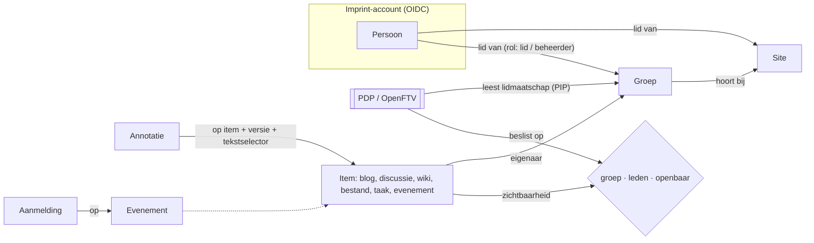

# Communities: Imprint als alternatief voor Pleio

> Verkenning van 29 september 2026 (Mark + Claude), na release 0.11.0. Vraag:
> hoe groot is de afstand tussen Imprint en Pleio, als Imprint voor Common
> Ground de plek van Pleio zou innemen? Wensen van Mark staan gemarkeerd met
> **▶**. Status: **verkenning**. Er is nog niets besloten en niets gepland;
> concreet werk komt pas in `docs/backlog.md` als we een stap kiezen.

## 1. Samenvatting

Op het **websitedeel** is Imprint al sterker dan Pleio: de studio, widgets,
vooraf gerenderde pagina's en bitemporele historie. De afstand zit in de
**sociale laag**: leden, groepen, zichtbaarheid per groep, discussies,
notificaties en evenementen. Die laag is middelgroot. Het meeste is gewoon
een contenttype, maar het fundament (identiteit, lidmaatschap en toegang)
moet eerst staan, en dat valt samen met het FTV-werk uit
[fase-3-admin-toegang-tijdreizen.md](fase-3-admin-toegang-tijdreizen.md) §4.

Wat Pleio niet heeft en wij bijna vanzelf wel: **annotaties in de kantlijn
die aan een versie vastzitten** (§4.6).

## 2. Vergelijking

| Pleio | Imprint nu | Afstand |
|---|---|---|
| Website, pagina's, navigatie | studio, widgets, SSG | geen: Imprint is sterker |
| Wiki | `plugin-wiki` | klein: scopen per groep |
| Bestanden | mediabibliotheek (0.11.0) | klein: map en toegang per groep |
| Kanban | `plugin-planning` (borden) | klein: per groep |
| Blogs | nog geen type, wel alle bouwstenen | klein |
| Custom termenlijsten | contenttypen + RelationRules | klein; herkenning in content is nieuw (§4.7) |
| Leden, zelf registreren | admin maakt accounts, rollen per site | **middel** (§4.1) |
| Groepen met drie niveaus | `publiek`/`beperkt` per item | **middel**, samen met FTV (§4.2) |
| Discussies, reacties | – | middel (§4.3) |
| Mail, notificaties | alleen versturen via relay ([mail.md](mail.md)) | **middel**, wordt vaak onderschat (§4.4) |
| Evenementen met aanmelden | – | klein, plus een privacymodel (§4.5) |
| Eén login voor alle sites | eigen login per site | middel (§5) |
| – | bitemporele historie | voorsprong: annotaties (§4.6) |

**Prestaties.** Pleio moet 's ochtends soms minuten opstarten, ook voor een
gewone bezoeker. Bij Imprint zijn publieke pagina's vooraf gerenderd en is er
geen koude start. Let wel: groepspagina's achter een login zijn per
definitie dynamisch. Zie §6.

## 3. Het model in één plaatje

## 4. De onderdelen

### 4.1 Leden

Nu maakt een admin de accounts aan, met een rol per site
(`admin`/`editor`/`reader`). Voor een community moet dat anders:

- **Zelf registreren**, of een uitnodiging accepteren. Dit is een
  principiële stap: iedereen kan dan een account aanmaken, dus ook spam,
  e-mailverificatie en AVG-rechten (inzage, export, verwijderen).
- **Persoon en lidmaatschap scheiden.** De persoon leeft in de IdP (§5); de
  site kent een *lidmaatschap* met een rol. Pleio doet het ook zo: één
  account, lid worden per site.
- De huidige `RoleType` blijft voor redactie en beheer. `lid` komt erbij als
  lichtste rol: mag lezen wat voor leden is en meedoen in groepen.

### 4.2 Groepen en de drie niveaus ▶

Mark: een site heeft leden, leden gaan in groepen zitten en delen daar
discussies, blogs, een interne wiki en bestanden. Standaard blijft dat
binnen de groep, maar het kan **gepromoveerd** worden naar *alle leden van de
site* of naar *openbaar*.

- **Groep als contenttype** (`group`): naam, beschrijving, open of op
  aanvraag, beheerders. Het lidmaatschap is een relatie persoon ↔ groep met
  een rol (`lid`/`beheerder`) en staat in de DB, niet in content, omdat het
  persoonsgegevens zijn.
- **Zichtbaarheid per item**: `groep` · `leden` · `openbaar`. Dit breidt
  het huidige `publiek`/`beperkt` uit: `openbaar` = publiek, en `leden` en
  `groep` zijn twee vormen van beperkt.
- **Promoveren** is gewoon een nieuwe versie van het item met een ander
  niveau. De historie laat zien wie het wanneer openbaar maakte.
- **Toegang loopt via FTV.** De PDP krijgt het groepslidmaatschap als
  attribuut van de PIP; het beleid wordt dan: "`groep`-items alleen voor
  leden van de eigenaarsgroep". Zo komt er geen tweede rechtenmodel naast
  FTV. De groepen zijn daarom het beste als eerste echte toepassing van dat
  werk te bouwen.
- **Groepscontent is bestaande plugins, maar dan gescoped.** Een wiki, bord
  of map krijgt een `group`-veld. Zo'n groep krijgt een eigen startpagina
  (een layout zoals nu), met widgets als "laatste discussies" en "taken".

### 4.3 Discussies en reacties

- `discussion` als contenttype (onderwerp + openingsbericht). Reacties zijn
  losse records die naar het item wijzen, dus niet in het item zelf; anders
  wordt elke reactie een nieuwe versie van de discussie.
- Reacties kunnen ook onder blogs en evenementen: één reactiemodel voor
  alles.
- **Moderatie**: verbergen (een nieuwe versie, dus terug te zien), melden,
  en groepsbeheerders die modereren. Tel ook een spamdrempel in (rate
  limits, alleen leden).

### 4.4 Mail en notificaties

Het meest onderschatte stuk:

- Gebeurtenissen in een groep, zoals een nieuwe discussie, een reactie op
  jouw bericht, een uitnodiging of een aanmelding.
- Per persoon en per groep kiezen: direct, dagelijkse samenvatting of niets.
  Elke mail heeft een afmeldlink.
- **Afleverbaarheid**: SPF, DKIM, DMARC en bounces verwerken. De relay uit
  [mail.md](mail.md) is voor een contactformulier; voor groepsmail is een
  echte dienst nodig. Die kan Europees zijn (Brevo, Mailjet) of eigen
  (Postal op de VPS).
- Techniek: een wachtrij van gebeurtenissen in de DB met een worker. Er is
  nu geen achtergrondproces, dus dat is ook nieuw voor de deploy.

### 4.5 Evenementen met aanmelden

- `event` als contenttype: tijd, plaats (of online) en capaciteit. Er kan al
  een agendawidget op.
- **Aanmelden** à la Facebook: *ik kom · misschien · ik kom niet*. De
  aanmeldingen zijn records in de DB, geen content.
- De organisator kan de aanmelders bereiken (mail, eventueel telefoon). Dat
  mag alleen met een **privacyverklaring bij het aanmelden**: doel, wie het
  ziet en de bewaartermijn. Na afloop worden de gegevens automatisch
  opgeruimd.
- ▶ Dit is in wezen **stakeholdermanagement**, net als het formulier dat
  bitemporal in een iframe embedt. Ontwerp het contactmodel één keer
  (persoon, toestemming, doel, termijn) en laat aanmeldingen en formulieren
  het delen.

### 4.6 Annotaties in de kantlijn ▶

Mark: wat Pleio mist is elkaars werk kunnen annoteren, in de kantlijn
schrijven. *Natuurlijk bitemporeel.*

- **Model**: [W3C Web Annotation](https://www.w3.org/TR/annotation-model/).
  Een annotatie heeft een *target* (item-slug + **versie**, de transactietijd)
  en een *selector* (het geciteerde stuk tekst met een stukje ervoor en
  erna: `TextQuoteSelector`), plus een *body* (de opmerking) en een auteur.
- **Waarom bitemporeel het verschil maakt.** Omdat elke versie bewaard is:
  - toon je een annotatie altijd tegen **de tekst waarop ze geschreven is**;
  - kun je haar **opnieuw verankeren** in de nieuwste versie (het citaat
    zoeken; gevonden of verdwenen);
  - zie je **"de tekst is sindsdien veranderd"** met een diff van precies
    dat stuk.

  Pleio kan dit principieel niet goed: dat bewaart geen versies om tegen te
  verankeren.
- **Zichtbaarheid** volgt de drie niveaus: privé (alleen ik), groep, leden
  of openbaar.
- **Beantwoorden** gaat met hetzelfde reactiemodel als §4.3, dus een
  annotatie wordt een draadje in de kantlijn.
- **UI**: een tekst selecteren geeft een knop "annoteren"; de opmerkingen
  staan in de kantlijn, en op mobiel onder de alinea.

### 4.7 Termenlijsten en term-herkenning

- Termenlijsten zijn gewoon contenttypen (term, definitie, synoniemen, bron)
  met RelationRules, zonder code.
- ▶ **Term-herkenning**: termen uit een lijst worden in lopende tekst
  herkend en krijgen een uitleg bij hover of een link. Mark heeft dit voor
  Pleio gebouwd, maar het is daar nooit opgepakt. Bij Imprint is het een
  afgebakende plugin: een stap in de markdown-renderer (rehype), per site of
  pagina aan te zetten, per lijst te kiezen, en de eerste keer per pagina
  gemarkeerd. Het gebeurt bij het renderen, dus het kost bezoekers niets.

### 4.8 Kanban en planning ▶

De borden bestaan al. Mark: **geen totale planningstool bouwen**. Ideeën,
werkvoorraad, taken en afgerond werk is genoeg. Producten, componenten en
releases met versies hebben we al. Het enige werk is het scopen per groep
(§4.2), eventueel met een taak die naar een lid wijst.

## 5. Eén login voor meerdere sites

Pleio heeft één centrale identiteitsdienst (account.pleio.nl); per site word
je apart lid. Dat is precies na te bouwen.

**Voorstel: een eigen Imprint-account als OIDC-provider.**
[Zitadel](https://zitadel.com) (Zwitsers, open source) of Keycloak draait als
container op de VPS. Alle Imprint-sites zijn er cliënt van en het
lidmaatschap blijft per site (§4.1). Het is volledig in eigen hand, zonder
Google of Microsoft. Met **passkeys** verdwijnen wachtwoorden grotendeels.

Mark vroeg of er een betrouwbare Europese dienst bestaat waarmee je op één
plek inlogt en dat op meerdere plekken gebruikt. Wat er is:

| Dienst | Wat | Geschikt? |
|---|---|---|
| **EUDI-wallet** (eIDAS 2.0) | Europese identiteitswallet, lidstaten moeten die eind 2026 aanbieden | op termijn dé optie; nu nog te vroeg en zwaar (overheidsniveau) |
| **Yivi** (NL, ex-IRMA) | attributen tonen, zoals "e-mailadres geverifieerd", privacyvriendelijk | ja, als extra inlogmethode achter de eigen IdP |
| **eduID / SURFconext** | onderwijs en onderzoek | alleen voor die doelgroep |
| **DigiD / eHerkenning** | overheidsdiensten | nee, niet bedoeld voor communities |
| **EU Login** | diensten van de Europese Commissie | nee |

Een neutrale Europese "log in met …" voor iedereen bestaat niet echt. De
route is daarom: eerst de eigen IdP, en Yivi en later de EUDI-wallet als
koppelingen daarachter. De sites merken daar niets van.

Een samenhang om te bewaken: FTV (fase 3) wil de identiteit doorgeven aan
de achterkant-PDP. Een OIDC-token van de eigen IdP is daar het natuurlijke
dragermiddel voor.

## 6. Prestaties achter de login

Publieke pagina's blijven vooraf gerenderd. Groepspagina's niet, en daar
moeten we het bewust anders doen dan Pleio:

- **Geen PDP-rondreis per item.** Bepaal op een lijstpagina eerst de groepen
  van de gebruiker (één PIP-vraag) en filter dan in de query.
- **Cachen per zichtbaarheidsniveau.** `leden`-inhoud is voor alle leden
  gelijk, dus die kan een gedeelde cache in; alleen `groep` en persoonlijke
  onderdelen zijn per persoon.
- **Geen koude start.** De containers draaien altijd; alleen een deploy
  herstart ze.

## 7. Volgorde als het serieus wordt

1. **FTV-toegang afmaken**, met groepslidmaatschap als attribuut. Dit is het
   fundament.
2. **Leden, groepen en de eigen IdP** (Zitadel, passkeys).
3. **Groepscontent**: wiki, borden, bestanden en blogs per groep, plus
   discussies en reacties.
4. **Mail en notificaties** (wachtrij, worker, maildienst).
5. **Evenementen met aanmelden**, samen met het contact- en privacymodel.
6. **Annotaties**.
7. **Term-herkenning** (onafhankelijk, kan ook eerder als plugin).

Stap 1 en 2 zijn samen het grootste stuk. Daarna is het vooral vlijt: elk
onderdeel is een contenttype of plugin op hetzelfde fundament.

## 8. Open vragen voor Mark

- Voor wie is dit bedoeld: Common Ground als één community-site, of
  meerdere sites met gedeelde leden (dan is §5 meteen nodig)?
- Leden zelf laten registreren, of alleen op uitnodiging? Dit bepaalt de
  zwaarte van spam, verificatie en moderatie.
- Zitadel of Keycloak? (Zitadel is lichter en Europees; Keycloak is de
  bekende standaard.)
- Moeten bestaande Pleio-groepen en -content over kunnen komen? Dan is een
  import via de Pleio-API een eigen stap.
- Mag de term-herkenning eerst los, als plugin, voor de bestaande sites?
