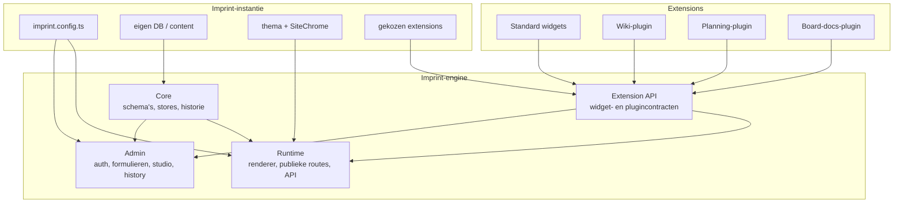
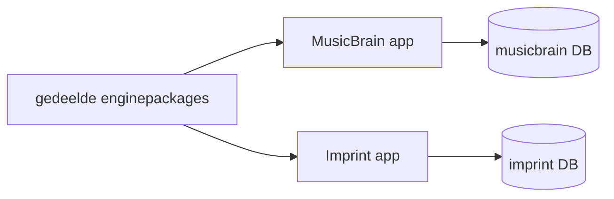

# Revisievoorstel — engine, instanties, widgets en plugins

Status: **ontwerpvoorstel**, augustus 2026. Dit document beschrijft een
architectuurrevisie; het is geen beschrijving van volledig gerealiseerd gedrag.
De huidige implementatie staat in [architecture.md](../architecture.md).

## 1. Aanleiding

De centrale belofte van Imprint is: **één publicatiemotor, meerdere zelfstandige
sites**. In het huidige repositorymodel is die scheiding maar gedeeltelijk
zichtbaar:

- `packages/content-core` is al grotendeels site-onafhankelijk;
- `sites/musicbrain` bevat niet alleen de MusicBrain-site, maar ook de admin,
  authenticatie, publieke API, paginarenderer en concrete widgets;
- `sites/imprint` is een tweede site met een eigen database en `ContentStore`,
  maar heeft nog geen admin, renderer of widgetcatalogus.

Daardoor heeft het begrip "Imprint-engine" nu twee betekenissen. Soms bedoelen
we alleen `content-core`; soms bedoelen we het hele systeem dat toevallig in de
MusicBrain-app is opgebouwd. Dat maakt het moeilijk te beantwoorden waar een
nieuwe capability thuishoort en leidt tot de verleiding om generieke code naar
een tweede site te kopiëren.

Dit voorstel maakt de architectuur expliciet. Het doel is niet om van Imprint
een dynamische pluginmarktplaats te maken, maar om één onderhoudbare motor te
bouwen die per instantie gecontroleerd is samen te stellen.

## 2. Samenvatting van het voorstel

Imprint wordt conceptueel en in de repository verdeeld in vier lagen:

1. **Engine core** — contentcontracten, opslag, historie en generieke
   domeinregels.
2. **Engine runtime en admin** — publieke rendering/API en de gedeelde
   beheeromgeving.
3. **Extensions** — widgets en plugins die via kleine, getypeerde contracten
   capabilities toevoegen.
4. **Imprint-instantie** — database, content, merk, SiteChrome en expliciet
   gekozen extensions.



Een concrete site is daarmee grotendeels content en configuratie, maar niet
uitsluitend content. De instantie blijft eigenaar van haar merk, domein,
operationele configuratie en eventuele uitzonderlijke presentatielogica.

## 3. Huidige toestand

### 3.1 Wat al site-onafhankelijk is

`@imprint/content-core` bevat nu:

- zod-schema's en TypeScript-typen voor content;
- `ContentStore` en `WritableContentStore`;
- file- en MariaDB-stores;
- bitemporal-light historie en valid-timelezingen;
- relationele integriteitsregels;
- gebruikersopslag en wachtwoordbeleid;
- het abstracte layout- en widgetmodel;
- afgeleide domeinlogica zoals component-itineraries.

Deze onderdelen kennen geen Next.js-sitechrome en in beginsel geen concrete
React-viewers. Dat is de juiste richting.

### 3.2 Wat nog onbedoeld door MusicBrain wordt bezeten

`sites/musicbrain` bevat momenteel ook generieke motoronderdelen:

- `/admin`-routes en circa 35 admincomponenten/-routebestanden;
- sessie-authenticatie en de PEP/PDP-autorisatielaag;
- schema-naar-formuliervertaling;
- de pagina- en wiki-studio;
- versiehistorie, gebruikersbeheer en relatieregelbeheer;
- publieke content-, ingest-, preview- en meta-API's;
- `PageRenderer`, layouttemplates en default-viewmechaniek;
- de volledige concrete widgetcatalogus.

Een deel daarvan is echt generiek; een ander deel is MusicBrain-domeinlogica.
Doordat beide in dezelfde app staan, is die grens nu niet afdwingbaar.

### 3.3 Gevolg voor de tweede instantie

De Imprint-productsite heeft inmiddels een eigen database en leest haar
siteconfig via `ContentStore`, maar `/admin` bestaat er niet. De juiste oplossing
is niet de MusicBrain-admin kopiëren. Dat zou twee implementaties opleveren die
onmiddellijk uit elkaar gaan lopen.

## 4. Begrippen en eigenaarschap

### 4.1 Engine

De **engine** is alle site-onafhankelijke code die nodig is om een imprint te
lezen, renderen en beheren. De engine bestaat uit meerdere packages, niet
noodzakelijk uit één groot pakket.

Eigenschappen:

- kent contracten en lifecycle, geen merkidentiteit;
- is één keer te onderhouden en te testen;
- gebruikt dependency injection/configuratie voor sitekeuzes;
- bevat geen verwijzing naar `musicbrain` of een concreet domein;
- publiceert expliciete, versieerbare interfaces.

### 4.2 Imprint-instantie

Een **instantie** is één concrete website met een eigen identiteit en
operationele grens.

Een instantie bezit:

- domein en basis-URL;
- eigen `DATABASE_URL`, assets en secrets;
- content en gebruikers;
- taalinstellingen;
- design-tokens, fonts en SiteChrome;
- geactiveerde contenttypen, widgets en plugins;
- site-specifieke configuratie;
- uitzonderlijke custom views, waar configuratie niet volstaat.

Een instantie importeert de engine, niet andersom.

### 4.3 Admin

De **admin** is onderdeel van de engine, maar draait in eerste instantie per
instantie. Dat onderscheid is belangrijk:

- **één codebasis**: een studiofix wordt één keer gemaakt;
- **meerdere deployments/contexts**: iedere `/admin` gebruikt de database,
  gebruikers, cookies en extensions van zijn eigen instantie.

Dit levert bijvoorbeeld op:

- `musicbrain.nl/admin` beheert alleen MusicBrain;
- `imprint.example/admin` beheert alleen de Imprint-productsite.

Een centraal multitenant beheerportaal is een mogelijke latere applicatie op
dezelfde adminpackages. Het is geen voorwaarde voor het losmaken van de code en
wordt niet in de eerste revisie gebouwd.

### 4.4 Runtime

De **runtime** verbindt een instantie met de publieke enginefunctionaliteit:

- samengestelde pagina's renderen;
- contenttype- en default views oplossen;
- publieke API en ingest aanbieden;
- previews en cache-revalidatie uitvoeren;
- routes van plugins registreren.

De SiteChrome blijft van de instantie. De runtime rendert erin.

### 4.5 Extension

Een **extension** is de verzamelterm voor een toevoeging aan Imprint. Er zijn
twee hoofdsoorten: widgets en plugins. Iedere plugin kan nul of meer widgets
meebrengen.

## 5. Widgets

### 5.1 Definitie

Een widget is een **plaatsbaar bouwblok in een paginalayout**. De opgeslagen
vorm blijft klein en platformneutraal:

```json
{
  "type": "gallery",
  "config": {
    "title": "Werkplaats",
    "columns": 3
  }
}
```

Een widgettype bestaat uit:

1. een stabiele typenaam en versie;
2. een zod-configschema;
3. een publieke viewer;
4. optioneel een gespecialiseerde admineditor;
5. helptekst en eventueel migrators voor oude configversies.

### 5.2 Sitecatalogus

Niet iedere site hoeft iedere widget te kennen. Een instantie stelt haar
catalogus expliciet samen:

```ts
export default defineImprint({
  widgets: [
    standardWidgets.text,
    standardWidgets.image,
    standardWidgets.gallery,
    standardWidgets.hero,
  ],
});
```

Alleen geregistreerde widgets:

- verschijnen in de studio;
- mogen bij opslag en rendering valideren;
- worden in de relevante bundles opgenomen;
- moeten door de instantie ondersteund blijven zolang content ernaar verwijst.

Een widget uitschakelen terwijl bestaande pagina's hem gebruiken moet daarom
worden geweigerd of als expliciete migratie worden uitgevoerd.

### 5.3 Voorgestelde groepen

**Standard widgets** zijn generiek en horen in een gedeeld package:

- text, image, table;
- hero, callout, divider;
- gallery, carousel, video, album;
- accordion, embed, map;
- eenvoudige lijst/treeview.

**Domein- of plugingebonden widgets** reizen mee met een capability:

- products, releases, subjectheader en spectable;
- itinerary;
- board en boardspec;
- planning;
- wiki-gerelateerde navigatie.

De grens is niet "kan een andere site dit ooit gebruiken?", maar "welke
domeincontracten moet deze widget kennen?".

### 5.4 Widgetbundelcontract

Een mogelijk eerste contract:

```ts
interface WidgetDefinition<TConfig> {
  type: string;
  version: string;
  label: string;
  help?: string;
  configSchema: ZodType<TConfig>;
  Viewer: ComponentType<WidgetViewProps<TConfig>>;
  Editor?: ComponentType<WidgetEditorProps<TConfig>>;
  migrate?: (fromVersion: string, config: unknown) => TConfig;
}
```

In de huidige Next.js Server Component-architectuur kunnen `Viewer` en
`Editor` niet altijd uit hetzelfde runtimebestand worden geïmporteerd. Het
praktische package mag daarom gescheiden server/client entrypoints aanbieden,
zolang zij dezelfde manifestmetadata en typenaam delen.

## 6. Plugins

### 6.1 Definitie

Een plugin is een **sitebrede capability**. Hij wordt voor een instantie
geactiveerd en hoeft niet op een pagina geplaatst te worden.

Een plugin kan bijdragen:

- contenttypen en schema's;
- adminnavigatie en beheerschermen;
- publieke routes of API-endpoints;
- widgets;
- relatieregels;
- policies/autorisatieattributen;
- background jobs en webhooks;
- database- en contentmigraties;
- configuratievelden en healthchecks.

### 6.2 Voorbeelden uit de huidige code

Capabilities die zich waarschijnlijk als plugin laten modelleren:

| Capability | Mogelijke bijdragen |
|---|---|
| Wiki | drie contenttypen, relatieregels, wiki-studio, publieke route, navigatiewidget |
| Planning | planningtypen, bordadmin, move-logica, planningwidget |
| Board documentation | board-spectype, assets/ingest, boardviewers en 3D-media |
| Product catalog | product/component/release-schema's, detailviews en subjectwidgets |
| GitHub releases | webhookroute, mappingconfig en release-import |
| Media library | assetbeheer, uploadadmin, varianten en image/gallery-integratie |

Niet elk bestaand contenttype hoeft onmiddellijk uit core te verdwijnen. De
pluginvorm maakt wel expliciet welke delen samen één capability vormen.

### 6.3 Geen WordPress-installatiemodel

Imprint moet niet toestaan dat een beheerder willekeurige code uit een publieke
marktplaats tijdens runtime installeert. Dat maakt builds niet reproduceerbaar,
vergroot de aanvalsvector en creëert moeilijk testbare versiecombinaties.

Voorgesteld model:

1. plugins zijn vertrouwde npm-workspaces of vastgepinde dependencies;
2. een ontwikkelaar activeert ze in `imprint.config.ts`;
3. installatie en update gebeuren tijdens build/deploy;
4. iedere plugin declareert compatibiliteit en migraties;
5. een beheerder configureert alleen reeds geïnstalleerde plugins;
6. de engine valideert de complete combinatie bij opstart/build;
7. uitschakelen verwijdert nooit stilzwijgend data.

Dit geeft modulariteit zonder de onbeheersbaarheid van een onbeperkt
runtime-ecosysteem.

### 6.4 Pluginmanifest

Een eerste manifest kan er conceptueel zo uitzien:

```ts
interface ImprintPlugin {
  name: string;
  version: string;
  engine: string;
  contentTypes?: ContentTypeExtension[];
  widgets?: WidgetDefinition<unknown>[];
  relations?: RelationRule[];
  admin?: AdminContribution[];
  routes?: RouteContribution[];
  jobs?: JobContribution[];
  migrations?: PluginMigration[];
  configure?: (input: unknown) => PluginConfig;
}
```

Dit is een doelcontract, geen opdracht om meteen dynamische Next.js-routes uit
willekeurige packages te genereren. In de eerste versie mogen route- en
admincontributions build-time compositie zijn.

## 7. Voorgestelde repositorystructuur

```text
packages/
  content-core/          bestaande schemas, stores en historie
  runtime/               renderer, publieke helpers, API-contracten
  admin/                 admin-shell, schemaforms, studio en history
  extension-api/         defineImprint, widget- en plugincontracten
  widgets-standard/      generieke widgets
  plugin-wiki/           wiki-capability
  plugin-planning/       planning-capability
  plugin-catalog/        product/component/release-capability
  plugin-board-docs/     board-spec, assets en viewers

sites/
  musicbrain/
    imprint.config.ts
    content/
    src/site-chrome.tsx
    src/theme.css
    src/extensions.ts

  imprint/
    imprint.config.ts
    content/
    src/site-chrome.tsx
    src/theme.css
    src/extensions.ts
```

Dit is een richting, geen verplichting om direct negen packages te maken.
Extractie gebeurt alleen wanneer een grens aantoonbaar is. Tijdens de migratie
kunnen bijvoorbeeld `runtime` en `admin` eerst één package zijn.

## 8. Instantieconfiguratie

Een instantie krijgt één expliciet composition root:

```ts
import { defineImprint } from "@imprint/extension-api";
import { standardWidgets } from "@imprint/widgets-standard";
import { wikiPlugin } from "@imprint/plugin-wiki";
import { planningPlugin } from "@imprint/plugin-planning";
import { musicBrainCatalog } from "./extensions/catalog";

export default defineImprint({
  id: "musicbrain",
  store: { databaseUrl: process.env.DATABASE_URL },
  chrome: () => import("./src/site-chrome"),
  widgets: standardWidgets,
  plugins: [wikiPlugin(), planningPlugin(), musicBrainCatalog()],
});
```

Deze config is code, omdat hij React-entrypoints en vertrouwde executable
extensions samenstelt. Bewerkbare waarden zoals sitenaam, menu's, thema's en
pagina's blijven content in de database.

## 9. Grenzen en afhankelijkheidsregels

De volgende regels moeten door linting, packagegrenzen of tests afdwingbaar
worden:

1. Enginepackages importeren nooit uit `sites/*`.
2. `content-core` importeert geen React of Next.js.
3. Admin en runtime werken tegen interfaces, niet tegen globale MusicBrain-
   singletons.
4. Een instantie mag enginepackages en eigen code importeren.
5. Een widgetviewer ontvangt een expliciete context/store; hij importeert geen
   siteglobaal storebestand.
6. Een plugin declareert zijn contenttypen en relaties op één plaats.
7. Elke instantie heeft eigen database, assets, secrets en sessiecookienaam.
8. Content verwijst alleen naar geactiveerde widget- en contenttypen.
9. Publieke pagina's blijven waar mogelijk SSG; admin blijft dynamisch.
10. Een build valideert de complete extensiongraph vóór rendering.

De huidige typelijsten in meerdere admin- en API-bestanden zijn strijdig met
regel 6. De extensioncatalogus moet op termijn de bron worden voor lijstbare,
schrijfbare en ingestbare typen.

## 10. Adminextractie

### 10.1 Wat generiek is

Waarschijnlijk direct deelbaar:

- loginformulier en sessiehelpers;
- admin-shell en navigatiekader;
- schemaformulieren en rich-texteditor;
- generieke itemlist, itemeditor en history;
- gebruikers- en relatieregelbeheer;
- basisstudio en pure layoutoperaties;
- authorisatiecontract/PEP.

### 10.2 Wat injecteerbaar moet worden

De gedeelde admin heeft per instantie nodig:

- `WritableContentStore` en `DbUserStore`;
- widgetmanifesten en editors;
- viewers voor studiopreview;
- SiteChrome voor het echte canvas;
- geactiveerde contenttypen;
- admincontributions van plugins;
- revalidate- en assetfuncties;
- site-identiteit en sessieconfiguratie.

### 10.3 Wat niet automatisch generiek is

- MusicBrain-product-, component- en boardviews;
- specifieke ingestmapping van hardwareprojecten;
- contenttype-specifieke adminflows van plugins;
- huisstijl en publieke navigatie.

Deze delen worden een instance extension of plugin, niet een conditionele tak
met `if (site === "musicbrain")` in de gedeelde admin.

## 11. Deploymentmodel

### 11.1 Aanbevolen eerste model: gedeelde code, aparte appcontext

Iedere instantie bouwt en draait als eigen Next.js-app met dezelfde packages.
Dat houdt storingen, secrets, cookies, cache en databases geïsoleerd.



Voordelen:

- eenvoudige tenantgrens;
- geen tenant-ID in iedere query nodig;
- onafhankelijke releases en domeinen;
- een fout in één instantie raakt de andere niet direct;
- past bij de huidige Plesk-hosting.

Nadeel: een engine-update vereist een rebuild/deploy per instantie. Dat is
acceptabel en juist controleerbaar.

### 11.2 Niet nu: één multitenant admin

Een centraal beheerportaal vraagt om:

- tenantselectie in alle stores en routes;
- cross-domain of centrale authenticatie;
- tenantrollen en superadminbeleid;
- sterkere isolatietests;
- cache- en assetnamespacing;
- impactanalyse bij gedeeltelijke uitval.

Dit is pas zinvol als er meerdere operationeel beheerde imprints zijn en één
beheerervaring echt waarde toevoegt.

## 12. Migratieplan

Iedere fase moet zelfstandig releasable zijn. MusicBrain blijft gedurende de
hele revisie werken.

### Fase 0 — Architectuurcontract vastleggen

- dit voorstel bespreken en beslispunten afvinken;
- ownershipregels vastleggen;
- karakterisatietests toevoegen voor MusicBrain-publiek, admin en API;
- geen code verplaatsen zonder test die bestaand gedrag bewaakt.

**Exit:** begrippen en packagegrenzen zijn besloten; relevante flows hebben een
baselinecheck.

### Fase 1 — Composition root en context

- `defineImprint()` en `ImprintConfig` introduceren;
- globale imports van store, registry en sitechrome achter context/factories
  brengen;
- MusicBrainconfig maken zonder zichtbaar gedrag te veranderen;
- Imprint-productsite dezelfde configvorm geven.

**Exit:** beide sites starten vanuit hetzelfde configuratiecontract.

### Fase 2 — Renderer en standard widgets

- `PageRenderer` en layouthelpers naar runtime verplaatsen;
- generieke widgets classificeren en naar `widgets-standard` verplaatsen;
- viewers expliciete `WidgetContext` geven;
- MusicBraincatalogus samenstellen uit standaard- en domeinwidgets.

**Exit:** een eenvoudige DB-pagina kan in beide instanties met dezelfde
renderer en een gekozen subset widgets worden weergegeven.

### Fase 3 — Generieke adminbasis

- admin-shell, auth, schemaform en generieke CRUD/history extraheren;
- stores, sessieconfig en contentcatalogus injecteren;
- `/admin` in MusicBrain vanuit het gedeelde package laten draaien;
- daarna dezelfde adminbasis in de Imprint-site activeren.

**Exit:** beide instanties hebben dezelfde login, generieke contenteditor en
history tegen hun eigen database.

### Fase 4 — Studio en widgeteditors

- studio, drafts en layoutoperaties extraheren;
- viewer/editorregistraties via de widgetcatalogus leveren;
- SiteChrome per instantie in het canvas injecteren;
- draftopslag namespacen per instantie en gebruiker.

**Exit:** dezelfde studio bewerkt een pagina in beide sites met hun eigen
chrome en widgetset.

### Fase 5 — Eerste echte plugins

Begin niet met de moeilijkste capability. Voorgestelde volgorde:

1. **Planning** — duidelijke contenttypen, admin en widget;
2. **Wiki** — routes, autorisatie en geneste studio;
3. **Product catalog** — domeinviews en subjectbinding;
4. **Board docs** — assets, ingest en 3D maken dit de zwaarste.

**Exit:** minimaal één capability is volledig als plugin geactiveerd en kan in
een instantie worden weggelaten zonder enginecode te wijzigen.

### Fase 6 — Hardening

- plugincompatibiliteit en migratievolgorde valideren;
- diagnostics/healthpagina voor geactiveerde extensions;
- detectie van content die naar uitgeschakelde widgets verwijst;
- package-boundarylint en contracttests;
- deployment- en rollbackdocumentatie.

**Exit:** extensionupdates zijn reproduceerbaar en foutmeldingen zijn voor een
beheerder/ontwikkelaar bruikbaar.

## 13. Teststrategie

### Contracttests

Iedere `ContentStore`-implementatie doorloopt dezelfde suite. Widget- en
pluginmanifesten worden zonder Next-runtime gevalideerd waar dat kan.

### Karakterisatietests

Vóór extractie worden de belangrijkste huidige flows vastgelegd:

- publieke pagina en default view;
- adminlogin en rollen;
- generieke save + nieuwe historieversie;
- restore;
- pagina-studio save;
- ingest en referentieregels;
- preview/time travel;
- wiki- en planningkernflow.

### Instantiatietests

Minimaal twee instanties zijn onderdeel van CI:

- MusicBrain met de rijke catalogus;
- Imprint met een kleinere catalogus.

Dat voorkomt dat een package ongemerkt weer afhankelijk wordt van alleen
MusicBrain.

### Extensiontests

Voor iedere plugin:

- manifest valideert tegen ondersteunde engineversie;
- contenttype- en relatieregistratie zijn conflictvrij;
- migraties zijn idempotent of hebben een journal;
- de plugin kan afwezig zijn;
- uitschakelen met afhankelijke content geeft een expliciete fout.

## 14. Versies en migraties

Er zijn drie verschillende versies:

1. **Engineversie** — huidige monorepoversie/tag.
2. **Extensionversie** — contract en gedrag van widget/plugin.
3. **Contentconfigversie** — versie van opgeslagen widgetconfig of plugindata.

Een engine-update mag opgeslagen content niet stil herschrijven tijdens lezen.
Bij breaking wijzigingen levert de extension een expliciete migrator. Database-
migraties worden centraal geordend en per instantie uitgevoerd; pluginmigraties
moeten in hetzelfde journal of in een aantoonbaar gecoördineerd journal staan.

Pre-1.0 mag het contract bewegen, maar iedere wijziging moet nog steeds een
controleerbaar migratiepad hebben voor de live MusicBrain-data.

## 15. Veiligheid en betrouwbaarheid

- Extensions zijn executable code en krijgen dus hetzelfde vertrouwen als de
  engine; alleen dependencies uit beheerde bron worden toegelaten.
- Geen plugininstallatie via upload in de admin.
- Geen `eval`, remote modules of runtime package-installatie.
- Admincontributions gaan door dezelfde autorisatie- en CSRF-grenzen.
- Publieke routecontributions mogen bestaande routes niet stil overschrijven.
- Secrets zijn instantieconfig, nooit plugincontent.
- Verwijderen van een plugin verwijdert geen data zonder apart bevestigd
  migratie-/opruimcommando.
- De extensiongraph en migratiestatus worden onderdeel van healthchecks.

## 16. Bewuste niet-doelen

Deze revisie bouwt niet automatisch:

- een publieke pluginmarktplaats;
- plugins van derden zonder review;
- installatie vanuit de browser;
- één multitenant SaaS-database;
- volledige visuele vrijheid zonder code voor SiteChrome;
- compatibiliteit met WordPress/Gutenbergblocks;
- hot-swapping van servercode zonder rebuild.

## 17. Beslispunten

Voor implementatie zijn de volgende besluiten nodig:

- [ ] Is **gedeelde code, aparte app en database per instantie** het gewenste
      operationele model voor de komende fase?
- [ ] Worden runtime en admin eerst één package of direct twee packages?
- [ ] Blijven de huidige product/component/release-schema's voorlopig in core,
      of wordt `plugin-catalog` vroeg geïntroduceerd?
- [ ] Is **Planning** de eerste proefplugin?
- [ ] Mogen instanties standaardwidgets individueel kiezen, of alleen via een
      versieerbare standaardbundel met optionele uitsluitingen?
- [ ] Moet een onbekende/uitgeschakelde widget een buildfout geven (huidig
      principe) of een zichtbare placeholder voor beheerders renderen?
- [ ] Wordt pluginconfig code-only, of mag een plugin daarnaast gevalideerde
      beheerconfig als content opslaan?
- [ ] Wanneer is een centraal multitenant adminportaal werkelijk nodig?

## 18. Aanbevolen besluiten

1. Kies voorlopig **aparte apps en databases per instantie**.
2. Introduceer eerst één `@imprint/runtime-admin`-package; splits runtime/admin
   pas als hun interne grens tijdens extractie stabiel blijkt.
3. Begin met composition root en dependency injection, niet met bestanden
   verplaatsen.
4. Extraheer daarna renderer plus standard widgets.
5. Maak de generieke admin bruikbaar in beide sites vóór pluginextractie.
6. Gebruik Planning als eerste end-to-end pluginproef.
7. Houd plugininstallatie build-time en onder ontwikkelaarscontrole.
8. Behandel de Imprint-productsite als tweede architectuurtest: als gedeelde
   code alleen in MusicBrain werkt, is zij nog niet werkelijk enginecode.

## 19. Beoogd eindbeeld

Na deze revisie is een nieuwe imprint geen kopie van MusicBrain meer. Een
ontwikkelaar maakt een dunne site, kiest extensions en levert merk/chrome. Een
redacteur vult daarna de database via dezelfde gedeelde admin.

```text
Nieuwe imprint = engineversie
                + instantieconfig
                + gekozen widgets/plugins
                + eigen merk en SiteChrome
                + eigen database/content/assets/secrets
```

Daarmee wordt de oorspronkelijke belofte technisch waar: **één motor die op
één plek wordt onderhouden, met sites die zelfstandig blijven in inhoud,
identiteit en operatie.**
