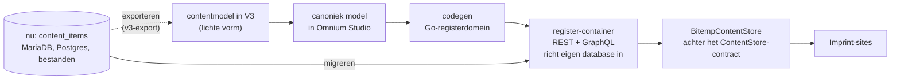
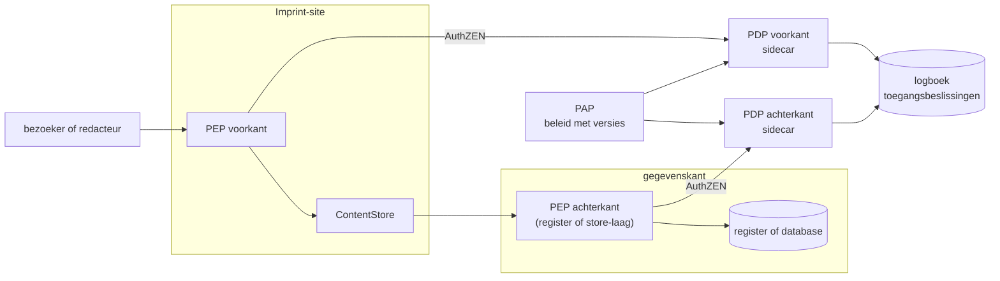
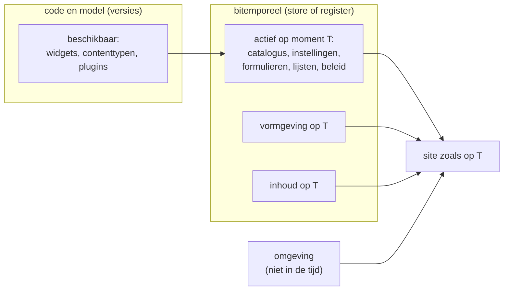

# Ontwerp Fase 3 — gedeelde admin, toegang, register en de site in de tijd

Status: **ontwerp met besluiten**, 16 september 2026 (derde versie, met de
antwoorden van Mark op de open vragen).
Besluiten van Mark zijn als zodanig gemarkeerd; wat nog open is, staat in
§11. Dit document werkt Fase 3 uit het
[revisievoorstel](engine-instance-plugin-architectuur.md) (§10 en §12)
verder uit, en legt twee richtingen vast die over meer fasen gaan: Imprint
gaat naar een gegenereerd bitemporeel register (§3), en de hele site moet
door de tijd te reizen zijn (§8).

Achtergrond: [positionering.md](../positionering.md),
[nl-design-system.md](nl-design-system.md), de
[opdrachtbrief](opdracht-engine-bibliotheek-backend-site.md) (§5, de vierde
backend) en de Omnium-code in `Bitemporal_2026/bitemp_register_v06`. Paden
naar Omnium hieronder zijn relatief aan die map.

## 1. Samenvatting

Fase 3 maakt de admin van MusicBrain tot een gedeelde admin, zodat elke site
dezelfde login, generieke contenteditor en historie heeft tegen haar eigen
opslag. **Imprint bouwt een eigen admin en leent ideeën, geen code** van
Payload, Drupal, Strapi of Pleio. Waar Omnium iets al heeft, volgt Imprint
Omnium.

Daarachter ligt een grotere richting. Wat Imprint nu als JSON in één
contenttabel bewaart, wordt eerst **gemodelleerd** in het canonieke model van
Omnium. Daaruit wordt een **register gegenereerd**: Go-code die als eigen
container draait, zijn database zelf inricht en REST en GraphQL aanbiedt.
Imprint praat daarmee via hetzelfde `ContentStore`-contract als nu, en de
bestaande opslag wordt ernaartoe **gemigreerd**. Formulier- en
lijstdefinities, configuratie in de tijd en de gegevenskant van toegang
komen dan mee als eigenschappen van dat register.

| onderwerp | besluit | status |
|---|---|---|
| strategie | eigen admin; van andere CMS'en alleen ideeën | besloten (Mark) |
| opslag, doel | modelleren in het canonieke model, register genereren, als container draaien, migreren vanuit MariaDB, Postgres en bestanden | richting besloten (Mark); §3 |
| login en sessies | eigen login houden, sessies intrekbaar maken | besloten (Mark) |
| rechten | PxP: PEP, PDP als sidecar via AuthZEN NL Gov, PIP, PAP; FTV als kader | besloten (Mark); §4 |
| twee PDP's | voorkant: vóórdat er iets getoond wordt; achterkant: bij gegevenstoegang | besloten (Mark); §4 |
| publiek en beperkt | alle content krijgt `publiek` of `beperkt`; publieke content werkt zonder PDP | besloten (Mark); §4 |
| browsertest | ja, voor het vastleggen van de admin-flows | besloten (Mark) |
| formulieren | Omnium-formulierdefinities; niet zelf verzinnen | besloten (Mark); §5 |
| lijsten | Omnium-lijstdefinities en het REST-lijstcontract | besloten (Mark); §6 |
| contenttypen | eigen catalogus, uit het model | besloten (Mark); §7 |
| bron van waarheid | het canonieke model; zod-schema's worden daarvan afgeleid. De eerste versies ontstaan andersom, uit zod | besloten (Mark); §3.4 |
| tijd | beide tijdassen als datum-tijd; het principe vraagt alleen lineaire tijd | besloten (Mark); §3.4 |
| modelwijzigingen | een groeiend model is geen probleem voor tijdreizen; een brekende wijziging vraagt, net als code, eerst een downgrade | besloten (Mark); §8.2 |
| gebruikers | aanmelden in het eigen systeem; gebruikers als tabel in dezelfde database; de registratie legt de redacteur vast; geen single sign-on; één gebruikersbestand pas bij multisite op één engine, lage prioriteit | besloten (Mark); §4.2 |
| de site in de tijd | configuratie, inhoud en vormgeving bitemporeel; code en omgeving niet | principe besloten (Mark); §8 |
| widgetversies | brekende wijziging = nieuwe hoofdversie of nieuwe widget | richting (Mark); §9 |
| media en formulieren | als plugin; Fase 3 maakt er ruimte voor | besloten (Mark); §10 |

## 2. Wat Fase 3 is, en wat niet

Fase 3 is **extractie**: de bestaande admin wordt gedeeld. Nieuwe
mogelijkheden (media met varianten, een vertaal-UI, formulieren voor
bezoekers, achtergrondtaken, goedkeuringsstappen) horen er niet bij, en de
overstap naar een register ook niet. Fase 3 moet voor beide wel ruimte laten.

Dat kan, omdat de admin via het `WritableContentStore`-contract met de
opslag praat. Een register achter dat contract (§3) vraagt dus geen andere
admin. Wat Fase 3 níet moet doen: een eigen opslag bedenken voor formulieren,
lijstdefinities of configuratie, want die komen uit het register.

De huidige admin, gemeten in september 2026:

| deel | regels | fase |
|---|---|---|
| generieke clientcomponenten: dialoog, formulier, markdown-editor, login, menu-, thema-, gebruikers- en relatiebeheer, itemeditor | ~1.400 | 3, vrijwel mechanisch |
| routes, server actions, admin-shell, formulierschema's, auth, poortje | ~1.550 | 3, met ontwerp |
| studio en widgeteditors | ~1.700 | 4 |
| planning | ~800 | 5, plugin |
| wiki | ~1.150 | 5, plugin |

Wat het ontwerpwerk veroorzaakt: 16 van de 18 admin-routebestanden lezen de
store rechtstreeks uit de site; contenttypen staan in vijf losse, onderling
verschillende lijsten; Next.js-routes moeten in de site staan (dunne
routebestanden die pagina's en server actions uit het package doorgeven);
en gebruikers werken nog alleen op MariaDB, terwijl de Imprint-site op
Postgres draait.

## 3. Richting: van contenttabel naar gegenereerd register

### 3.1 De keten (richting Mark)



1. **Modelleren.** De contenttypen van Imprint worden in het canonieke model
   getekend. V3 is de lichte vorm die Omnium kan inlezen; Imprint heeft al een
   V3-export (`sites/musicbrain/src/lib/v3-export.ts`), en
   `docs/imprint-contentmodel-v3.md` in Omnium beschrijft de afbeelding.
2. **Genereren.** De codegen van Omnium maakt er een registerdomein van.
3. **Draaien.** Het register draait als zelfstandige container en richt bij
   het eerste gebruik zijn eigen database in.
4. **Aansluiten.** Een `BitempContentStore` in `content-core` spreekt de
   register-API aan. Hij moet dezelfde lees- en schrijfcontractsuites halen
   als de MariaDB-, Postgres- en geheugen-backends. Pagina's, widgets en admin
   merken dan niets.
5. **Migreren.** De bestaande opslag gaat naar het register, historie
   inbegrepen.

### 3.2 Wat Omnium hiervoor al heeft

- **Canoniek model**: een diagramprofiel in Studio
  (`web/vite/src/diagramprofielen/canoniek-uml/index.js`) met Entiteit,
  Gegevenselement, Relatie, Enumeratie, Gegevenstype, Referentielijst,
  Package als domein, en een markering `materieel` voor de tijdlijn. Op schijf
  en over de API reist het als V3-JSON; een voorbeeld is
  `configuratie_model.json` (het domein met `FormulierDefinitie` en
  `WeergaveDefinitie`).
- **Codegen** in Go (`cmd/codegen/`), invoer V3:
  `go run ./cmd/codegen --input model.json --mode additive --domein x --prefix x --output model/`.
  Er is ook een omgekeerde export (`cmd/export_v3`), en code → V3 → code is
  getoetst als identiek. Handleiding: `docs/CODEGEN.md`.
- **Niet gegenereerd maar bij het starten opgebouwd uit de metaregistry**:
  REST-routes, het GraphQL-schema, OpenAPI en de database-DDL.
- **Eerste gebruik**: met `AUTO_CREATE_DATABASE=true` maakt het register zijn
  database aan en daarna alle tabellen die nog ontbreken
  (`dbsetup/createmodeltables.go`).
- **API per entiteit**: `GET/POST /{pad}`, `GET/POST /full/{pad}` met
  `?peiltijdstip=`, `PATCH /full/{pad}/:id?modus=registratie|correctie`,
  `POST /registratie/`, en GraphQL-queries en -mutaties.
- **Images**: `Dockerfile.api` bouwt alleen de API; de domeinen zitten erin
  gecompileerd.

### 3.3 Voorwaarden in Omnium, vóór Imprint kan overstappen

Gemeten in de code, september 2026. Dit is werk in Omnium, niet in Imprint.

| voorwaarde | stand in Omnium | waarom Imprint het nodig heeft |
|---|---|---|
| echte formele tijd | het registratietijdstip is synthetisch: 1 januari 2026 plus een uur per registratienummer (`handlers/registration_core.go`) | tijdreizen op formele tijd, en elke gewone save |
| historie inlezen met oude formele tijd | niet mogelijk, volgt uit het vorige punt | migratie zonder verlies van de versiegeschiedenis |
| bevragen op materiële tijd | backlog B31, niet gebouwd | `asOf` op geldigheid: geplande publicatie en "site zoals op datum X" |
| materiële tijd als tijdstip | alleen een datum (`datum DATE`) | Imprint legt geldigheid tot op de milliseconde vast; besluit: beide tijdassen als datum-tijd (§3.4) |
| de registratie legt de gebruiker vast | `Registratie` heeft geen gebruikersveld, alleen verzoek, pad en antwoord voor audit (`model/model_plumbing.go`); een tabel `Gebruiker` bestaat wel | de redacteur is degene die registreert (§4.2); Imprint legt nu `created_by` vast |
| een apart register per toepassing | niet als functie; codegen schrijft in dezelfde Go-module, dus nu een kopie van de repository | een Imprint-register met alleen Imprint-domeinen, eigen image, eigen releases |
| schemawijzigingen uitvoeren | bij het starten worden alleen ontbrekende tabellen gemaakt; migratie-SQL uit de diff wordt niet uitgevoerd | elk nieuw veld op een contenttype na de eerste uitrol |
| bulkimport | gepland als backlog N4; nu alleen replay via de UI | migratie van duizenden versies |
| toegang per contenttype en item | de PEP noemt resources grof (`api` plus het eerste padsegment; alles via GraphQL heet `graphql`) | de achterkant-PDP moet per type en item beslissen (§4) |
| weigeren als de PDP onbereikbaar is | standaard wordt doorgelaten | beperkte content mag nooit lekken (§4) |

### 3.4 De afbeelding van Imprint op het register

Hier zitten de echte ontwerpvragen (§11):

- **JSON of structuur.** Imprint bewaart per type één zod-gevalideerd
  JSON-document. Het register modelleert entiteiten met gegevenselementen en
  relaties. Diepe structuren zoals de paginaopbouw (rijen, vakken, widgets)
  blijven waarschijnlijk een JSON-veld; eenvoudige velden worden echte velden.
  Nog open; Mark denkt erover na.
- **Relaties.** Imprint heeft zachte slug-verwijzingen met RelationRules als
  bewerkbare content. Het register kent relaties met foreign keys. Harde
  relaties zijn strenger; dat verandert wat een redacteur mag opslaan.
- **Taal.** Imprint heeft per item een `lang` met een overlay op Engels. In
  het register is dat een ontwerpkeuze: een gegevenselement per taal, of een
  taalveld.
- **Bron van waarheid (besluit Mark).** Het canonieke model wordt de bron;
  zod-schema's worden daarvan afgeleid, of vervangen door de validatie van het
  register. De eerste versies ontstaan juist andersom: V3 wordt uit de huidige
  zod-schema's geëxporteerd en in Studio ingelezen. Daarmee is ook het open
  punt in `docs/imprint-contentmodel-v3.md` beantwoord.
- **Tijd (besluit Mark).** Voor het bitemporele principe maakt de eenheid van
  tijd niet uit, zolang de tijd lineair is: één dimensie. Een site staat in
  deze wereld online, dus beide tijdassen worden een gewone datum-tijd. Voor
  Omnium betekent dat materiële tijd als tijdstip, niet alleen als datum.

### 3.5 Migreren

Per contenttype worden alle versies (`tx_from`, `tx_to`, `valid_from`,
`valid_to`) in volgorde van formele tijd als registraties ingelezen: een
nieuwe versie wordt een registratie, een versie die eindigde zonder opvolger
een afvoer. Dat kan pas met de voorwaarden uit §3.3. Een droogloop vergelijkt
daarna per item en per moment de oude store met het register, met dezelfde
contractsuites als gereedschap. Volgorde: eerst de kleine Imprint-site, dan
MusicBrain. Dat laatste is een aparte beslissing, zoals de opdrachtbrief al
zei voor Postgres.

## 4. Toegang: het PxP-patroon

### 4.1 Rollen (besluit Mark)

- **PEP** — het poortje. Beslist zelf niets.
- **PDP** — de beslisser, als **sidecar**, aangesproken via AuthZEN.
- **PIP** — attributen: rollen van de gebruiker, eigenschappen van de resource.
- **PAP** — beheer van het toegangsbeleid, met bewaarde versies.

### 4.2 Twee PDP's (besluit Mark)

| | voorkant | achterkant |
|---|---|---|
| beslist | vóórdat er iets getoond wordt: mag deze bezoeker deze pagina, dit menu-item, deze widget zien? | bij gegevenstoegang: mag dit subject deze gegevens lezen of wijzigen? |
| PEP staat in | de site-runtime (`@imprint/runtime-admin`), vóór het renderen | de datalaag: met het register de PEP-middleware van het register; met MariaDB of Postgres een PEP rond de store in Imprint |
| typische vragen | enkele evaluatie; batch voor een lijst of menu | evaluatie per item; zoekvraag naar resources voor een lijst |



Met het register als achterkant zit de achterkant-PEP al in Omnium
(`middleware/authz_pep.go`, via `authz/authzen_client.go` naar een
OpenFTV-sidecar). Imprint moet dan de identiteit van de gebruiker doorgeven,
zodat de achterkant-PDP het echte subject ziet en niet een servicerekening.

**Gebruikers (besluit Mark).** Gebruikers melden zich aan in het eigen
systeem. Hun gegevens staan als tabel in dezelfde database; in het register is
dat `Gebruiker`. De redacteur is degene die content registreert, dus elke
registratie legt vast wie registreerde. Het register doet dat nog niet
(§3.3). Single sign-on en gebruikers uit andere registers zijn nu geen doel.
Pas bij multisite op één engine kan één gebruikersbestand zinvol worden, en dat
heeft lage prioriteit.

### 4.3 Publiek en beperkt (besluit Mark)

Alle content krijgt een toegangswaarde: `publiek` of `beperkt`. Nu bestaat
alleen `visibility` (`public`, `members`), en alleen op wiki's.

- **Publiek** werkt zonder PDP: geen toegangsvraag, dus ook geen afhankelijkheid
  van een bereikbare PDP. Publieke pagina's blijven statisch voorgerenderd.
- **Beperkt** gaat altijd langs de PDP, en wordt nooit statisch gerenderd.
- **Onbereikbare PDP**: beperkt lezen wordt geweigerd; schrijven en admin
  worden geweigerd. Publiek lezen gaat gewoon door.
- **Gevolg voor de achterkant**: de PEP moet de toegangswaarde van een item
  kennen om een PDP-vraag over te slaan. Bij lijsten betekent dat: publieke
  items direct, beperkte items gefilterd via een batch- of zoekvraag. In het
  register vraagt dit een aanpassing van de PEP (§3.3).

`members` gaat op in `beperkt`: "alleen ingelogd" wordt een regel in het
beleid, niet een waarde in de content.

### 4.4 De standaarden

- **AuthZEN Authorization API 1.0** is sinds januari 2026 een definitieve
  OpenID-specificatie: enkele evaluatie, batch, zoekvragen naar subjects,
  resources en acties, en een metadata-document van de PDP.
- **AuthZEN NL Gov** is het Nederlandse profiel, beheerd door Logius, in maart
  2026 aangemeld bij Forum Standaardisatie. Het voegt verwijzingen naar
  verwerkingsactiviteiten toe (aansluitend op Logboek Dataverwerkingen),
  verwijzingen naar het Algoritmeregister, en semantische identificatie via
  MIM en JSON-LD.
- **FTV** bundelt AuthZEN NL Gov, het **Logboek Toegangsbeslissingen** (de PDP
  legt vraag en antwoord vast, met toegepaste regels, bronnen, configuratie en
  correlatie-ID's; OpenTelemetry met `trace_id` en `span_id`) en het
  **Register Toegangsbeleid** (in ontwikkeling; regels met versies bewaren, de
  PAP synchroniseert naar de PDP). FTV adviseert autorisatie bij aanbieder én
  afnemer; dat past bij twee PDP's.

### 4.5 Omnium als voorbeeld

- PEP als Gin-middleware, AuthZEN-client naar
  `POST {OPENFTV_PDP_URL}/authzen/v1/evaluation`.
- PDP: OpenFTV 2.2.3 als Docker Compose-sidecar (`docker-compose.auth.yml`),
  met een beheerdienst als PAP en PIP, beleid in Rego, en het logboek in
  Postgres (`openftv_adl`).
- Ontwerp: `docs/plans/Whitepaper-Register-Toegangsbeleid.md` — een
  bitemporeel ODRL-register als PAP, een vrij te kiezen engine als PDP, AuthZEN
  daartussen, zodat "welk beleid gold op moment T" een gewone vraag is.
  Toegangsspraak (`docs/TOEGANGSSPRAAK.md`) vertaalt klare taal naar ODRL.

**Advies**: de OpenFTV-sidecar-opzet van Omnium overnemen, twee keer.

### 4.6 Wat er in Imprint verandert

Nu (`sites/musicbrain/src/lib/authorize.ts`): een synchroon poortje, één
beslisser in het proces met regels per rol. Aan de voorkant wordt het alleen
voor wiki's aangeroepen; alle andere content is feitelijk al publiek. Het
commentaar "geen sidecar, Plesk-proof" is met de VPS achterhaald.

| | nu | doel |
|---|---|---|
| verzoek | `subject {role, name}`, `action`, `resource {type, slug, visibility, wiki}` | AuthZEN: `subject {type, id, properties}`, `action {name}`, `resource {type, id, properties}`, `context` |
| antwoord | `{ allow, reason }` | `{ decision, context? }` |
| aanroep | synchroon; 29 aanroepen in 11 bestanden | asynchroon |
| beslisser | in het proces | adapter: in het proces voor dev, test en CI; HTTP naar de sidecar in productie |
| toegangswaarde | `visibility` op wiki's | `publiek` of `beperkt` op alle content |
| correlatie | geen | `trace_id` in `context`, te koppelen aan de opgeslagen versie |

Het groeipad in [wiki.md §4](wiki.md) ("policies als content, geen sidecar")
is hiermee vervangen.

## 5. Formulieren: Omnium volgen (besluit Mark)

Niet zelf verzinnen. Het huidige formulier (`SchemaForm`, gegenereerd uit de
zod-schema's, complexe velden als JSON-vak) blijft zolang het volstaat.
Wordt het moeilijker — groepen, voorwaarden, herhaalblokken, keuzelijsten uit
referentielijsten — dan gaat Imprint over op de Omnium-aanpak.

Die is modelgedreven: `FormulierDefinitie` is getekend in het canonieke model
(`configuratie_model.json`) en daaruit gegenereerd als registerentiteit. Met
een eigen register (§3) krijgt Imprint dat configuratiedomein mee, met
dezelfde API, en dus bitemporeel.

- **Definitie**: `Meta` (`naam`, `beschrijving`, `doeltype`, `status`
  concept|actief|inactief, `is_standaard`), `Layout` (`layout_json`,
  `definitie_versie`) en een geldigheid.
- **Datamodel en weergave gescheiden**, zoals JSONForms: het datamodel is V3,
  de weergave `layout_json`:

  ```jsonc
  { "type": "formulier", "elementen": [
    { "type": "groep", "label": "Product", "elementen": [
      { "type": "veld", "veld": "ENT.GE.veld", "breedte": "50%", "widget": "textarea" },
      { "type": "rij", "elementen": [] } ] },
    { "type": "conditioneel", "conditie": { "veld": "…", "op": "==", "waarde": "…" }, "dan": [] },
    { "type": "lijst", "bron": "ENT.GE", "elementen": [] } ] }
  ```

- **Renderer**: `CustomFormulierRenderer.jsx` met `SchemaFormField.jsx`;
  keuzelijsten via `/api/viz/reflijst/:typenaam/opties`; NL Design System via
  Utrecht-CSS; validatie in de browser en volledig op de server, fouten als
  `application/problem+json`.
- **Editor**: Studio-activiteit F41, zonder externe formulierbibliotheek.
- **Nog niet in Omnium**: stappen (F42), een formeel type voor `layout_json`,
  patroon- en checksumregels in de browser. De renderer is aan Omnium
  gekoppeld (`useSchema()`, `/api/viz`); losmaken staat in de backlog.

Voor Fase 3: geen formulierwerk, alleen een plek in de admin-context voor een
formulierrenderer per contenttype.

## 6. Lijsten: Omnium volgen (besluit Mark)

Ook modelgedreven: `WeergaveDefinitie` staat in hetzelfde configuratiedomein.

- **Lijstdefinitie** (`tabel_config_json`), met een detailsjabloon in Markdown
  met `{{veldpad}}`:

  ```json
  { "kolommen": [ { "veldpad": "namen.data.achternaam", "label": "Achternaam",
                    "breedte": 160, "sorteerbaar": true, "filterbaar": true } ],
    "standaardSortering": { "veld": "id", "richting": "asc" },
    "rijenPerPagina": 25 }
  ```

  Zonder definitie valt de lijst terug op kolommen uit het schema.
- **REST-lijstcontract** (`docs/REST_CRUD.md`): `?page=&size=`, `?q=`,
  `?filter.<kolom>=`, `?sort=&order=`, antwoord met `page`, `size`,
  `has_more`, `total_count`; `?peiltijdstip=` op de `/full`-routes.
- **GraphQL** bestaat, maar geen enkele lijst gebruikt het; alleen de
  publicatiedetailpagina en de 3D-weergave. REST is de bron voor lijsten.
- **Nog niet in Omnium**: zoeken, rijacties en links in de lijstdefinitie.

Voor Imprint: admin-lijsten per contenttype krijgen een lijstdefinitie in deze
vorm, met een terugval op kolommen uit het schema; `/api/content` groeit naar
hetzelfde lijstcontract. De `template`-widget met Mustache lijkt al op het
detailsjabloon. Lijsten filteren beperkte content via de achterkant-PDP.

## 7. Contenttypen: een eigen catalogus (besluit Mark)

De vijf losse typelijsten verdwijnen in één catalogus per site:

- **beschikbaar** — wat het model kent, met label, menugroep, en of een type
  lijstbaar, schrijfbaar en via de API aan te leveren is;
- **actief** — welke daarvan deze site gebruikt.

Admin-menu, lijst-, bewerk- en historieroutes en de schrijf-API lezen uit die
catalogus. Nu komt "beschikbaar" uit de zod-schema's in `content-core`; met
het register uit het canonieke model (§3.4). "Actief" is configuratie, en
hoort dus in de tijd (§8).

## 8. De site in de tijd: inhoud, vormgeving en configuratie

### 8.1 Principe (besluit Mark)

> Hoe zag de site er op 1 januari uit = configuratie + inhoud + vormgeving.
> Dat moet je terug kunnen halen.

Alles wat de site bepaalt, behalve de omgeving (waar de database staat,
secrets), moet bitemporeel vastlegbaar zijn. **Niet** bitemporeel: de code van
engine, plugins en widgets. Een upgrade zonder brekende wijziging hoort niet in
de tijdlijn. Wie de site met een oude engineversie wil zien, start een oude
instantie en kijkt daar naar de oude inhoud, vormgeving en configuratie.

### 8.2 De lagen

| laag | voorbeelden | nu | bitemporeel nu | doel |
|---|---|---|---|---|
| omgeving | databaselocatie, secrets, assetmap | omgevingsvariabelen | nee | nooit |
| code | engine, plugins, widgets, gegenereerd register | git, versietags, images | nee | nee; oud = oude instantie |
| model | contenttypen, velden, relaties | zod-schema's in git | nee | het canonieke model, met versies; groeien kan, brekend vraagt een downgrade |
| configuratie | actieve catalogus, formulier- en lijstdefinities, toegangsbeleid, relatieregels, aliassen | deels content, deels code | deels | ja |
| vormgeving | thema's, menu's, default views; SiteChrome-varianten | deels content, chrome in code | deels | ja, voor wat configureerbaar is |
| inhoud | pagina's, producten, releases | content | ja | ja |

Het model staat bewust apart (besluit Mark):

- **Een model dat groeit**, zoals Imprint 1.2 ten opzichte van 1.1, is geen
  probleem voor tijdreizen. Oude content gebruikt het nieuwe deel van het model
  niet, en nieuwe content het verdwenen deel niet.
- **Een brekende modelwijziging** breekt het vermogen om terug te reizen tot
  vóór die wijziging. Dat is niet anders dan bij code: eerst het systeem
  downgraden, dan terugkijken.

Dat is hetzelfde principe als bij widgetversies (§9). In Omnium zijn
schemaversies (`schema_versies`) overigens nog niet bitemporeel, en
Studio-modellen staan nog in `localStorage` (Omnium-backlog §27.2).

### 8.3 Ontwerpregel: beschikbaar in code, actief in de tijd



### 8.4 Waar het nu lekt

In Imprint, gemeten in de code:

- `getSiteConfig()` accepteert geen leesopties, dus siteconfiguratie reist niet mee.
- De thema-CSS in de root-layout wordt zonder `asOf` gelezen; het menu reist wel mee.
- Default views (`_view/<type>`) worden zonder `asOf` gelezen.
- De widgetselectie staat in code.
- Widgetinstanties noteren geen versie (§9).

De eerste drie zijn kleine, losse reparaties. In Omnium lekt het op dezelfde
manier: formulier- en lijstdefinities zijn bitemporeel opgeslagen, maar
`useFormulierDefinitie` en `useWeergaveDefinitie` lezen altijd de huidige
versie.

### 8.5 In welke fase

Voorstel, nog niet besloten (§11): de drie reparaties los; Fase 3 en 5 houden
de splitsing beschikbaar/actief aan; een nieuwe **Fase 7 — configuratie in de
tijd** brengt de actieve catalogus, instellingen, formulier- en
lijstdefinities en toegangsbeleid in de tijdlijn. Met het register (§3) is dat
grotendeels een kwestie van ze als registerentiteiten modelleren.

## 9. Widgetversies en tijdreizen

**Nu**: widgets worden tijdens het bouwen geregistreerd. De catalogus is
TypeScript; een andere set vraagt een nieuwe build. Elke widget heeft een
`version` (de meeste `1.0.0`, `hero` en `divider` `1.1.0`), maar een
opgeslagen widget heeft alleen `type` en `config`.

**Richting (Mark)**: een widget die brekend verandert, wordt een andere
widget, of krijgt in elk geval een andere hoofdversie. Dan is duidelijk dat je
niet naar een oude versie van de widget kunt reizen zonder de widget zelf naar
die versie terug te zetten.

- **Niet-brekend** (minor, patch): oude inhoud rendert met de nieuwe versie.
- **Brekend**: nieuwe hoofdversie; een widgetinstantie noteert bij opslaan de
  hoofdversie (`{ type, versie, config }`). Bij oude inhoud: renderen als die
  hoofdversie geïnstalleerd is, migreren als er een migratie is
  (revisievoorstel §5.4), anders een zichtbare melding in de preview.
- **Nieuwe widget** als ook de betekenis verandert, niet alleen de configuratie.

## 10. Ruimte voor plugins: media en formulieren (besluit Mark)

Media (S8) en formulieren voor bezoekers (S10) worden plugins. Fase 3 bouwt
ze niet, maar de admin-context krijgt de plekken: admin-bijdragen (menu-items,
schermen), contenttypen uit plugins via de catalogus, een formulierrenderer
per contenttype, en de asset-store uit de instantie. Voor bezoekersformulieren
staat de route al in de backlog: de Omnium-renderer als package, een
`form`-widget, NL Design System als CSS-classes, inzendingen buiten de
bitemporele store vanwege de AVG.

## 11. Stappenplan en open vragen

### 11.1 Fase 3

| stap | wat | maat |
|---|---|---|
| 0 | besluiten vastleggen (dit document) | S, klaar |
| 1 | gebruikers op Postgres, secrets via de config, catalogus beschikbaar/actief | 3 × S, klaar |
| 2 | admin-flows vastleggen met een browsertest (Playwright): login, lijst, opslaan, historie, herstel, gebruikers | L |
| 3 | poortje in AuthZEN-vorm en asynchroon, beslisser in het proces; `publiek` of `beperkt` op alle content | M |
| 4 | admin-context, en de generieke clientcomponenten naar het package | M |
| 5 | routes en server actions in het package, dunne routebestanden, menu uit de catalogus | L |
| 6 | MusicBrain draait `/admin` uit het package; planning en wiki blijven bijdragen van de site | M |
| 7 | Imprint-site: admin aan, eerste gebruiker, bewerken en historie op Postgres | M |

### 11.2 Sporen naast Fase 3

| spoor | wat | waar |
|---|---|---|
| toegang | twee OpenFTV-sidecars, HTTP-adapter, weigeren bij onbereikbare PDP voor beperkt en schrijven, correlatie met het logboek | Imprint; M–L |
| register, voorwaarden | echte formele tijd, historie inlezen, materiële tijd als tijdstip en bevraagbaar, gebruiker bij de registratie, apart register per toepassing, schemawijzigingen uitvoeren, bulkimport, PEP per type en item, standaard weigeren | Omnium; §3.3 |
| register, Imprint | contentmodel in V3 en in het canonieke model; Imprint-register genereren; `BitempContentStore` door de contractsuites; migratie met droogloop; eerst de Imprint-site | Imprint en Omnium; L |
| tijdreizen | de drie leesreparaties (§8.4); later Fase 7 | Imprint; 3 × S, dan L |

### 11.3 Open vragen

1. **Volgorde register en Fase 3.** Eerst Fase 3 op de huidige opslag en dan
   het register, of het register eerder, zodat formulieren, lijsten en
   configuratie meteen uit het register komen? Mark denkt hierover na.
2. **JSON of structuur** (§3.4). Welke delen worden echte velden in het
   register, en welke blijven een JSON-veld, zoals de paginaopbouw? Mark denkt
   hierover na.
3. **Relaties en taal** (§3.4). Zachte verwijzingen of relaties met foreign
   keys? Taal als gegevenselement per taal, of als veld?
4. **Opzet van Fase 3.** In één keer, of in twee helften: eerst login, lijst,
   bewerken en historie; dan gebruikers, relaties, menu's, thema's en
   modeloverzichten?
5. **PAP.** Nu OpenFTV-beheer met Rego-bundels, later het Register
   Toegangsbeleid uit het bitemporele register?
6. **Configuratie in de tijd.** Een nieuwe Fase 7, of verweven in Fase 3 tot en
   met 5? En de drie leesreparaties uit §8.4 nu al doen?
7. **Widgetversies.** De hoofdversie per widgetinstantie opslaan? Oude
   hoofdversies naast nieuwe laten bestaan?
8. **Tijdreis naar een verdwenen widget.** Een melding in de preview, terwijl
   opslaan en bouwen hard blijven falen?
9. **Lijstdefinities.** Al in Fase 3 in de vorm van `WeergaveDefinitie`, of
   pas met het register?

### 11.4 Beantwoord

| vraag | antwoord (Mark) | verwerkt in |
|---|---|---|
| browsertest voor de admin-flows | ja | §11.1, stap 2 |
| één of twee PDP's | twee: voorkant vóór het tonen, achterkant bij gegevenstoegang | §4.2 |
| onbereikbare PDP | met `publiek` of `beperkt` op alle content werkt publieke content zonder PDP | §4.3 |
| bron van waarheid voor het model | het canonieke model; de eerste versies ontstaan andersom | §3.4 |
| precisie van tijd | datum-tijd is prima; het principe vraagt alleen lineaire tijd | §3.4 |
| het model in de tijd | groeien is geen probleem; een brekende wijziging vraagt eerst een downgrade | §8.2 |
| login en identiteit | eigen systeem, gebruikers in dezelfde database, de registratie legt de redacteur vast; single sign-on en één gebruikersbestand later, lage prioriteit | §4.2 |

## Bronnen

- [OpenID Foundation: Authorization API 1.0 Final Specification Approved](https://openid.net/authorization-api-1-0-final-specification-approved/)
- [Authorization API 1.0 (specificatie)](https://openid.net/specs/authorization-api-1_0.html)
- [Logius: openbare consultatie NLGov AuthZEN Authorization API v1.0](https://www.logius.nl/actueel/openbare-consultatie-nlgov-authzen-authorization-api-v10)
- [Logius-standaarden/authzen-nlgov (GitHub)](https://github.com/Logius-standaarden/authzen-nlgov)
- [Federatieve Toegangsverlening: AuthZEN NL Gov](https://vng-realisatie.github.io/ftv/methodiek/authzen-nlgov/)
- [Federatieve Toegangsverlening: Register Toegangsbeleid](https://vng-realisatie.github.io/ftv/methodiek/register-toegangsbeleid/)
- [NORA: Handreiking FTV-standaarden](https://www.noraonline.nl/wiki/Handreiking_FTV_standaarden)
- [Digilab: Federatieve Toegangsverlening](https://digilab.overheid.nl/projecten/toegangsverleningmethodiek-api/)
- Omnium (`Bitemporal_2026/bitemp_register_v06`):
  - register en codegen: `cmd/codegen/`, `docs/CODEGEN.md`,
    `configuratie_model.json`, `dbsetup/createmodeltables.go`,
    `handlers/registration_core.go`, `routes/addroutes_helper.go`,
    `docs/REST_CRUD.md`, `Dockerfile.api`
  - canoniek model: `web/vite/src/diagramprofielen/canoniek-uml/index.js`,
    `model/v3_format.go`, `docs/imprint-contentmodel-v3.md`
  - toegang: `middleware/authz_pep.go`, `authz/authzen_client.go`,
    `docker-compose.auth.yml`, `docs/plans/Whitepaper-Register-Toegangsbeleid.md`,
    `docs/TOEGANGSSPRAAK.md`
  - formulieren en lijsten: `web/vite/src/formuliereditor/layoutModel.js`,
    `web/vite/src/components/editor/CustomFormulierRenderer.jsx`,
    `model/configuratie_modellen_entiteiten.go`
  - backlog: `docs/BACKLOG.md` §27.2, backlog B31 en N4
