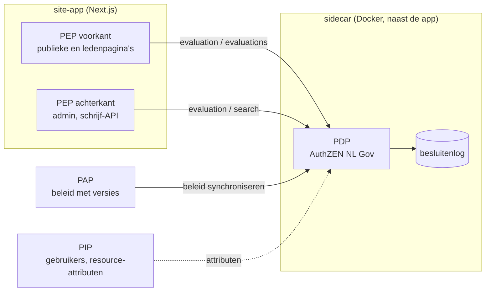
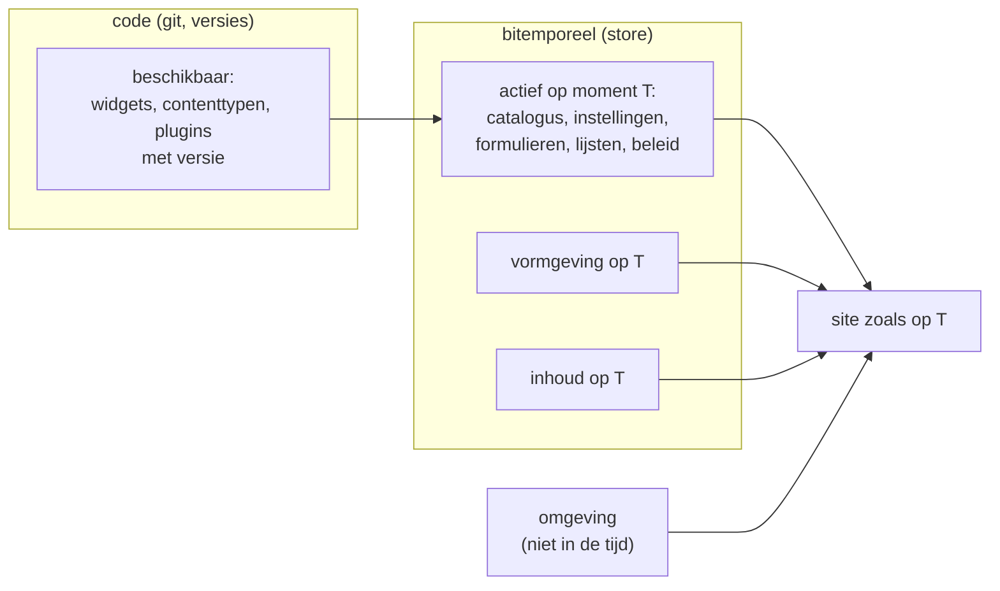

# Ontwerp Fase 3 — gedeelde admin, toegang en de site in de tijd

Status: **ontwerp met besluiten**, 16 september 2026. Besluiten van Mark zijn
als zodanig gemarkeerd; wat nog open is, staat in §10. Dit document werkt
Fase 3 uit het [revisievoorstel](engine-instance-plugin-architectuur.md)
(§10 en §12) verder uit, en legt daarnaast een principe vast dat over meer
fasen gaat: de hele site moet door de tijd te reizen zijn (§7).

Achtergrond: [positionering.md](../positionering.md) (Imprint naast Drupal
en Payload), [nl-design-system.md](nl-design-system.md) (Omnium en NLDS), en
de Omnium-code in `Bitemporal_2026/bitemp_register_v06`. Paden naar Omnium
hieronder zijn relatief aan die map.

## 1. Samenvatting

Fase 3 maakt de admin van MusicBrain tot een gedeelde admin, zodat elke site
dezelfde login, generieke contenteditor en historie heeft tegen haar eigen
database. De vraag "bouwen of lenen" is beantwoord: **Imprint bouwt een eigen
admin en leent ideeën, geen code** van Payload, Drupal, Strapi of Pleio. Waar
een patroon al in Omnium bestaat, volgt Imprint Omnium in plaats van iets
nieuws te verzinnen.

| onderwerp | besluit | status |
|---|---|---|
| strategie | eigen admin; van andere CMS'en alleen ideeën | besloten (Mark) |
| login en sessies | eigen login houden, sessies intrekbaar maken | besloten (Mark) |
| rechten | PxP-patroon: PEP als poortje in de engine, PDP als sidecar via AuthZEN, met PIP en PAP; AuthZEN NL Gov en FTV als kader | besloten (Mark); uitwerking §3 |
| formulieren | Omnium-formulierdefinities volgen, niet zelf verzinnen; zolang het niet moeilijker wordt dan nu blijft het huidige formulier | besloten (Mark); §4 |
| lijsten | afkijken bij Omnium: declaratieve lijstdefinitie en REST-contract | besloten (Mark); §5 |
| contenttypen | eigen catalogus per site | besloten (Mark); §6 |
| de site in de tijd | configuratie, inhoud en vormgeving bitemporeel; code en omgeving niet | principe besloten (Mark); fase open, §7 |
| widgetversies | brekende wijziging = nieuwe hoofdversie of nieuwe widget | richting (Mark); §8 |
| media en formulieren | als plugin; Fase 3 maakt er ruimte voor | besloten (Mark); §9 |

## 2. Wat Fase 3 is, en wat niet

Fase 3 is **extractie**: de bestaande admin wordt gedeeld. Nieuwe
mogelijkheden zoals media met varianten, een vertaal-UI, formulieren voor
bezoekers, achtergrondtaken of goedkeuringsstappen horen er niet bij. Fase 3
moet er alleen ruimte voor laten (§9).

De huidige admin, gemeten in september 2026:

| deel | regels | fase |
|---|---|---|
| generieke clientcomponenten: dialoog, formulier, markdown-editor, login, menu-, thema-, gebruikers- en relatiebeheer, itemeditor | ~1.400 | 3, vrijwel mechanisch |
| routes, server actions, admin-shell, formulierschema's, auth, poortje | ~1.550 | 3, met ontwerp |
| studio en widgeteditors | ~1.700 | 4 |
| planning | ~800 | 5, plugin |
| wiki | ~1.150 | 5, plugin |

Wat het ontwerpwerk veroorzaakt:

- 16 van de 18 admin-routebestanden lezen de store rechtstreeks uit de site;
  dat vraagt een admin-context, zoals de `WidgetContext` in Fase 2.
- De contenttypen staan in vier admin-bestanden en één API-route als losse
  lijsten, die onderling verschillen; het admin-menu noemt MusicBrain-typen.
- Next.js-routes moeten in de site staan: sites houden dunne routebestanden
  die pagina's en server actions uit het package doorgeven.
- Login, opslaan en herstellen lopen via cookies, redirects en server actions;
  vastleggen vraagt waarschijnlijk een browsertest (§10).
- Gebruikers werken nog alleen op MariaDB; de Imprint-site draait op Postgres.

## 3. Toegang: het PxP-patroon met een sidecar-PDP

### 3.1 Rollen en plaats (besluit Mark)

- **PEP** — het poortje. Eén functie in de engine (`@imprint/runtime-admin`)
  waar elke lees- en schrijfbeslissing doorheen gaat. Beslist zelf niets.
- **PDP** — de beslisser, als **sidecar** naast de site: een eigen proces of
  container, aangesproken via AuthZEN. Mogelijk twee: één voor de voorkant
  (publieke en ledenpagina's) en één voor de achterkant (admin en schrijf-API).
- **PIP** — levert attributen voor een besluit: rollen en eigenschappen van
  de gebruiker, eigenschappen van de resource (zoals `visibility`).
- **PAP** — beheer van het toegangsbeleid, met bewaarde versies.



### 3.2 De standaarden

- **AuthZEN Authorization API 1.0** is sinds januari 2026 een definitieve
  OpenID-specificatie. Hij definieert een enkele toegangsvraag (Access
  Evaluation), batchvragen (Access Evaluations), zoekvragen naar subjects,
  resources en acties (Search APIs) en een metadata-document van de PDP.
- **AuthZEN NL Gov** is het Nederlandse profiel daarop, beheerd door Logius,
  in maart 2026 aangemeld bij Forum Standaardisatie. Het voegt verwijzingen
  naar verwerkingsactiviteiten toe (aansluitend op Logboek Dataverwerkingen),
  verwijzingen naar het Algoritmeregister, en semantische identificatie van
  subjects, resources en acties via MIM en JSON-LD.
- **FTV** (Federatieve Toegangsverlening) bundelt drie standaarden: AuthZEN NL
  Gov, het **Logboek Toegangsbeslissingen** en het **Register
  Toegangsbeleid**.
  - Het logboek is een taak van de PDP: vraag en antwoord vastleggen, met
    verwijzing naar de toegepaste regels, informatiebronnen, configuratie en
    correlatie-ID's; over HTTPS, OpenTelemetry aanbevolen, met `trace_id` en
    `span_id` om aan Logboek Dataverwerkingen te koppelen.
  - Het register is nog in ontwikkeling. Het eist dat regels met versies en
    metadata bewaard worden; de PAP synchroniseert ze naar de PDP.
  - FTV adviseert autorisatie zowel bij aanbieders als bij afnemers te
    beleggen. Dat past bij een PDP aan de voorkant én de achterkant.

### 3.3 Omnium als voorbeeld

Omnium heeft dit patroon al werkend:

- **PEP**: Gin-middleware `middleware/authz_pep.go`, na de JWT-check.
  GET wordt `read`, schrijven `write`, `/admin` wordt `admin`.
- **Client**: `authz/authzen_client.go` doet
  `POST {OPENFTV_PDP_URL}/authzen/v1/evaluation` met
  `subject {type:"user", id, properties.role}`, `action {name}`,
  `resource {type, id}` en `context`; antwoord `{decision, reason}`.
- **PDP**: OpenFTV 2.2.3 als Docker Compose-sidecar (`docker-compose.auth.yml`):
  `openftv-pdp` (AuthZEN), `openftv-manager` (PAP en PIP, bundels),
  `openftv-db` en een beheer-UI. Beleid in Rego
  (`authz/pdp/policies/bitemp_authz.rego`).
- **Besluitenlog**: door OpenFTV zelf, in de Postgres-database `openftv_adl`.
- **Let op**: met `AUTHZ_DENY_ON_ERROR` standaard uit laat Omnium verzoeken
  **door** als de PDP onbereikbaar is.
- **Ontwerpen**: `docs/plans/Whitepaper-Register-Toegangsbeleid.md` stelt
  drie lagen voor — een bitemporeel ODRL-register als PAP en PIP, een vrij te
  kiezen engine als PDP, AuthZEN daartussen — zodat "welk beleid gold op
  moment T" een gewone vraag wordt. Toegangsspraak
  (`docs/TOEGANGSSPRAAK.md`) vertaalt klare taal naar ODRL.

**Advies**: neem de OpenFTV-sidecar-opzet van Omnium over, in plaats van zelf
een PDP te bouwen of te kiezen.

### 3.4 Wat er in Imprint verandert

Nu (`sites/musicbrain/src/lib/authorize.ts`): een synchroon poortje met een
PDP-interface in AuthZEN-geest, en één implementatie in hetzelfde proces:
`staticPdp`, regels per rol. Het commentaar "geen sidecar, Plesk-proof" is
met de VPS achterhaald; dat besluit wordt hiermee teruggedraaid.

| | nu | doel |
|---|---|---|
| subject | `{ role, name }` | `{ type: "user", id, properties: { role, … } }` |
| action | `"read" \| "create" \| "update" \| "delete"` | `{ name }`, dezelfde namen |
| resource | `{ type, slug, visibility, wiki }` | `{ type, id: slug, properties: { visibility, wiki, … } }` |
| antwoord | `{ allow, reason }` | `{ decision, context? }` volgens AuthZEN |
| aanroep | synchroon | asynchroon; 29 aanroepen in 11 bestanden |
| PDP | `staticPdp` in het proces | adapter per omgeving: in het proces (dev, test, CI) of HTTP naar de sidecar |
| lijsten | per item | batch (`evaluations`) of zoekvraag naar resources |
| PDP onbereikbaar | n.v.t. | schrijven en admin: weigeren; publiek lezen: open vraag |

Aandachtspunten:

- **Publieke pagina's zijn voorgerenderd.** Een PDP-beslissing voor publieke
  inhoud valt dan bij de build; de sidecar moet dan draaien tijdens de build,
  of de publieke leesregel blijft lokaal. Ledeninhoud is al dynamisch.
- **Correlatie.** De PEP geeft een `trace_id` mee in `context`, zodat een
  besluit in het logboek te koppelen is aan de versie die in Imprint is
  opgeslagen.
- **Het groeipad in [wiki.md §4](wiki.md)** ("policies als content, geen
  sidecar") wordt vervangen door dit ontwerp.

## 4. Formulieren: Omnium volgen (besluit Mark)

**Afspraak**: niet zelf verzinnen. Het huidige formulier van Imprint
(`SchemaForm`, gegenereerd uit de zod-schema's, complexe velden als JSON-vak)
blijft zolang het volstaat. **Zodra formulieren moeilijker worden dan nu** —
opbouw in groepen, voorwaarden, herhaalblokken, keuzelijsten uit
referentielijsten — gaat Imprint over op de Omnium-aanpak, in plaats van
`SchemaForm` uit te bouwen.

Wat Omnium heeft:

- **Formulierdefinitie als bitemporele configuratie**: entiteit
  `FormulierDefinitie` in het register (`model/configuratie_modellen_entiteiten.go`),
  met `Meta` (`naam`, `beschrijving`, `doeltype`, `status`
  concept|actief|inactief, `is_standaard`), `Layout` (`layout_json`,
  `definitie_versie`) en een geldigheid (`Aanvang`, `Einde`).
- **Scheiding datamodel en weergave**, zoals JSONForms: het datamodel is het
  V3-formaat (`model/v3_format.go`), de weergave is `layout_json`:

  ```jsonc
  { "type": "formulier", "elementen": [
    { "type": "groep", "label": "Product", "elementen": [
      { "type": "veld", "veld": "ENT.GE.veld", "breedte": "50%", "widget": "textarea" },
      { "type": "rij", "elementen": [] } ] },
    { "type": "conditioneel", "conditie": { "veld": "…", "op": "==", "waarde": "…" }, "dan": [] },
    { "type": "lijst", "bron": "ENT.GE", "elementen": [] } ] }
  ```

- **Renderer**: `CustomFormulierRenderer.jsx` met `SchemaFormField.jsx`;
  keuzelijsten via `RefCombobox` op `/api/viz/reflijst/:typenaam/opties`;
  NL Design System via Utrecht-CSS-classes.
- **Validatie**: basis in de browser, volledige regels op de server, fouten
  als `application/problem+json`.
- **Visuele editor** als Studio-activiteit (F41), bewust zonder externe
  formulierbibliotheek.
- **`docs/imprint-contentmodel-v3.md`** beschrijft al hoe Imprint het
  V3-model zou gebruiken, en Imprint heeft een V3-export
  (`sites/musicbrain/src/lib/v3-export.ts`).

Nog niet in Omnium: stappen of wizard (F42), een formeel type of JSON Schema
voor `layout_json`, patroon- en checksumregels in de browser. En de renderer
is aan Omnium gekoppeld (`useSchema()`, `/api/viz`); losmaken als package
staat al in de backlog (formulier-renderer als widget).

Voor Fase 3: geen formulierwerk, behalve dat de admin-context een plek krijgt
voor een formulierrenderer per contenttype, zodat de Omnium-renderer later
kan inpluggen. Formulierdefinities worden dan bitemporele configuratie (§7).

## 5. Lijsten: afkijken bij Omnium (besluit Mark)

Wat Omnium heeft:

- **Een declaratieve lijstdefinitie**, `WeergaveDefinitie`, ook bitemporele
  configuratie, met `tabel_config_json` en een detailsjabloon in Markdown met
  `{{veldpad}}`:

  ```json
  { "kolommen": [ { "veldpad": "namen.data.achternaam", "label": "Achternaam",
                    "breedte": 160, "sorteerbaar": true, "filterbaar": true } ],
    "standaardSortering": { "veld": "id", "richting": "asc" },
    "rijenPerPagina": 25 }
  ```

  Zonder definitie valt de lijst terug op kolommen uit het schema.
- **Een REST-lijstcontract** (`docs/REST_CRUD.md`): `?page=&size=`, `?q=`
  over tekstkolommen, `?filter.<kolom>=`, `?sort=&order=`, antwoord met
  `page`, `size`, `has_more`, `total_count`, en `?peiltijdstip=` voor een
  moment in het verleden.
- **Componenten**: `RepresentatieTabel.jsx` (editor) en
  `PublicatieTabel.jsx` (publiek), op TanStack Table.
- **GraphQL**: bestaat (`dynql/`), maar geen enkele lijst gebruikt het; alleen
  de publicatiedetailpagina en de 3D-weergave. Anders dan gedacht is REST dus
  de bron voor lijsten.

Nog niet in Omnium: zoeken, rijacties en links in de lijstdefinitie; een
visuele editor ervoor.

Voor Imprint:

- De admin-lijsten per contenttype krijgen een lijstdefinitie in de vorm van
  `WeergaveDefinitie`, opgeslagen als content (dus bitemporeel, §7), met een
  terugval op kolommen uit het schema. Of dat al in Fase 3 gebeurt, staat
  open (§10).
- `/api/content` groeit naar hetzelfde lijstcontract als Omnium; geen
  blokkade voor Fase 3.
- Imprint heeft al iets verwants: de `template`-widget gebruikt Mustache met
  `{{veld}}`, zoals het detailsjabloon van Omnium.
- Lijsten filteren op toegang via AuthZEN-batch- of zoekvragen (§3.4).

## 6. Contenttypen: een eigen catalogus (besluit Mark)

De vijf losse typelijsten verdwijnen in één catalogus per site:

- **beschikbaar** — wat de code kent: de schema's in `content-core` en later
  in plugins, met label, groep in het menu, en of het type lijstbaar,
  schrijfbaar en via de API aan te leveren is;
- **actief** — welke daarvan deze site gebruikt.

Admin-menu, lijst-, bewerk- en historieroutes en de schrijf-API lezen
allemaal uit die catalogus. De Imprint-site toont zo alleen site, pagina's,
menu's en thema's; MusicBrain ook producten, componenten, board-specs,
releases, planning en wiki. De catalogus is ook als V3-model te publiceren,
zodat Omnium-gereedschap hem kan lezen.

De splitsing beschikbaar/actief is bewust: "actief" is configuratie en hoort
in de tijd (§7).

## 7. De site in de tijd: inhoud, vormgeving en configuratie

### 7.1 Principe (besluit Mark)

> Hoe zag de site er op 1 januari uit = configuratie + inhoud + vormgeving.
> Dat moet je terug kunnen halen.

Alles wat de site bepaalt, behalve de omgeving (waar de database staat,
secrets), moet bitemporeel vastlegbaar zijn. **Niet** bitemporeel: de code
van engine, plugins en widgets. Een upgrade zonder brekende wijziging hoort
niet in de tijdlijn. Wie de site met een oude engineversie wil zien, start een
oude instantie en kijkt daar naar de oude inhoud, vormgeving en configuratie.
Dat kan, maar is bewust geen onderdeel van gewoon tijdreizen.

### 7.2 De lagen

| laag | voorbeelden | nu | bitemporeel nu | doel |
|---|---|---|---|---|
| omgeving | databaselocatie, secrets, assetmap | omgevingsvariabelen | nee | nooit |
| code | engine, plugins, widgets, schema's | git en versietags | nee | nee; oude engine = oude instantie |
| configuratie | actieve widgets, contenttypen en plugins; formulier- en lijstdefinities; toegangsbeleid; relatieregels; aliassen; releasebronnen | deels content (siteconfig, relatieregels), deels code (`imprint.config.ts`) | deels | ja |
| vormgeving | thema's, menu's, default views; SiteChrome-varianten | thema's, menu's en views als content; chrome en standaardtokens in code | deels | ja, voor wat configureerbaar is |
| inhoud | pagina's, producten, releases | content | ja | ja |

### 7.3 Ontwerpregel: beschikbaar in code, actief in de tijd



De code zegt wat er **kan**; de configuratie in de store zegt wat er op een
moment **is**. `imprint.config.ts` houdt de omgeving en de beschikbare set.

### 7.4 Waar het nu lekt

Gemeten in de code, september 2026:

- **Siteconfiguratie** reist niet mee: `getSiteConfig()` accepteert geen
  leesopties.
- **Thema-CSS** in de root-layout wordt zonder `asOf` gelezen; het menu reist
  wel mee.
- **Default views** (`_view/<type>`) worden zonder `asOf` gelezen.
- **De widgetselectie** staat in code.
- **Widgetinstanties** noteren geen versie: oude inhoud rendert altijd met de
  widgetversie van nu (§8).

De eerste drie zijn kleine, losse reparaties. Omnium heeft een vergelijkbaar
lek: formulier- en lijstdefinities zijn bitemporeel opgeslagen, maar
`useFormulierDefinitie` en `useWeergaveDefinitie` lezen altijd de huidige
versie. Omnium-backlog §27.2 ("modellen bitemporeel opslaan") is dezelfde
beweging als deze.

### 7.5 In welke fase

Voorstel, nog niet besloten (§10):

- de drie leesreparaties uit §7.4 los, wanneer het uitkomt;
- Fase 3 en 5 ontwerpen catalogus en pluginactivering volgens de splitsing
  beschikbaar/actief, zodat "actief" later naar de store kan;
- een nieuwe **Fase 7 — configuratie in de tijd**: de actieve catalogus,
  instellingen, formulier- en lijstdefinities en toegangsbeleid als
  bitemporele configuratie, en een as-of-preview die alle lagen samen
  terughaalt.

## 8. Widgetversies en tijdreizen

**Nu**: widgets worden tijdens het bouwen geregistreerd. De catalogus is
TypeScript in `src/widgets/` en de standaardbibliotheek; een andere set vraagt
een nieuwe build. Elke widget heeft een `version` (de meeste `1.0.0`, `hero`
en `divider` `1.1.0`), maar een opgeslagen widget heeft alleen `type` en
`config`. Dat past bij het besluit dat plugins build-time zijn
(revisievoorstel §6.3).

**Richting (Mark)**: een widget die brekend verandert, wordt een andere widget,
of krijgt in elk geval een andere hoofdversie. Dan is duidelijk dat je niet
naar een oude versie van de widget kunt tijdreizen zonder de widget zelf naar
die versie terug te zetten.

Uitwerking:

- **Niet-brekend** (minor, patch): oude inhoud rendert met de nieuwe versie;
  niets in de tijdlijn.
- **Brekend**: nieuwe hoofdversie. Een widgetinstantie noteert bij opslaan de
  hoofdversie (`{ type, versie, config }`). Bij renderen van oude inhoud:
  - dezelfde hoofdversie geïnstalleerd: gewoon renderen;
  - oude hoofdversie nog naast de nieuwe geïnstalleerd: met die renderen;
  - een migratie beschikbaar (revisievoorstel §5.4, `migrate`): migreren;
  - anders een zichtbare melding in de preview: "deze widget bestond toen in
    hoofdversie 1".
- **Nieuwe widget** in plaats van een nieuwe hoofdversie als ook de betekenis
  verandert, niet alleen de configuratie.

## 9. Ruimte voor plugins: media en formulieren (besluit Mark)

Media (S8) en formulieren voor bezoekers (S10) worden plugins. Fase 3 bouwt
ze niet, maar de admin-context krijgt de plekken die ze nodig hebben:

- **admin-bijdragen**: menu-items en schermen van een plugin;
- **contenttypen uit plugins**, via de catalogus (§6);
- **een formulierrenderer per contenttype** (§4), zodat de Omnium-renderer kan
  inpluggen;
- **de asset-store** uit de instantie, zodat een mediaplugin uploads en
  varianten kan toevoegen.

Voor formulieren staat de route al in de backlog: de Omnium-renderer losmaken
als package, een `form`-widget, NL Design System als CSS-classes, en
inzendingen buiten de bitemporele store vanwege de AVG.

## 10. Gevolgen voor het stappenplan, en open vragen

### 10.1 Stappen

| stap | wat | maat |
|---|---|---|
| 0 | besluiten vastleggen (dit document) | S, klaar |
| 1 | voorwaarden: gebruikers op Postgres, secrets via de config, catalogus beschikbaar/actief | 3 × S |
| 2 | admin-flows vastleggen: login, lijst, opslaan, historie, herstel, gebruikers | M, of L met een browsertest |
| 3 | poortje in AuthZEN-vorm en asynchroon, met een PDP-adapter in het proces | M |
| 4 | admin-context, en de generieke clientcomponenten naar het package | M |
| 5 | routes en server actions in het package, dunne routebestanden, menu uit de catalogus | L |
| 6 | MusicBrain draait `/admin` uit het package; planning en wiki blijven bijdragen van de site | M |
| 7 | Imprint-site: admin aan, eerste gebruiker, bewerken en historie op Postgres | M |

Los van het exitcriterium van Fase 3, als eigen spoor **toegang**: de
OpenFTV-sidecar in Docker Compose, de HTTP-adapter, weigeren bij een
onbereikbare PDP, en correlatie met het besluitenlog. Maat: M tot L.

### 10.2 Open vragen

1. **Browsertest.** Mag er voor het vastleggen van admin-flows een browsertest
   komen, bijvoorbeeld met Playwright?
2. **Opzet.** Fase 3 in één keer, of in twee helften: eerst login, lijst,
   bewerken en historie; dan gebruikers, relaties, menu's, thema's en
   modeloverzichten?
3. **PDP.** De OpenFTV-sidecar zoals in Omnium overnemen? Twee PDP's
   (voorkant, achterkant), of één PDP met twee PEP's?
4. **Onbereikbare PDP.** Schrijven en admin weigeren is het advies. En publiek
   lezen? Omnium laat standaard alles door.
5. **Voorgerenderde pagina's.** Publieke toegang beslissen bij de build
   (sidecar draait tijdens de build) of de publieke leesregel lokaal houden?
6. **PAP.** Nu OpenFTV-beheer met Rego-bundels, later het Register
   Toegangsbeleid uit het bitemporele register?
7. **Login.** Blijft een eigen wachtwoordlogin voldoende, of moet het
   subject-ontwerp al rekening houden met OIDC of een federatieve login?
8. **Configuratie in de tijd.** Een nieuwe Fase 7, of verweven in Fase 3 tot
   en met 5? En de drie leesreparaties uit §7.4 nu al doen?
9. **Widgetversies.** De hoofdversie per widgetinstantie opslaan? Oude
   hoofdversies naast nieuwe laten bestaan?
10. **Tijdreis naar een verdwenen widget.** Een melding in de preview in plaats
    van een harde fout, terwijl opslaan en bouwen wel hard blijven falen?
11. **Lijstdefinities.** Al in Fase 3 in de vorm van `WeergaveDefinitie`, of
    later?

## Bronnen

- [OpenID Foundation: Authorization API 1.0 Final Specification Approved](https://openid.net/authorization-api-1-0-final-specification-approved/)
- [Authorization API 1.0 (specificatie)](https://openid.net/specs/authorization-api-1_0.html)
- [Logius: openbare consultatie NLGov AuthZEN Authorization API v1.0](https://www.logius.nl/actueel/openbare-consultatie-nlgov-authzen-authorization-api-v10)
- [Logius-standaarden/authzen-nlgov (GitHub)](https://github.com/Logius-standaarden/authzen-nlgov)
- [Federatieve Toegangsverlening: AuthZEN NL Gov](https://vng-realisatie.github.io/ftv/methodiek/authzen-nlgov/)
- [Federatieve Toegangsverlening: Register Toegangsbeleid](https://vng-realisatie.github.io/ftv/methodiek/register-toegangsbeleid/)
- [NORA: Handreiking FTV-standaarden](https://www.noraonline.nl/wiki/Handreiking_FTV_standaarden)
- [Digilab: Federatieve Toegangsverlening](https://digilab.overheid.nl/projecten/toegangsverleningmethodiek-api/)
- Omnium (`Bitemporal_2026/bitemp_register_v06`): `middleware/authz_pep.go`,
  `authz/authzen_client.go`, `docker-compose.auth.yml`,
  `docs/plans/Whitepaper-Register-Toegangsbeleid.md`,
  `model/configuratie_modellen_entiteiten.go`, `model/v3_format.go`,
  `web/vite/src/formuliereditor/layoutModel.js`,
  `web/vite/src/components/editor/CustomFormulierRenderer.jsx`,
  `docs/imprint-contentmodel-v3.md`, `docs/REST_CRUD.md`, `docs/BACKLOG.md` §27.2
