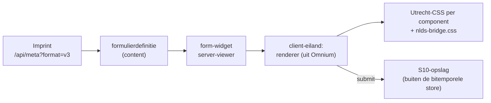

# Onderzoek — NL Design System voor Imprint

Vraag van Mark (september 2026): wat kan Imprint met de componenten van
[NL Design System](https://nldesignsystem.nl), en wat is daar in het
formulierenspoor van het bitemporal-project (Omnium) al mee gedaan?

## Het korte antwoord

Gebruik NL Design System in Imprint **als CSS en tokens op eigen markup**,
niet als React-bibliotheek, en begin bij de **formulieren** (S10). Omnium doet
het in de praktijk al zo, en de Omnium-formulierrenderer leest het V3-formaat
dat Imprint op `/api/meta?format=v3` publiceert. De twee sporen sluiten dus
op elkaar aan. NLDS vervangt de widgetcatalogus niet: het gaat over
formulieren, typografie en navigatie, niet over galerijen, kaarten of borden.

## Wat Omnium al doet

Bron: `Bitemporal_2026/bitemp_register_v06/web/vite` en de docs daar
(`plans/2026-03-29 Forms plan 01.md`,
`plans/2026-04-09 F1-Q1Q2Q3 Formulieren-Views-Datatypes.md`,
`inhoud-editor-technisch.md`, `imprint-contentmodel-v3.md`).

| onderwerp | stand |
|---|---|
| **keuze** | `react-hook-form` + eigen veldcomponent (`SchemaFormField`); RJSF en form.io afgewezen. Het UI-Schema-idee van JSON Forms overgenomen, de library niet |
| **dependencies** | `@utrecht/component-library-react ^13`, `@utrecht/component-library-css ^9`, `@utrecht/design-tokens ^5` |
| **gebruik in de code** | geen enkel bestand importeert de React-bibliotheek. 14 bestanden zetten Utrecht-klassen op eigen HTML: `utrecht-form-field`, `utrecht-form-label`, `utrecht-textbox--html-input`, `utrecht-select--html-select`, `utrecht-form-field-error-message` (met `role="alert"`) |
| **thema** | `styles/common-ground-theme.css` (554 regels) overschrijft de `--utrecht-*`-tokens met Common Ground-kleuren (hexwaarden) |
| **renderer** | `CustomFormulierRenderer.jsx` (231 regels): groep/rij/veld, voorwaarden, herhaalbare `lijst`; gedeeld door de Studio-preview en de inhoud-editor |
| **editor** | visuele formuliereditor als Omnium Studio-activiteit (F41), op main |
| **zoekveld** | `RefCombobox` op `downshift`, omdat de NLDS Select Combobox nog "Help Wanted" is |
| **Imprint** | `imprint-contentmodel-v3.md` (juli 2026) beschrijft hoe de formuliereditor een Imprint-V3Model consumeert (via FieldRef of `injectedTypes`) |

Aandachtspunten:

- React 18 + Vite, Utrecht React `^13`; actueel is 15.0.0.
- CSS-bundel 553 KB (49 KB gzip) door de hele componentbibliotheek (Omnium-backlog F15).
- De renderer is aan Omnium gekoppeld: `SchemaFormField` gebruikt `useSchema()`
  (SchemaContext) en `validatieMeldingVoorVeld` uit `ActionFormParts`;
  `RefCombobox` haalt opties op via `/api/viz/reflijst/…`.

## Stand van NL Design System (september 2026)

- **Geen enkele bibliotheek maar een estafettemodel**: Help Wanted → Community →
  Candidate → Hall of Fame, met implementaties per organisatie (Utrecht,
  Amsterdam, Den Haag e.a.). Van de ~100 componenten is het merendeel
  Community.
- **Candidate-packages** (`@nl-design-system-candidate/*`) zijn nog basaal. React-packages
  die gevonden zijn: button, heading, paragraph, link, skip-link, code,
  code-block, data-badge, number-badge. Formuliercomponenten zitten er nog niet
  bij; form-field is Community (Utrecht volledig, Amsterdam en Den Haag bijna).
- **Voor formulieren blijft Utrecht de praktische bron**:
  `@utrecht/component-library-react@15.0.0` (augustus 2026, peer React 18 of 19)
  met o.a. FormField, FormLabel, FormFieldDescription, FormFieldErrorMessage,
  Textbox, Textarea, Select, Checkbox, RadioButton, Fieldset, Combobox,
  Calendar, Button, Alert, Table, Accordion. Utrecht publiceert ook **losse
  CSS-packages per component** (`@utrecht/form-field-css`,
  `@utrecht/textbox-css`, …).
- **Licentie**: code EUPL-1.2, documentatie CC0. Imprint is MIT. Als
  ongewijzigde dependency geen probleem; aanpassingen aan hún code vallen
  onder EUPL.
- **Formulierrichtlijnen** ([nldesignsystem.nl/richtlijnen/formulieren](https://nldesignsystem.nl/richtlijnen/formulieren/)):
  labels, beschrijvingen, foutmeldingen, fieldsets, formulieren in stappen,
  placeholders, verplichte velden, toetsenbordvolgorde, statusmeldingen,
  foutpreventie. Waardevol los van welke componenten je gebruikt.

## Hoe het in Imprint past

### CSS-klassen, geen React-bibliotheek

Het Utrecht-React-package (`dist/index.mjs`) heeft geen `"use client"` en
gebruikt `useState`, `useId` en `useRef`. Rechtstreeks importeren vanuit een
Next.js server-component gaat daardoor waarschijnlijk mis (niet getest). De
Omnium-aanpak, klassen op eigen markup, rendert zonder JavaScript en past bij
het Imprint-patroon: een server-viewer, met een `"use client"`-eiland alleen
waar interactie nodig is (zoals `map` en de 3D-tab).

Laad alleen de CSS-packages van de gebruikte componenten in plaats van de hele
`component-library-css`; dat scheelt het grootste deel van de 553 KB.

### Tokenbrug

Imprint heeft zo'n tien semantische tokens die per `data-theme` wisselen
(`--background`, `--surface`, `--border`, `--foreground`, `--muted`,
`--accent`, `--accent-strong`, `--accent-2`, `--sans`, `--mono`; zie
[architecture.md §3c](../architecture.md)). Utrecht heeft honderden
componenttokens (`--utrecht-*`). Een brugbestand koppelt die aan de
Imprint-tokens:

```css
/* nlds-bridge.css — Utrecht-componenttokens volgen het Imprint-thema */
:root {
  --utrecht-document-color: var(--foreground);
  --utrecht-document-font-family: var(--sans);
  --utrecht-form-label-color: var(--foreground);
  --utrecht-textbox-background-color: var(--surface);
  --utrecht-textbox-border-color: var(--border);
  --utrecht-form-field-error-message-color: var(--accent-strong);
  /* … per gebruikt component aanvullen */
}
```

Omdat de brug naar variabelen verwijst, kleuren NLDS-velden automatisch mee
met elk thema, ook donker. Het Common Ground-thema van Omnium is het sjabloon
voor de lijst tokens, maar dan met Imprint-tokens in plaats van hexwaarden
(werkafspraak: geen losse hexkleuren). Nog te controleren: of Tailwinds
preflight de Utrecht-basisstijlen in de weg zit.

### De `form`-widget (S10)



- De renderer wordt uit Omnium losgemaakt als package **zonder
  Omnium-koppelingen**: schema, validatie en optiebron (referentielijsten)
  worden aangereikt in plaats van `useSchema()` en `fetch` naar
  `/api/viz/…`. Dat is ook het open punt "injectedTypes of eigen endpoint" in
  `imprint-contentmodel-v3.md`.
- Inzendingen horen, net als users, niet in de bitemporele store: die moeten
  gewist kunnen worden (AVG).
- Spambescherming en notificatiemail blijven Imprint-werk (S10).

### Waar nog meer

- **Admin**: de NLDS-formulierrichtlijnen als checklist voor `SchemaForm`
  (labels boven velden, foutmelding bij het veld, focus zichtbaar). De admin
  hoeft daarvoor niet in NLDS-stijl.
- **Een overheids-imprint**: voor een site van een gemeente of Common
  Ground-partij wordt NLDS bijna een vereiste (toegankelijkheid, huisstijl via
  tokens). Voor MusicBrain (eigen merk, standaard donker) is het vooral de
  formulierlaag.

## Aanbevolen volgorde

1. Utrecht in Omnium van 13 naar 15 bijwerken, zodat beide projecten
   dezelfde versie gebruiken.
2. De renderer uit Omnium losmaken als package met aangereikte schema-, validatie- en
   optiebron.
3. In Imprint de `form`-widget bouwen: server-viewer, renderer als eiland,
   losse Utrecht-CSS, `nlds-bridge.css`.
4. De formulierrichtlijnen afvinken voor de widget en voor `SchemaForm`.

## Bronnen

- [NL Design System — componenten](https://nldesignsystem.nl/componenten/) · [Form Field](https://nldesignsystem.nl/form-field/) · [richtlijnen formulieren](https://nldesignsystem.nl/richtlijnen/formulieren/)
- [nl-design-system/candidate](https://github.com/nl-design-system/candidate) · [nl-design-system/utrecht](https://github.com/nl-design-system/utrecht)
- npm: `@utrecht/component-library-react@15.0.0` (bekeken: dependencies, exports, hookgebruik in `dist/index.mjs`), `@nl-design-system-candidate/*-react`
- Omnium: `bitemp_register_v06/web/vite/src` (componenten, thema) en de genoemde docs
