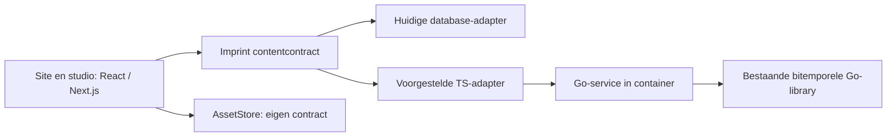

# Opdracht: doorontwikkeling na de Imprint-review

Datum: 28 september 2026.
Publiek: architect/ontwerper en vervolgens bouw-agent.
Status: onderzoeks- en ontwerpbrief; geen toestemming voor een integrale
herbouw, productiedeploy of datamigratie.

## 1. Doel en uitgangspunten

Maak Imprint geschikt voor de eigen informatieve websites, fotografieportfolio's
en product-/kenniswebsites, met een open stack in eigen beheer. De stack blijft
React/JS/TS; PHP is geen gewenste ontwikkelbasis. De bestaande databasebackend
is het vertrekpunt, aansluiting op Marks bitemporele Go-library de gewenste
richting. Een container voor die backend is acceptabel.

Openheid en zeggenschap zijn zelfstandige doelen. De opdracht is niet bewijzen
dat ieder bestaand CMS tekortschiet of dat Imprint een unieke markt moet hebben.
Ook is de opdracht niet alle WordPress-plugins of Adobe-functies na te bouwen.

Lees eerst:

- [Review R1-R9, aanvulling en letterlijke chattekst](../review-2026-09-28.md).
- [Architectuur](../architecture.md) en
  [engine-/instantiecontract](engine-instance-plugin-architectuur.md).
- [Requirements](../website-requirements.md) en [actuele backlog](../backlog.md).
- [Beeldbibliotheek](beeldbibliotheek.md): de besluiten zijn inmiddels genomen.
- [Positionering](../positionering.md).

De review is een momentopname op `3eac7a8`. Hercontroleer de actuele code en
tests: een bevinding kan inmiddels zijn opgelost. Bestaande requirements en
expliciete besluiten van Mark gaan voor op aanbevelingen in deze opdracht.
Leg tegenstrijdigheden voor; wijzig ze niet impliciet.

## 2. Eerst opleveren, dan bouwen

Lever een compact ontwerp met:

1. Een tabel per R1-R9: bevestigd/opgelost/onzeker, codeverwijzing,
   reproduceerbare check, voorgestelde ingreep en afhankelijkheden.
2. Een capability-/licentiematrix voor de werkelijk benodigde stack,
   inclusief de Go-library en objectopslag; geen algemene marketingvergelijking.
3. Een verantwoordelijkheden- en contractontwerp voor de backendovergang,
   met expliciete onbekenden en een kleine adapterproef.
4. Een migratie-inventaris per eigen site en een media-/portfolioplan.
5. Kleine bouwstappen met acceptatietests, migraties, rollback en documentatie.

Geef aan wat nu moet om bestaande sites veilig te houden en wat uitsluitend
voor de toekomstige backend nodig is. Vraag daarna opdracht voor de gekozen
bouwstap; behandel dit document niet als opdracht om alles tegelijk te bouwen.

## 3. Open-sourcebeleid vastleggen

Leg per directe runtimecomponent en kritieke transitieve dependency vast:
versie, bronrepository, SPDX-licentie, distributievorm, noodzakelijke betaalde
features, verplichte clouddiensten en export-/vervangingsmogelijkheden.
Controleer ook plugins, fonts, beeldverwerking en containerimages.

Onderscheid open source van source-available en van gratis SaaS. Copyleft
is niet hetzelfde als gesloten software. Laat Mark kiezen welke licentie-
verplichtingen aanvaardbaar zijn; neem niet zonder besluit "uitsluitend MIT"
of "geen AGPL" als eis aan. Bewaak ook de eigen licentiecompatibiliteit.

Acceptatie: een nieuwe installatie kan uit vastgelegde bronnen worden gebouwd,
gehost en hersteld zonder verplicht commercieel CMS-account. Externe diensten
zijn expliciete, vervangbare keuzes. Er is een dependency-overzicht met een
onderhouds- en beveiligingsupdatepad, niet alleen een licentiebadge.

## 4. Backend: contract en proef

### Voorgestelde verdeling

Dit is een voorstel, geen beschrijving van een al bestaande Go-service.
Zoek eerst het andere project op of vraag het pad wanneer dat niet beschikbaar
is. Inspecteer de echte library, tests en interfaces. Verzin geen endpoints,
transactiegaranties, licentie of ondersteunde database.

De site/viewers blijven uitsluitend via Imprint-contracten lezen. Een
Go-library kan niet rechtstreeks als normale TS-import draaien; een service
met een TS-adapter is het uitgangspunt voor de containeropzet. Hergebruik een
bestaand passend servicecontract voordat je een nieuw protocol introduceert.

### Verantwoordelijkheden expliciet toewijzen

| Onderwerp | Ontwerpbeslissing die nodig is |
|---|---|
| Schema's | Zod blijft de Imprint-bron; bepaal hoe ongevalideerde directe writes naar de service worden voorkomen |
| Tijd | Scheid geldig-op en bekend-op, definieer defaultgedrag en behoud een compatibiliteitspad voor `asOf` |
| Historie | Bepaal correctie, vervanging, verwijdering, herstel, actor en import van oorspronkelijke registratietijden |
| Gelijktijdigheid | Verwachte revisie, conflictfout en atomaire mutaties; definieer invariant voor overlappende intervallen |
| Autorisatie | Onderscheid service-authenticatie, gebruikersrechten en site-isolatie; een servicecredential is geen editorrecht |
| Queries | Generieke reads voor plugins met taal, tijd, filters, stabiele sortering, paginering en gerichte sleutelquery |
| Cache | Imprint ontvangt/ontdekt publicatieveranderingen en invalideert ook wijzigingen buiten de admin om |
| Identiteit | Stabiele identifiers tegenover wijzigbare slugs; grote numerieke IDs veilig over de JS/Go-grens vervoeren |
| Assets | Metadata kan content zijn; bytes, varianten en toegangsregels blijven een afzonderlijke verantwoordelijkheid |
| Storingen | Begrensde timeouts, geen onbeperkte retries, geen automatische lege file-store bij backenduitval |

Voorkom dubbele schrijfeffecten bij een timeout: retry writes alleen met
een overeengekomen idempotencymechanisme. Maak defaults voor UTC, precisie,
intervalgrenzen en open eindes expliciet. Toets fail-closed gedrag voor
afgeschermde content. Definieer readiness, connectie-/concurrencylimieten,
logging zonder secrets, backup en herstel van de service.

### Minimale proef en acceptatie

Gebruik een wegwerpomgeving met een pagina en een plugintype. Doorloop:
aanmaken, wijzigen, toekomstige vervanging, annuleren, historisch lezen op
twee onafhankelijke assen, verwijderen, herstel en concurrerende edits.
Bewijs dat de huidige publicatie niet verdwijnt bij inplannen. Toets dezelfde
publieke lees-/schrijfcontracten tegen de huidige en nieuwe adapter; leg
bedoelde verschillen vast, neem de huidige fouten niet over als norm.

De proef raakt geen productiedata. Een werkende Go-store lost de publieke
Next-cache niet vanzelf op: test ook een warme pagina die zonder extra save
op het afgesproken moment verandert. Behoud bestaande backendondersteuning
tot een afzonderlijk besluit over uitfasering.

### Migratie van bestaande Imprint-historie

Gewoon alle versies via `putItem` afspelen behoudt oorspronkelijke
registratietijden niet vanzelf. Ontwerp een expliciete, gecontroleerde
importvoorziening met validatie, identificatiemapping, tellingen en checksums.
Gebruik geen ad-hoc SQL vanuit sitecode. Kan de library historische
registratietijden niet importeren, rapporteer dat als blocker of kies na
besluit een duidelijk beschreven archiefstrategie; fabriceer geen historie.

Oefen backup, import, vergelijking van huidige en historische antwoorden,
cutover met afgesproken schrijfpauze en rollback. Vermijd een impliciet
dual-writesysteem; dat vereist een eigen consistentieontwerp.

## 5. WordPress-migratie als productproef

Inventariseer eerst een werkelijk te migreren site: pagina's, berichten,
media, auteurs, menu's, categorieen/tags, permalinkstructuur en alle gebruikte
plugins/functies (bijvoorbeeld formulieren, agenda, SEO, redirects of zoeken).
Maak een behouden/vervangen/niet-meenemen-matrix. Stel geen universele
WordPress-pariteit als doel en vraag geen wachtwoorden via chat.

Gebruik een door de eigenaar geleverde export en mediabestanden. Een
WordPress WXR-export bevat niet automatisch alle beeldbytes, plugininstellingen
of themavormgeving. Verifieer beschikbaarheid en volledigheid. Verwerk XML
met een parser, saniteer HTML en map ondersteunde Gutenberg-blokken bewust.
Rapporteer shortcodes/page-builderdata die niet omzetbaar zijn; geen stil verlies
en geen uitvoer van geimporteerde code of willekeurige server-URL's.

Behoud bron-ID's voor herhaalbare imports, slugs/datum/tijdzone, titels,
beschrijvingen, alt/captions/credits en interne links waar beschikbaar.
WordPress-wachtwoordhashes niet blind overnemen; plan accountactivatie apart.

Acceptatie op staging:

- Dry-run maakt een inventaris en rapport van onbekende/ontbrekende onderdelen.
- Herhaalde import maakt geen duplicaten en overschrijft geen nieuwe
  redactionele edits zonder expliciet beleid.
- URL-inventaris is volledig afgevinkt: behouden of permanente redirect,
  zonder redirectlussen; interne links en media werken.
- Content-/asset-aantallen zijn verklaard, representatieve pagina's zijn
  visueel en inhoudelijk vergeleken; metadata/feed/formulieren naar behoefte.
- Staging wordt niet geindexeerd; het oude systeem en backup blijven tot
  goedgekeurde cutover en rollbackproef beschikbaar.

Kies eerst een overzichtelijke eigen site. Zet pas daarna complexere sites
over; importfunctionaliteit is een herbruikbaar hulpmiddel, geen noodzakelijke
publieke runtimeafhankelijkheid van WordPress.

## 6. Fotografieportfolio als volwaardig scenario

Volg [het bestaande beeldbibliotheekontwerp](beeldbibliotheek.md), inclusief
de reeds genomen keuzes: varianten bij upload, onaangeroerde originelen,
EXIF-beleid, toegang per formaat en MinIO met eigen bucket/sleutel.
Maak geen concurrerend assetmodel. Metadatafilters en portfolioseries zijn
verschillende begrippen: een gecureerde serie heeft een eigen titel, omslag,
volgorde en eventueel tekst; niet alleen een map of automatische tagselectie.

Onderzoek de feitelijke Adobe Portfolio-exportmogelijkheden en beschikbare
Lightroom/catalogus-/JPEG/TIFF-bronnen. Neem geen WordPress-onderbouw aan.
Herbruik beschikbare originele webexports, niet alleen verkleinde screenshots
of thumbnails. Adobe blijft voorlopig het werkende referentieportfolio.

Werk minstens uit:

- Series/collecties, omslag, vaste beeldvolgorde en navigatie tussen series.
- Presentatie van portret, landschap en panorama zonder onbedoeld bijsnijden;
  gecontroleerde uitsnede uitsluitend waar de ontwerper/redacteur die kiest.
- Correcte EXIF-orientatie en kleurbeheer (ICC/sRGB-keuze), getest op echte
  referentiebeelden; bestandsgrootte en beeldkwaliteit samen beoordelen.
- Responsive varianten, `srcset`/`sizes`, vaste afmetingen tegen layoutshift,
  en bewust laadgedrag voor eerste beeld tegenover beelden verderop.
- Toegankelijke lightbox, focusherstel, toetsenbordbediening, mobiele
  bediening en uitschakelbare beweging; heldere captions/credits/alttekst.
- Geen publiek bereikbaar origineel of private metadata via een omweg:
  toets zowel bytes als metadata, thumbnails, caches en eventuele downloadlinks.
- Bulk-upload, voortgang, hervatten/herhalen zonder duplicaten en duidelijk
  foutgedrag; begrens geheugengebruik en beelddecompressie.

De bestaande keuze "originelen nooit publiek" betekent dat publieke varianten
ook echt apart toegankelijk moeten zijn. Een geheim of onraadbaar pad is
geen autorisatie. Veronderstel evenmin dat beeldwatermerken kopieren voorkomen.

Acceptatie: bouw een representatieve serie naast Adobe Portfolio, met eigen
landschaps-, portret- en panoramafoto's. Laat Mark beeldkwaliteit, volgorde en
beheer beoordelen; meet mobiel laden en controleer toegankelijkheid, privacy,
backups en domein-/URL-overgang. De migratie moet de huidige bruikbaarheid
behouden. Fotografie wordt niet verplicht aan product- of verkoopschema's
gekoppeld; verkoop blijft een afzonderlijke uitbreiding.

## 7. Bouwvolgorde en grenzen

1. Herbevestig R1-R9, herstel huidige risico's en maak Postgres-gates bruikbaar.
2. Ontwerp het generieke lees-/tijdcontract en voer de kleine Go-adapterproef uit.
3. Realiseer de besloten beeldbibliotheek en de gedeelde CMS-basis in kleine
   stappen; laat een backendmigratie dit niet onnodig blokkeren.
4. Migreer een eenvoudige WordPress-site op staging; realiseer daarnaast een
   representatieve portfolioproef voordat Adobe wordt uitgezet.
5. Voer de backendovergang pas uit na historische vergelijking en herstelproef.

Dit is een voorgestelde afhankelijkheidsvolgorde, geen stilzwijgende deadline.
Gebruik bestaande suites; voeg gerichte tests voor tijd, conflicten,
autorisatie, import en media toe. Draai relevante tests na elke stap en de
repo-gates voor oplevering. Noteer overgeslagen controles met reden.

Werk per opgeleverde capability handleiding, architectuur (met mermaid),
changelog, backlog en de revisiestand bij waar van toepassing. Een ontwerpbrief
betekent niet dat een implementatiestap al is afgerond. Geen automatische
productie-import, secretsrotatie, verwijdering van oude sites of wijziging van
expliciete keuzes zonder opdracht.

## 8. Startopdracht voor een nieuwe agent

> Lees deze opdracht, de review inclusief sectie 10 en bijlage A, en de actuele
> repository-instructies. Begin met een hercontrole van R1-R9 en inspecteer het
> bestaande beeldbibliotheekontwerp. Maak daarna het ontwerp uit sectie 2,
> gericht op eigen WordPress-sites, een fotografieportfolio en aansluiting op
> de bestaande Go-library. Onderzoek die library alleen wanneer het project
> beschikbaar is; vraag anders het pad en benoem de onbekenden. Behoud React/TS,
> de huidige storegrenzen en de genomen mediabesluiten. Bouw en migreer nog
> niets in productie. Stel als eerste bouwstap de kleinste toetsbare ingreep
> voor die een bevestigd risico of een noodzakelijke migratievoorwaarde oplost.